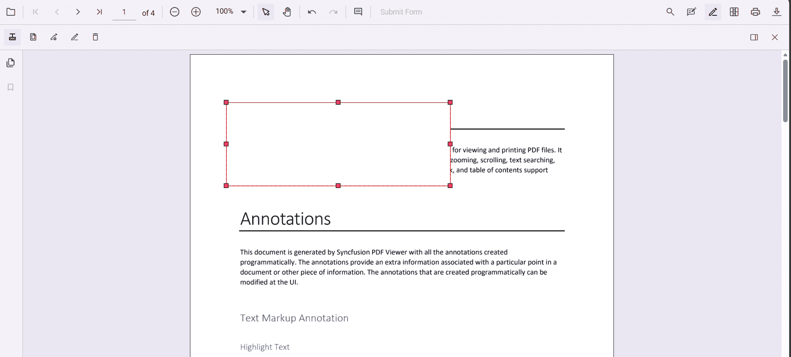
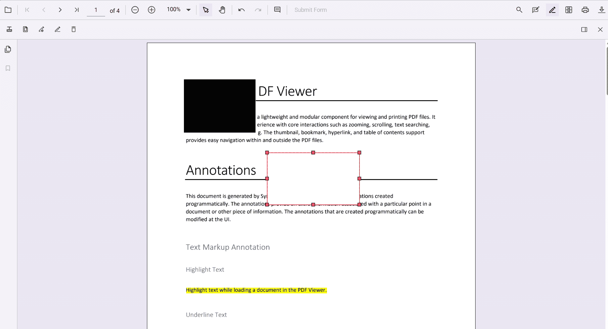
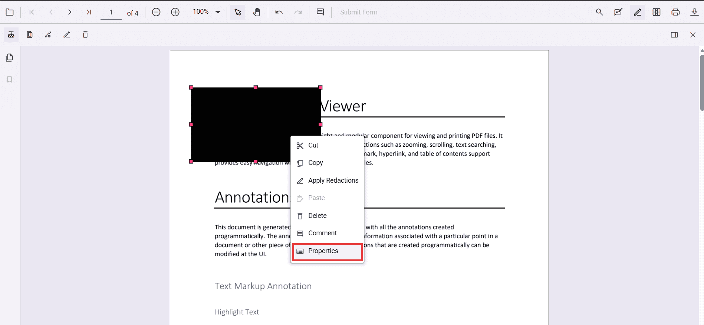
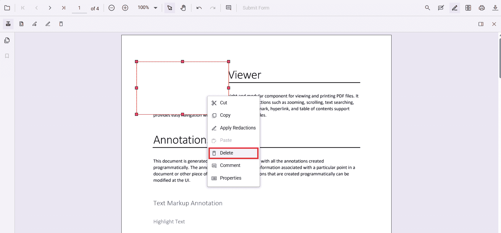
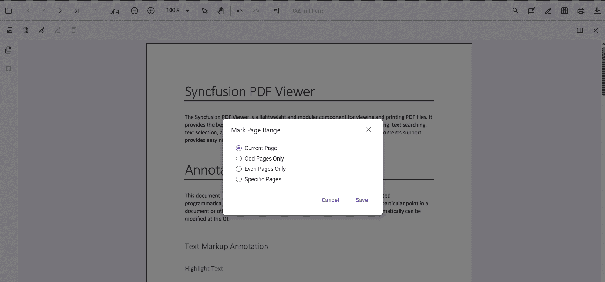
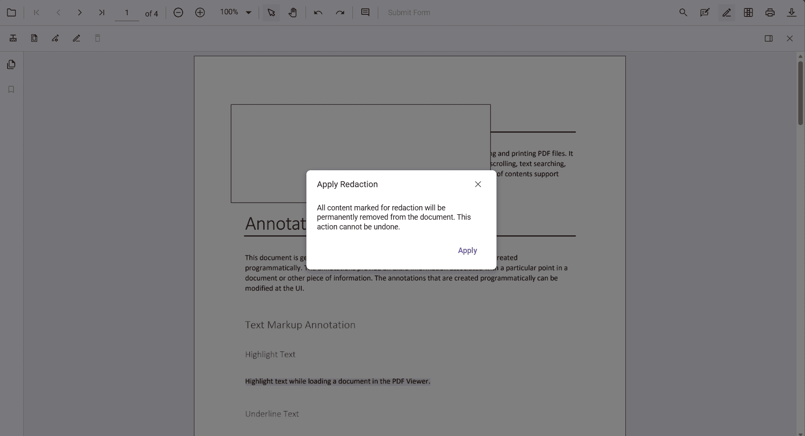

# Redaction annotation in Vue PDF Viewer

Redaction annotations permanently remove sensitive content from a PDF. You can draw redaction marks over text or graphics, redact entire pages, customize overlay text and styling, and apply redaction to finalize. 

## Add Redaction Annotation

### Add redaction annotations in UI
- Use the **Redaction** tool from the toolbar to draw over content to hide it.  
- Redaction marks can show overlay text (for example, "Confidential") and can be styled.

Redaction annotations are interactive:
- **Movable**  
  
- **Resizable**  

You can also add redaction annotations from the **context menu** by selecting content and choosing **Redact Annotation**.  

N> Ensure the **Redaction** tool is included in the toolbar. See [RedactionToolbar](../../Redaction/toolbar.md) for configuration.

### Add redaction annotations programmatically



<template>
  

    <button @click="addRedactionProgrammatically">Add Redaction</button>
    <ejs-pdfviewer id="container" ref="container" :documentPath="documentPath" :resourceUrl="resourceUrl" style="height: 650px"></ejs-pdfviewer>
  

</template>




Track additions using the `annotationAdd` event (wired above as a component prop).

## Edit Redaction Annotations

### Edit redaction annotations in UI
Use the viewer to select, move, and resize Redaction annotations. Use the context menu for additional actions.

#### Edit the properties of redaction annotations in UI
Use the property panel or **context menu → Properties** to change overlay text, font, fill color, and more.  
  

### Edit redaction annotations programmatically



<template>
  

    <button @click="editFirstRedaction">Edit Redaction</button>
    <ejs-pdfviewer id="container" ref="container" :documentPath="documentPath" :resourceUrl="resourceUrl" style="height: 650px"></ejs-pdfviewer>
  

</template>




## Delete redaction annotations

### Delete in UI
- **Right‑click → Delete**  

- Use the **Delete** button in the toolbar  

- Press **Delete** key

### Delete programmatically



<template>
  

    <button @click="deleteFirstRedaction">Delete Redaction</button>
    <ejs-pdfviewer id="container" ref="container" :documentPath="documentPath" :resourceUrl="resourceUrl" style="height: 650px"></ejs-pdfviewer>
  

</template>




## Redact pages

### Redact pages in UI
Use the **Redact Pages** dialog to mark entire pages with options like **Current Page**, **Odd Pages Only**, **Even Pages Only**, and **Specific Pages**.  

### Add page redactions programmatically



<template>
  

    <button @click="addPageRedactions">Redact Pages</button>
    <ejs-pdfviewer id="container" ref="container" :documentPath="documentPath" :resourceUrl="resourceUrl" style="height: 650px"></ejs-pdfviewer>
  

</template>




## Apply redaction

### Apply redaction in UI
Click **Apply Redaction** to permanently remove marked content.  

N> **Redaction is permanent and cannot be undone.**

### Apply redaction programmatically



<template>
  

    <button @click="applyRedaction">Apply Redaction</button>
    <ejs-pdfviewer id="container" ref="container" :documentPath="documentPath" :resourceUrl="resourceUrl" style="height: 650px"></ejs-pdfviewer>
  

</template>




N> Applying redaction is **irreversible**.

## Default redaction settings during initialization

Configure defaults with the `redactionSettings` **component prop**:



<template>
  <ejs-pdfviewer id="container" :documentPath="documentPath" :resourceUrl="resourceUrl" :redactionSettings="redactionSettings" style="height: 650px"></ejs-pdfviewer>
</template>




## See also
- [Annotation Overview](../overview)
- [Redaction Overview](../../Redaction/overview)
- [Annotation Toolbar](../../toolbar-customization/annotation-toolbar)
- [Create and Modify Annotation](../../annotations/create-modify-annotation)
- [Customize Annotation](../../annotations/customize-annotation)
- [Remove Annotation](../../annotations/delete-annotation)
- [Handwritten Signature](../../annotations/signature-annotation)
- [Export and Import Annotation](../../annotations/export-import/export-annotation)
- [Annotation in Mobile View](../../annotations/annotations-in-mobile-view)
- [Annotation Events](../../annotations/annotation-event)
- [Annotation API](../../annotations/annotations-api)
