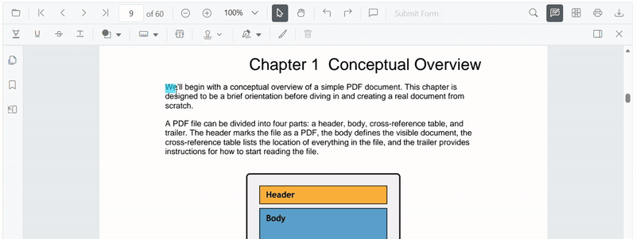
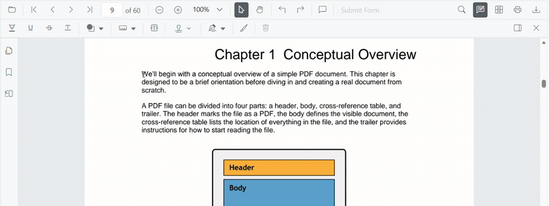

# Squiggly Annotation (Text Markup) in Vue PDF Viewer

This guide explains how to **enable**, **apply**, **customize**, and **manage** *Squiggly* text markup annotations in the Syncfusion **Vue PDF Viewer**.
You can add squiggly underlines from the toolbar or context menu, programmatically invoke squiggly mode, customize default settings, handle events, and export the PDF with annotations.

## Enable Squiggly in the Viewer
To enable Squiggly annotations, inject the following modules into the Vue PDF Viewer:

- [**Annotation**](https://ej2.syncfusion.com/vue/documentation/api/pdfviewer/index-default#annotation)
- [**TextSelection**](https://ej2.syncfusion.com/vue/documentation/api/pdfviewer/index-default#textselection)
- [**Toolbar**](https://ej2.syncfusion.com/vue/documentation/api/pdfviewer/index-default#toolbar)

This minimal setup enables UI interactions like selection and squiggly markup.



<template>
  <ejs-pdfviewer id="container" :documentPath="documentPath" :resourceUrl="resourceUrl" style="height: 650px"></ejs-pdfviewer>
</template>




## Add Squiggly Annotation

### Add Squiggly Using the Toolbar

1. Select the text you want to annotate.
2. Click the **Squiggly** icon in the annotation toolbar.
   - If **Pan Mode** is active, the viewer automatically switches to **Text Selection** mode.

### Add Squiggly Using the Context Menu

Right-click a selected text region → select **Squiggly**.

To customize menu items, refer to [**Customize Context Menu**](../../context-menu/custom-context-menu) documentation.

### Enable Squiggly Mode
Switch the viewer into squiggly mode using `setAnnotationMode('Squiggly')`.



<template>
  

    <button @click="enableSquiggly">Enable Squiggly</button>
    <ejs-pdfviewer id="container" ref="container" :documentPath="documentPath" :resourceUrl="resourceUrl" style="height: 650px"></ejs-pdfviewer>
  

</template>




#### Exit Squiggly Mode
Switch back to normal mode using:



<template>
  

    <button @click="disableSquigglyMode">Disable Squiggly</button>
    <ejs-pdfviewer id="container" ref="container" :documentPath="documentPath" :resourceUrl="resourceUrl" style="height: 650px"></ejs-pdfviewer>
  

</template>




### Add Squiggly Programmatically
Use [`addAnnotation()`](https://ej2.syncfusion.com/vue/documentation/api/pdfviewer/index-default#addannotation) to insert a squiggly at a specific location.



<template>
  

    <button @click="addSquiggly">Add Squiggly</button>
    <ejs-pdfviewer id="container" ref="container" :documentPath="documentPath" :resourceUrl="resourceUrl" style="height: 650px"></ejs-pdfviewer>
  

</template>




## Customize Squiggly Appearance
Configure default squiggly settings such as **color**, **opacity**, and **author** using [`squigglySettings`](https://ej2.syncfusion.com/vue/documentation/api/pdfviewer/index-default#squigglysettings).



<template>
  <ejs-pdfviewer id="container" :documentPath="documentPath" :resourceUrl="resourceUrl" :squigglySettings="squigglySettings" style="height: 650px"></ejs-pdfviewer>
</template>




## Manage Squiggly (Edit, Delete, Comment)

### Edit Squiggly

#### Edit Squiggly Appearance (UI)

Use the annotation toolbar:
- **Edit Color** tool  

- **Edit Opacity** slider  

#### Edit Squiggly Programmatically
Modify an existing squiggly programmatically using `editAnnotation()`.



<template>
  

    <button @click="editSquigglyProgrammatically">Edit Squiggly</button>
    <ejs-pdfviewer id="container" ref="container" :documentPath="documentPath" :resourceUrl="resourceUrl" style="height: 650px"></ejs-pdfviewer>
  

</template>




### Delete Squiggly
The PDF Viewer supports deleting existing annotations through both the UI and API.
For detailed behavior, supported deletion workflows, and API reference, see [**Delete Annotation**](../remove-annotations)

### Comments
Use the [**Comments panel**](../comments) to add, view, and reply to threaded discussions linked to squiggly annotations.
It provides a dedicated UI for reviewing feedback, tracking conversations, and collaborating on annotation‑related notes within the PDF Viewer.

## Set properties while adding Individual Annotation
Set properties for individual squiggly annotations at the time of creation using the [`addAnnotation`](https://ej2.syncfusion.com/vue/documentation/api/pdfviewer/index-default#addannotation) API.



<template>
  

    <button @click="addMultipleSquigglies">Add Multiple Squigglies</button>
    <ejs-pdfviewer id="container" ref="container" :documentPath="documentPath" :resourceUrl="resourceUrl" style="height: 650px"></ejs-pdfviewer>
  

</template>




## Disable TextMarkup Annotation
Disable text markup annotations (including squiggly) using the [`enableTextMarkupAnnotation`](https://ej2.syncfusion.com/vue/documentation/api/pdfviewer/index-default#enabletextmarkupannotation) property.



<template>
  <ejs-pdfviewer id="container" :documentPath="documentPath" :resourceUrl="resourceUrl" :enableTextMarkupAnnotation="false" style="height: 650px"></ejs-pdfviewer>
</template>




## Handle Squiggly Events
The PDF viewer provides annotation life‑cycle events that notify when squiggly annotations are added, modified, selected, or removed.
For the full list of available events and their descriptions, see [**Annotation Events**](../annotation-event)

## Export and Import

The PDF Viewer supports exporting and importing annotations, allowing you to save annotations as a separate file or load existing annotations back into the viewer.
For full details on supported formats and steps to export or import annotations, see [**Export and Import annotations**](../export-import-annotations)

## See Also
- [Annotation Toolbar](../../toolbar-customization/annotation-toolbar)
- [Customize Context Menu](../../context-menu/custom-context-menu)
- [Comments Panel](../comments)
- [Annotation Events](../annotation-event)
- [Export and Import annotations](../export-import-annotations)
- [Delete Annotations](../remove-annotations)
