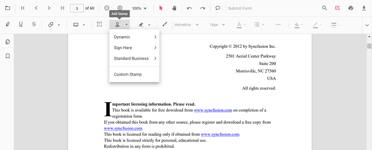

# Stamp Annotation in Vue PDF Viewer

Stamp annotations display predefined or custom stamps in PDF documents. The Vue PDF Viewer supports several stamp types: **Sign Here**, **Witness**, **Approved**, **AsIs**, **Expired**, **NotApproved**, **NotForPublicRelease**, **Confidential**, **TopSecret**, **ForComment**, **Recommended**, and **Custom stamps**.

## Enable Stamp in the Viewer

To enable Stamp annotations, inject the following modules:

- [**Annotation**](https://ej2.syncfusion.com/vue/documentation/api/pdfviewer/index-default#annotation)
- [**Toolbar**](https://ej2.syncfusion.com/vue/documentation/api/pdfviewer/index-default#toolbar)



<template>
  <ejs-pdfviewer id="container" :documentPath="documentPath" :resourceUrl="resourceUrl" style="height: 650px"></ejs-pdfviewer>
</template>




## Add Stamp Annotation

### Add Stamp Using the Toolbar

1. Click the **Stamp** tool in the toolbar.
2. Select a stamp type from the dropdown.
3. Click on the PDF page to place the stamp.

### Add Stamp Using the Context Menu

Right-click on the PDF page → select **Stamp** → choose a stamp type.

### Enable Stamp Mode

Switch the viewer to stamp mode using `setAnnotationMode()`:



<template>
  

    <button @click="enableStampMode">Enable Stamp</button>
    <ejs-pdfviewer id="container" ref="container" :documentPath="documentPath" :resourceUrl="resourceUrl" style="height: 650px"></ejs-pdfviewer>
  

</template>




### Add Stamp Programmatically

Use [`addAnnotation()`](https://ej2.syncfusion.com/vue/documentation/api/pdfviewer/index-default#addannotation) to insert stamps at specific locations.



<template>
  

    <button @click="addStampProgrammatically">Add Stamp</button>
    <ejs-pdfviewer id="container" ref="container" :documentPath="documentPath" :resourceUrl="resourceUrl" style="height: 650px"></ejs-pdfviewer>
  

</template>




## Add Custom Stamp

### Add Custom Stamp

Create custom stamps with base64-encoded images. Set up the custom stamp array via [`stampSettings`](https://ej2.syncfusion.com/vue/documentation/api/pdfviewer/index-default#stampsettings):



<template>
  

    <button @click="addCustomStamp">Add Custom Stamp</button>
    <ejs-pdfviewer id="container" ref="container" :documentPath="documentPath" :resourceUrl="resourceUrl" :stampSettings="stampSettings" style="height: 650px"></ejs-pdfviewer>
  

</template>




N> Supported image format for custom stamps: **JPEG**. Only the base64-encoded image source is supported; local file paths are not supported.

## Customize Stamp Appearance

Configure default stamp settings using [`stampSettings`](https://ej2.syncfusion.com/vue/documentation/api/pdfviewer/index-default#stampsettings):



<template>
  <ejs-pdfviewer id="container" :documentPath="documentPath" :resourceUrl="resourceUrl" :stampSettings="stampSettings" style="height: 650px"></ejs-pdfviewer>
</template>




## Manage Stamp (Edit, Delete)

### Edit Stamp

#### Edit Stamp in UI
- Select a stamp and drag to move it.
- Resize by dragging the corner handles.
- Use the right-click context menu for additional options.

#### Edit Stamp Programmatically

Modify an existing stamp using `editAnnotation()`:



<template>
  

    <button @click="editStamp">Edit Stamp</button>
    <ejs-pdfviewer id="container" ref="container" :documentPath="documentPath" :resourceUrl="resourceUrl" style="height: 650px"></ejs-pdfviewer>
  

</template>




### Delete Stamp

#### Delete in UI
- Right-click the stamp → **Delete**
- Press the **Delete** key while the stamp is selected

#### Delete Programmatically

Use `deleteAnnotationById()` to remove a stamp:



<template>
  

    <button @click="deleteStamp">Delete Stamp</button>
    <ejs-pdfviewer id="container" ref="container" :documentPath="documentPath" :resourceUrl="resourceUrl" style="height: 650px"></ejs-pdfviewer>
  

</template>




## Handle Stamp Events

The PDF viewer provides annotation life-cycle events for stamps. For a complete list of events and details, see [**Annotation Events**](../annotation-event)

## Export and Import

The PDF Viewer supports exporting and importing annotations, including stamps. For full details on export/import formats and procedures, see [**Export and Import Annotations**](../export-import-annotations)

## See Also
- [Annotation Toolbar](../../toolbar-customization/annotation-toolbar)
- [Annotation Events](../annotation-event)
- [Export and Import Annotations](../export-import-annotations)
- [Delete Annotations](../remove-annotations)
