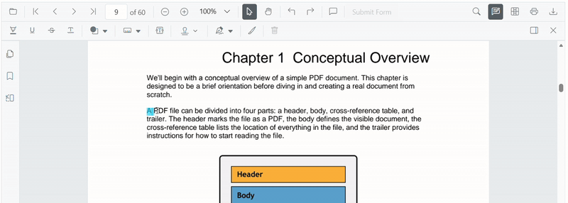
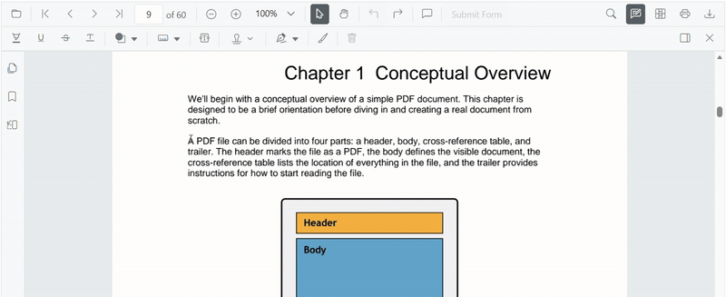

# Underline Annotation (Text Markup) in Vue PDF Viewer

This guide explains how to **enable**, **apply**, **customize**, and **manage** *Underline* text markup annotations in the Syncfusion **Vue PDF Viewer**.
You can apply underlines to text from the toolbar or context menu, programmatically invoke underline mode, customize default settings, handle events, and export the PDF with annotations.

## Enable Underline in the Viewer

To enable Underline annotations, inject the following modules into the Vue PDF Viewer:

- [**Annotation**](https://ej2.syncfusion.com/vue/documentation/api/pdfviewer/index-default#annotation)
- [**TextSelection**](https://ej2.syncfusion.com/vue/documentation/api/pdfviewer/index-default#textselection)
- [**Toolbar**](https://ej2.syncfusion.com/vue/documentation/api/pdfviewer/index-default#toolbar)

This minimal setup enables UI interactions like text selection and underline markup.



<template>
  <ejs-pdfviewer id="container" :documentPath="documentPath" :resourceUrl="resourceUrl" style="height: 650px"></ejs-pdfviewer>
</template>




## Add Underline Annotation

### Add Underline Using the Toolbar

1. Select the text you want to annotate.
2. Click the **Underline** icon in the annotation toolbar.
   - If **Pan Mode** is active, the viewer automatically switches to **Text Selection** mode.

### Add Underline Using the Context Menu

Right-click a selected text region → select **Underline**.

To customize menu items, refer to [**Customize Context Menu**](../../context-menu/custom-context-menu) documentation.

### Enable Underline Mode

Switch the viewer into underline mode using `setAnnotationMode('Underline')`.



<template>
  

    <button @click="enableUnderline">Enable Underline</button>
    <ejs-pdfviewer id="container" ref="container" :documentPath="documentPath" :resourceUrl="resourceUrl" style="height: 650px"></ejs-pdfviewer>
  

</template>




#### Exit Underline Mode

Switch back to normal mode using:



<template>
  

    <button @click="disableUnderlineMode">Disable Underline</button>
    <ejs-pdfviewer id="container" ref="container" :documentPath="documentPath" :resourceUrl="resourceUrl" style="height: 650px"></ejs-pdfviewer>
  

</template>




### Add Underline Programmatically

Use [`addAnnotation()`](https://ej2.syncfusion.com/vue/documentation/api/pdfviewer/index-default#addannotation) to insert an underline at a specific location.



<template>
  

    <button @click="addUnderline">Add Underline</button>
    <ejs-pdfviewer id="container" ref="container" :documentPath="documentPath" :resourceUrl="resourceUrl" style="height: 650px"></ejs-pdfviewer>
  

</template>




## Customize Underline Appearance

Configure default underline settings such as **color**, **opacity**, and **author** using [`underlineSettings`](https://ej2.syncfusion.com/vue/documentation/api/pdfviewer/index-default#underlinesettings).



<template>
  <ejs-pdfviewer id="container" :documentPath="documentPath" :resourceUrl="resourceUrl" :underlineSettings="underlineSettings" style="height: 650px"></ejs-pdfviewer>
</template>




## Manage Underline (Edit, Delete, Comment)

### Edit Underline

#### Edit Underline Appearance (UI)

Use the annotation toolbar:
- **Edit Color** tool  

- **Edit Opacity** slider  

#### Edit Underline Programmatically

Modify an existing underline programmatically using `editAnnotation()`.



<template>
  

    <button @click="editUnderlineProgrammatically">Edit Underline</button>
    <ejs-pdfviewer id="container" ref="container" :documentPath="documentPath" :resourceUrl="resourceUrl" style="height: 650px"></ejs-pdfviewer>
  

</template>




### Delete Underline

The PDF Viewer supports deleting existing annotations through both the UI and API.
For detailed behavior, supported deletion workflows, and API reference, see [**Delete Annotation**](../remove-annotations)

### Comments

Use the [**Comments panel**](../comments) to add, view, and reply to threaded discussions linked to underline annotations.
It provides a dedicated UI for reviewing feedback, tracking conversations, and collaborating on annotation‑related notes within the PDF Viewer.

## Set properties while adding Individual Annotation

Set properties for individual underline annotations at the time of creation using the [`addAnnotation`](https://ej2.syncfusion.com/vue/documentation/api/pdfviewer/index-default#addannotation) API.



<template>
  

    <button @click="addMultipleUnderlines">Add Multiple Underlines</button>
    <ejs-pdfviewer id="container" ref="container" :documentPath="documentPath" :resourceUrl="resourceUrl" style="height: 650px"></ejs-pdfviewer>
  

</template>




## Disable TextMarkup Annotation

Disable text markup annotations (including underline) using the [`enableTextMarkupAnnotation`](https://ej2.syncfusion.com/vue/documentation/api/pdfviewer/index-default#enabletextmarkupannotation) property.



<template>
  <ejs-pdfviewer id="container" :documentPath="documentPath" :resourceUrl="resourceUrl" :enableTextMarkupAnnotation="false" style="height: 650px"></ejs-pdfviewer>
</template>




## Handle Underline Events

The PDF viewer provides annotation life-cycle events that notify when underline annotations are added, modified, selected, or removed.
For the full list of available events and their descriptions, see [**Annotation Events**](../annotation-event)

## Export and Import

The PDF Viewer supports exporting and importing annotations, allowing you to save annotations as a separate file or load existing annotations back into the viewer.
For full details on supported formats and steps to export or import annotations, see [**Export and Import annotations**](../export-import-annotations)

## See Also
- [Annotation Toolbar](../../toolbar-customization/annotation-toolbar)
- [Customize Context Menu](../../context-menu/custom-context-menu)
- [Comments Panel](../comments)
- [Annotation Events](../annotation-event)
- [Export and Import annotations](../export-import-annotations)
- [Delete Annotations](../remove-annotations)
