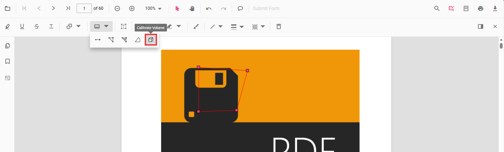

# Volume Annotation in Vue PDF Viewer

Volume annotations calculate the volume of cubic shapes for technical drawings and architectural plans. They measure circular regions using width and height properties, with scale ratio configuration and unit conversion support.

## Enable Volume Annotation

To enable Volume annotations, inject the following modules:

- [**Annotation**](https://ej2.syncfusion.com/vue/documentation/api/pdfviewer/index-default#annotation)
- [**Toolbar**](https://ej2.syncfusion.com/vue/documentation/api/pdfviewer/index-default#toolbar)



<template>
  <ejs-pdfviewer id="container" :documentPath="documentPath" :resourceUrl="resourceUrl" style="height: 650px"></ejs-pdfviewer>
</template>




## Add Volume Annotation

### Add Volume Using the Toolbar

1. Click the **Volume** tool in the measurement toolbar.
2. Click and drag on the PDF to define the cubic region (width and height).
3. The volume is automatically calculated and displayed.

### Enable Volume Mode

Switch the viewer to volume mode using `setAnnotationMode()`:



<template>
  

    <button @click="enableVolumeMode">Enable Volume</button>
    <ejs-pdfviewer id="container" ref="container" :documentPath="documentPath" :resourceUrl="resourceUrl" style="height: 650px"></ejs-pdfviewer>
  

</template>




### Add Volume Programmatically

Use [`addAnnotation()`](https://ej2.syncfusion.com/vue/documentation/api/pdfviewer/index-default#addannotation) to insert volume measurements at specific locations:



<template>
  

    <button @click="addVolumeProgrammatically">Add Volume</button>
    <ejs-pdfviewer id="container" ref="container" :documentPath="documentPath" :resourceUrl="resourceUrl" style="height: 650px"></ejs-pdfviewer>
  

</template>




## Customize Volume Appearance

Configure default volume settings such as **color**, **opacity**, and **thickness** using [`volumeSettings`](https://ej2.syncfusion.com/vue/documentation/api/pdfviewer/index-default#volumesettings):



<template>
  <ejs-pdfviewer id="container" :documentPath="documentPath" :resourceUrl="resourceUrl" :volumeSettings="volumeSettings" :measurementSettings="measurementSettings" style="height: 650px"></ejs-pdfviewer>
</template>




## Scale Ratio Configuration

Set a scale ratio to adjust measurement calculations for the PDF's drawing scale. Access via the **Scale Ratio dialog** (double-click a volume annotation):



<template>
  

    <button @click="configureScaleRatio">Configure Scale Ratio</button>
    <ejs-pdfviewer id="container" ref="container" :documentPath="documentPath" :resourceUrl="resourceUrl" :measurementSettings="measurementSettings" style="height: 650px"></ejs-pdfviewer>
  

</template>




## Manage Volume (Edit, Delete)

### Edit Volume

#### Edit Volume in UI
- Select a volume annotation and drag to move it.
- Resize by dragging corner/edge handles.
- Double-click to open the Scale Ratio dialog.
- Use the context menu for additional options.

#### Edit Volume Programmatically

Modify an existing volume using `editAnnotation()`:



<template>
  

    <button @click="editVolume">Edit Volume</button>
    <ejs-pdfviewer id="container" ref="container" :documentPath="documentPath" :resourceUrl="resourceUrl" style="height: 650px"></ejs-pdfviewer>
  

</template>




### Delete Volume

#### Delete in UI
- Right-click the volume annotation → **Delete**
- Select the annotation and press the **Delete** key

#### Delete Programmatically

Use `deleteAnnotationById()` to remove a volume:



<template>
  

    <button @click="deleteVolume">Delete Volume</button>
    <ejs-pdfviewer id="container" ref="container" :documentPath="documentPath" :resourceUrl="resourceUrl" style="height: 650px"></ejs-pdfviewer>
  

</template>




## Measurement Units

Volume measurements support multiple unit conversions. Configure via [`measurementSettings`](https://ej2.syncfusion.com/vue/documentation/api/pdfviewer/index-default#measurementsettings):

**Supported Units:**
- Inch (in)
- Millimeter (mm)
- Centimeter (cm)
- Point (pt)
- Pica (pc)
- Feet (ft)



<template>
  <ejs-pdfviewer id="container" :documentPath="documentPath" :resourceUrl="resourceUrl" :measurementSettings="measurementSettings" style="height: 650px"></ejs-pdfviewer>
</template>




## Handle Volume Events

The PDF viewer provides annotation life-cycle events for volume measurements. For a complete list of events and details, see [**Annotation Events**](../annotation-event)

## Export and Import

The PDF Viewer supports exporting and importing annotations, including volume measurements. For full details on export/import formats and procedures, see [**Export and Import Annotations**](../export-import-annotations)

## See Also
- [Annotation Toolbar](../../toolbar-customization/annotation-toolbar)
- [Distance Annotation](distance-annotation)
- [Radius Annotation](radius-annotation)
- [Annotation Events](../annotation-event)
- [Export and Import Annotations](../export-import-annotations)
- [Delete Annotations](../remove-annotations)
