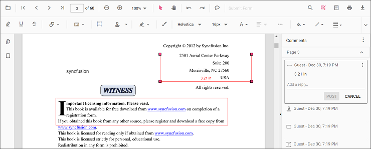
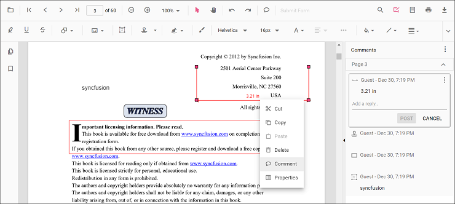
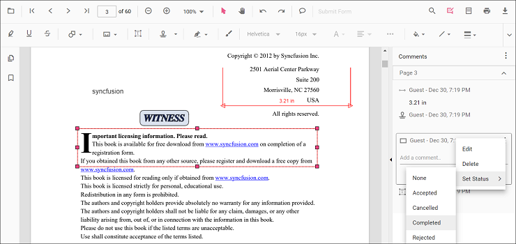
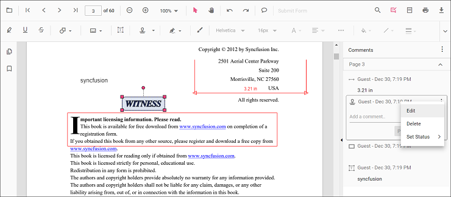
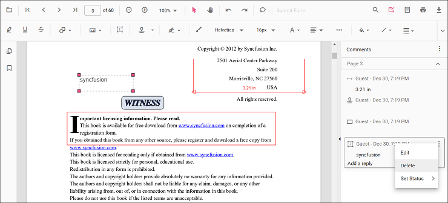

# Comments in Vue PDF Viewer control

The PDF Viewer control provides options to add, edit, and delete comments for the following annotations in PDF documents:

* Shape annotation
* Stamp annotation
* Sticky note annotation
* Measurement annotation
* Text markup annotation
* Free text annotation
* Ink annotation

## Adding a comment to the annotation

Annotation comments, replies, and status can be managed in the PDF document using the comment panel.

### Comment panel

Annotation comments can be added to the PDF using the comment panel. The comment panel can be opened in the following ways:

1. Using the annotation menu

    * Click the Edit Annotation button in the PDF Viewer toolbar. A toolbar appears below it.
    * Click the Comment Panel button. The comment panel opens.

2. Using Context menu

    * Select the annotation in the PDF document and right-click it.
    * Select Comment from the context menu.

3. Using the Mouse click

    * Select the annotation in the PDF document and double-click it. The comment panel opens.

If the comment panel is already open, select the annotation and add comments using the panel.

### Adding comments

* Select the annotation in the PDF document.
* The corresponding comment thread is highlighted in the comment panel.
* Add comments and replies using the comment panel.

### Adding Comment Replies

* Multiple replies can be added to a comment.
* After adding a comment, add replies as needed.

### Adding Comment or Reply Status

* Select the annotation comment in the comment panel.
* Click More options in the comment or reply container.
* Select Set Status from the context menu.
* Choose a status for the comment.

### Editing the comments and comments replies of the annotations

Comments, replies, and status can be edited using the comment panel.

### Editing the Comment or Comment Replies

Edit comments and replies in the following ways:

1. Using the Context menu

    * Select the annotation comment in the comment panel.
    * Click More options in the comment or reply container.
    * Select Edit from the context menu.
    * An editable text box appears. Change the content of the comment or reply.

2. Using the Mouse Click

    * Select the annotation comment in the comment panel.
    * Double-click the comment or reply content.
    * An editable text box appears. Change the content of the comment or reply.

### Editing Comment or Reply Status

* Select the annotation comment in the comment panel.
* Click More options in the comment or reply container.
* Select Set Status from the context menu.
* Choose a status for the comment.
* None is the default state. Selecting None clears the status indicator; the comment or reply remains visible.

### Delete Comment or Comment Replies

* Select the annotation comment in the comment panel.
* Click More options in the comment or reply container.
* Select Delete from the context menu.

## How to check the comments added by the user

Comments added to the PDF document can be read using the annotation's `comments` property.

The following example logs comments in response to a button click.




<template>
  

    <button id="checkComments">Check the Comments</button>
    <ejs-pdfviewer id="pdfViewer" ref="pdfviewer" :documentPath="documentPath" :resourceUrl="resourceUrl"
      :documentLoad="documentLoad">
    </ejs-pdfviewer>
  

</template>







>The annotation will be deleted on deleting the comment using comment panel.
