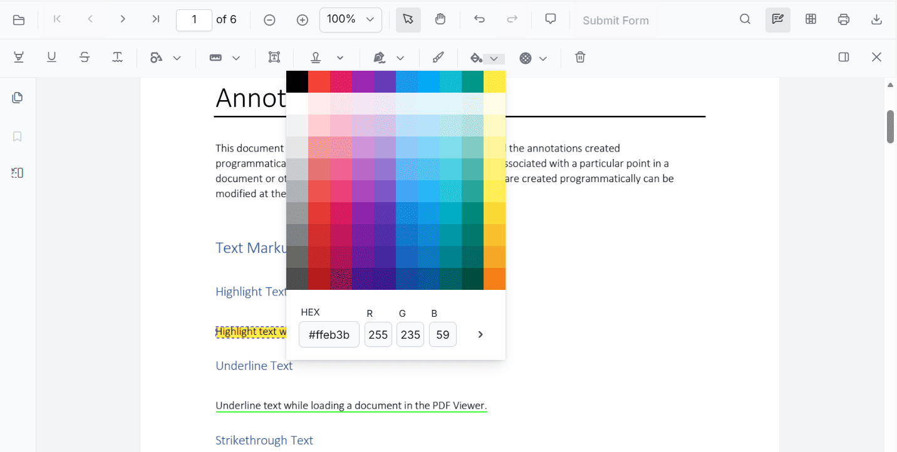
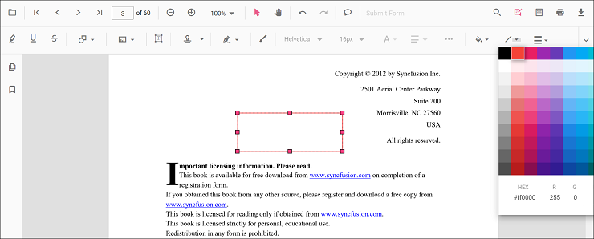
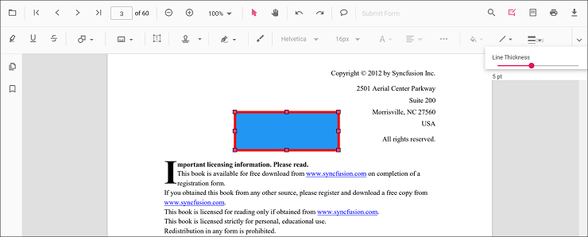
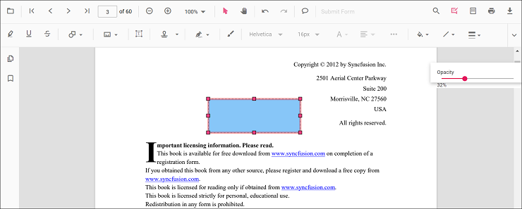

# Customize annotations in Vue

Annotation appearance and behavior (for example color, stroke color, thickness, and opacity) can be customized using the built‑in UI or programmatically. This page summarizes common customization patterns and shows how to set defaults per annotation type.

## Customize via UI

Use the annotation toolbar after selecting an annotation:
- Edit color: changes the annotation fill/text color

- Edit stroke color: changes border or line color for shapes and lines types.

- Edit thickness: adjusts border or line thickness

- Edit opacity: adjusts transparency

Type‑specific options (for example, Line properties) are available from the context menu (right‑click > Properties) where supported.

## Set default properties during initialization

Set defaults for specific annotation types when creating the `PdfViewer` instance. Configure properties such as author, subject, color, and opacity using annotation settings. The examples below reference settings used on the annotation type pages.

Text markup annotations:

- Highlight: Set default properties before creating the control using [`highlightSettings`](../annotation-types/highlight-annotation)
- Strikethrough: Use [`strikethroughSettings`](../annotation-types/strikethrough-annotation)
- Underline: Use [`underlineSettings`](../annotation-types/underline-annotation)
- Squiggly: Use [`squigglySettings`](../annotation-types/squiggly-annotation)

Shape annotations:

- Line: Use [`lineSettings`](../annotation-types/line-annotation)
- Arrow: Use [`arrowSettings`](../annotation-types/arrow-annotation)
- Rectangle: Use [`rectangleSettings`](../annotation-types/rectangle-annotation)
- Circle: Use [`circleSettings`](../annotation-types/circle-annotation)
- Polygon: Use [`polygonSettings`](../annotation-types/polygon-annotation)

Measurement annotations:

- Distance: Use [`distanceSettings`](../annotation-types/distance-annotation)
- Perimeter: Use [`perimeterSettings`](../annotation-types/perimeter-annotation)
- Area: Use [`areaSettings`](../annotation-types/area-annotation)
- Radius: Use [`radiusSettings`](../annotation-types/radius-annotation)
- Volume: Use [`volumeSettings`](../annotation-types/volume-annotation)

Other annotations:

- Free Text: Use [`freeTextSettings`](../annotation-types/free-text-annotation)
- Ink: Use [`inkSettings`](../annotation-types/ink-annotation)
- Stamp: Use [`stampSettings`](../annotation-types/stamp-annotation)
- Sticky Notes: Use [`stickyNotesSettings`](../annotation-types/sticky-notes-annotation)
- Redaction: Use [`redactionSettings`](../annotation-types/redaction-annotation)

### Example: Set highlight defaults




<template>
  

    <ejs-pdfviewer 
      id="pdfViewer" 
      :documentPath="documentPath" 
      :resourceUrl="resourceUrl"
      :highlightSettings="highlightSettings"
      style="height: 650px;">
    </ejs-pdfviewer>
  

</template>




### Example: Set shape defaults (Rectangle and Circle)




<template>
  

    <ejs-pdfviewer 
      id="pdfViewer" 
      :documentPath="documentPath" 
      :resourceUrl="resourceUrl"
      :rectangleSettings="rectangleSettings"
      :circleSettings="circleSettings"
      style="height: 650px;">
    </ejs-pdfviewer>
  

</template>




### Example: Set measurement annotation defaults




<template>
  

    <ejs-pdfviewer 
      id="pdfViewer" 
      :documentPath="documentPath" 
      :resourceUrl="resourceUrl"
      :distanceSettings="distanceSettings"
      style="height: 650px;">
    </ejs-pdfviewer>
  

</template>




## Modify annotation at runtime

Annotations can be modified programmatically after they are created. Retrieve an annotation from the collection, update its properties, and apply the changes using `editAnnotation()`.




<template>
  

    

      <button @click="modifyAnnotation">Modify Selected Annotation</button>
    

    <ejs-pdfviewer 
      id="pdfViewer" 
      ref="pdfviewer"
      :documentPath="documentPath" 
      :resourceUrl="resourceUrl"
      style="height: 600px;">
    </ejs-pdfviewer>
  

</template>




## See also

- [Annotation Overview](../overview)
- [Annotation Types](../annotation-types)
- [Create and Modify Annotation](./create-modify-annotation)
- [Annotation Toolbar](../toolbar-customization)
- [Delete Annotation](./delete-annotation)
- [Annotation Events](./annotation-event)
- [Annotations API](./annotations-api)
