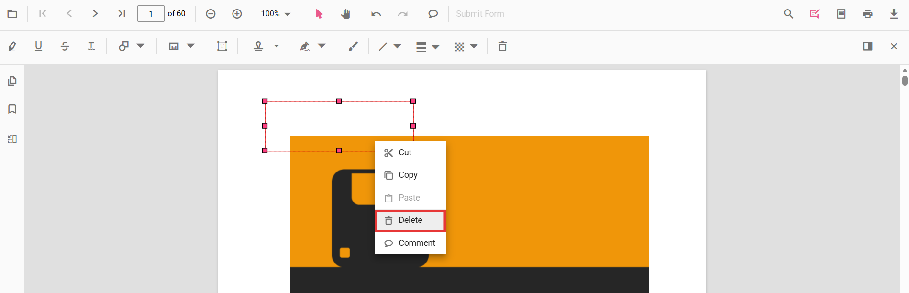
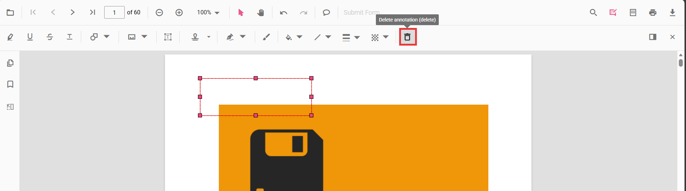

# Remove annotations in Vue

Annotations can be removed using the built-in UI or programmatically. This page shows common methods to delete annotations in the viewer.

## Delete via UI

A selected annotation can be deleted in three ways:

- Context menu: right-click the annotation and choose Delete.

- Annotation toolbar: select the annotation and click the Delete button on the annotation toolbar.

- Keyboard: select the annotation and press the `Delete` key.

## Delete programmatically

Annotations can be deleted programmatically either by removing the currently selected annotation or by specifying an annotation id.




<template>
  

    

      <button @click="deleteAnnotation">Delete Selected Annotation</button>
      <button @click="deleteAnnotationById">Delete First Annotation by ID</button>
    

    <ejs-pdfviewer 
      id="pdfViewer" 
      ref="pdfviewer"
      :documentPath="documentPath" 
      :resourceUrl="resourceUrl"
      style="height: 600px;">
    </ejs-pdfviewer>
  

</template>




N> Deleting via the API requires the annotation to exist in the current document. Ensure an annotation is selected when using `deleteAnnotation()`, or pass a valid id to `deleteAnnotationById()`.

[View Sample on GitHub](https://github.com/SyncfusionExamples/vue-pdf-viewer-examples)

## See also

- [Annotation Overview](../overview)
- [Annotation Types](../annotation-types)
- [Annotation Toolbar](../toolbar-customization)
- [Create and Modify Annotation](./create-modify-annotation)
- [Customize Annotation](./customize-annotation)
- [Handwritten Signature](../signature-annotation)
- [Export and Import Annotation](../export-import)
- [Annotation Permission](./annotation-permission)
- [Annotation in Mobile View](./annotations-in-mobile-view)
- [Annotation Events](./annotation-event)
- [Annotations API](./annotations-api)
