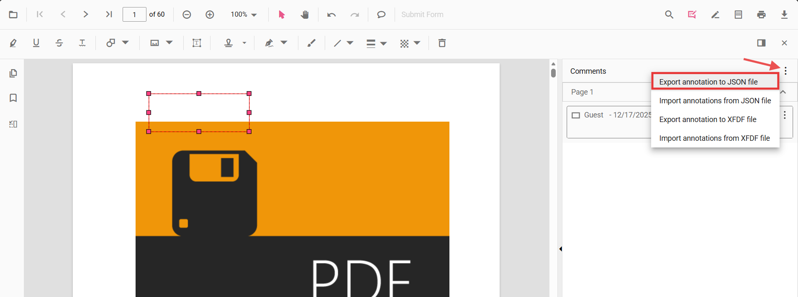

# Export annotations in Vue PDF Viewer

PDF Viewer provides support to export annotations. You can export annotations from the PDF Viewer in two ways:

- Using the built-in UI in the Comments panel (JSON or XFDF file)
- Programmatically (JSON file, XFDF file, or as a JSON string for custom handling)

## Export using the UI (Comments panel)

The Comments panel provides export actions in its overflow menu:

- Export annotation to JSON file
- Export annotation to XFDF file

Follow the steps to export annotations:

1. Open the Comments panel in the PDF Viewer.
2. Click the overflow menu (three dots) at the top of the panel.
3. Choose Export annotation to JSON file or Export annotation to XFDF file.

This generates and downloads the selected format containing all annotations in the current document.

## Export programmatically

You can export annotations from code using [exportAnnotation](https://ej2.syncfusion.com/vue/documentation/api/pdfviewer#exportannotation), [exportAnnotationsAsObject](https://ej2.syncfusion.com/vue/documentation/api/pdfviewer#exportannotationsasobject) and [exportAnnotationsAsBase64String](https://ej2.syncfusion.com/vue/documentation/api/pdfviewer#exportannotationsasbase64string) APIs.

Use the following example to initialize the viewer and export annotations as JSON, XFDF, or as an object.




<template>
  

    

      <button @click="exportAsJSON">Export JSON</button>
      <button @click="exportAsXFDF">Export XFDF</button>
      <button @click="exportAsObject">Export as Object</button>
      <button @click="exportAsBase64">Export as Base64</button>
    

    <ejs-pdfviewer
      id="pdfViewer"
      ref="pdfviewer"
      :documentPath="documentPath"
      :resourceUrl="resourceUrl"
      style="height: 650px"
    >
    </ejs-pdfviewer>
  

</template>





N> The exported annotations can be stored in a database or sent to a server for persistence. Use the appropriate API based on your storage and serialization requirements.

## Common use cases

- Export annotations for archival and long-term storage
- Share reviewer feedback and comments with other users
- Create audit trails and compliance records
- Archive annotation data before document disposal

## See also

- [Import Annotation](./import-annotation)
- [Import/Export Events](./export-import-events)
- [Annotation Types](../annotation-types/area-annotation)
