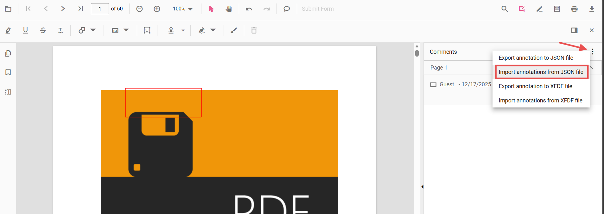

# Import annotations in Vue PDF Viewer

Annotations can be imported into the PDF Viewer using the built-in UI or programmatically. The UI accepts JSON and XFDF files from the Comments panel; programmatic import accepts a JSON string previously exported by the viewer.

## Import using the UI (Comments panel)

The Comments panel provides import options in its overflow menu:

- Import annotations from JSON file
- Import annotations from XFDF file

Steps:
1. Open the Comments panel in the PDF Viewer.
2. Click the overflow menu (three dots) at the top of the panel.
3. Choose the appropriate import option and select the file.

All annotations in the selected file are applied to the current document.

## Import programmatically (from JSON)

Import annotations from a JSON string previously exported using `exportAnnotationsAsObject()`. Only the JSON string produced by the viewer can be re-imported with the [`importAnnotation`](https://ej2.syncfusion.com/vue/documentation/api/pdfviewer#importannotation) API.

Example: export annotations as a JSON string and import them back into the viewer.




<template>
  

    

      <button @click="exportAsObject">Export as Object</button>
      <button @click="importFromObject">Import from Object</button>
    

    <ejs-pdfviewer
      id="pdfViewer"
      ref="pdfviewer"
      :documentPath="documentPath"
      :resourceUrl="resourceUrl"
      style="height: 650px"
    >
    </ejs-pdfviewer>
  

</template>





N> Only objects produced by the viewer (for example, by `exportAnnotationsAsObject()`) are compatible with `importAnnotation`. Persist exported objects in a safe storage location (database or API) and validate them before import.

## Common use cases

- Restore annotations saved earlier (for example, from a database or API)
- Apply reviewer annotations shared as JSON/XFDF files via the Comments panel
- Migrate or merge annotations between documents or sessions
- Support collaborative workflows by reloading team annotations

## See also

- [Annotation Overview](../overview)
- [Export Annotation](./export-annotation)
- [Import/Export Events](./export-import-events)
- [Annotation Types](../annotation-types/area-annotation)
