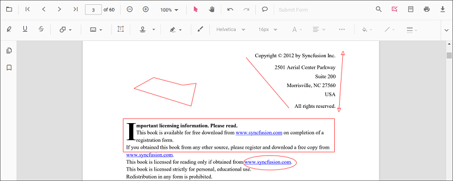
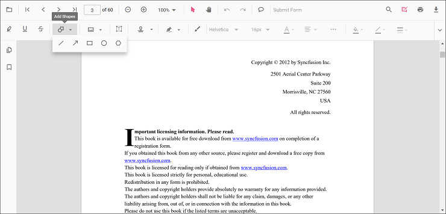
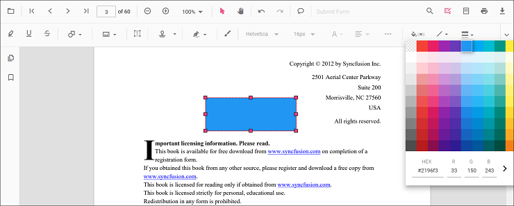
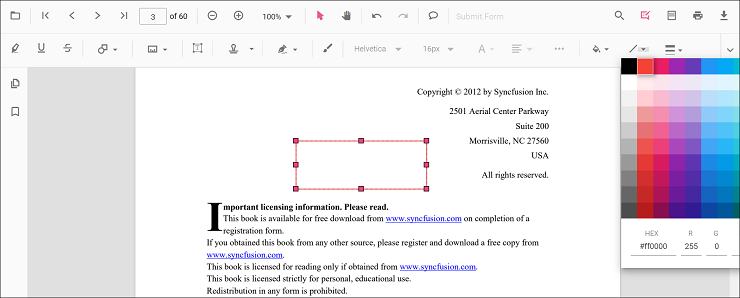
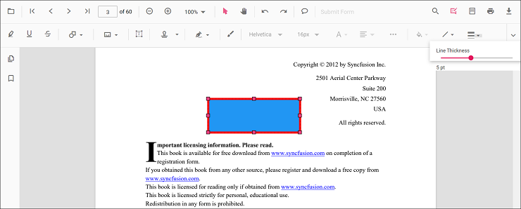
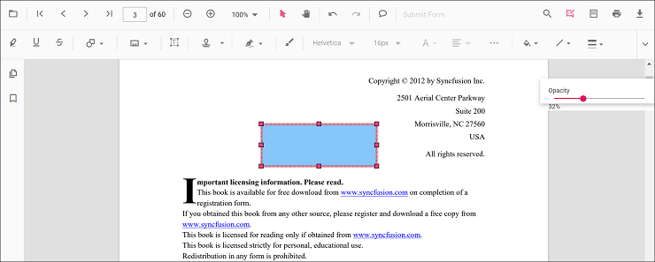
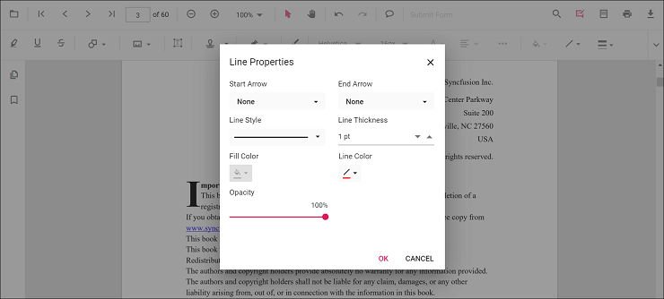

# Shape annotation in Vue PDF Viewer control

The PDF Viewer control provides options to add, edit, and delete shape annotations. The supported shape annotation types are:

* Line
* Arrow
* Rectangle
* Circle
* Polygon

## Adding a shape annotation to the PDF document

Shape annotations can be added to the PDF document using the annotation toolbar.

* Click the **Edit Annotation** button in the PDF Viewer toolbar. A toolbar appears below it.
* Click the **Shape Annotation** drop-down button. The pop-up lists available shape annotation types.
* Select a shape type to enable its annotation mode.
* Draw the shape on the pages of the PDF document.

N> When in pan mode and a shape annotation tool is selected, the PDF Viewer switches to text select mode automatically to ensure a smooth interaction experience.

Refer to the following code sample to switch to the circle annotation mode.




<template>
  

    <button id="set">Circle</button>
    <ejs-pdfviewer id="pdfViewer" ref="pdfviewer" :resourceUrl="resourceUrl" :documentPath="documentPath"
      :documentLoad="documentLoad">
    </ejs-pdfviewer>
  

</template>




<template>
  

    <button id="set">Circle</button>
    <ejs-pdfviewer id="pdfViewer" ref="pdfviewer" :resourceUrl="resourceUrl" :documentPath="documentPath"
      :documentLoad="documentLoad">
    </ejs-pdfviewer>
  

</template>




<template>
  

    <button id="set">Circle</button>
    <ejs-pdfviewer id="pdfViewer" ref="pdfviewer" :documentPath="documentPath" :serviceUrl="serviceUrl"
      :documentLoad="documentLoad">
    </ejs-pdfviewer>
  

</template>




<template>
  

    <button id="set">Circle</button>
    <ejs-pdfviewer id="pdfViewer" ref="pdfviewer" :documentPath="documentPath" :serviceUrl="serviceUrl"
      :documentLoad="documentLoad">
    </ejs-pdfviewer>
  

</template>




## Add a shape annotation to the PDF document programmatically

The PDF Viewer library allows adding a shape annotation programmatically using the [addAnnotation()](https://ej2.syncfusion.com/vue/documentation/api/pdfviewer/annotation/#addannotation) method.

Here is an example showing how to add shape annotations programmatically using addAnnotation():




<template>
  

    <button v-on:click="addLineAnnotation">Add Line Annotation programatically</button>
    <button v-on:click="addArrowAnnotation">Add Arrow Annotation programatically</button>
    <button v-on:click="addRectangleAnnotation">Add Rectangle Annotation programatically</button>
    <button v-on:click="addCircleAnnotation">Add Circle Annotation programatically</button>
    <button v-on:click="addPolygonAnnotation">Add Polygon Annotation programatically</button>
    <ejs-pdfviewer id="pdfViewer" ref="pdfviewer" :documentPath="documentPath" :resourceUrl="resourceUrl">
    </ejs-pdfviewer>
  

</template>




<template>
  

    <button v-on:click="addLineAnnotation">Add Line Annotation programatically</button>
    <button v-on:click="addArrowAnnotation">Add Arrow Annotation programatically</button>
    <button v-on:click="addRectangleAnnotation">Add Rectangle Annotation programatically</button>
    <button v-on:click="addCircleAnnotation">Add Circle Annotation programatically</button>
    <button v-on:click="addPolygonAnnotation">Add Polygon Annotation programatically</button>
    <ejs-pdfviewer id="pdfViewer" ref="pdfviewer" :documentPath="documentPath" :resourceUrl="resourceUrl">
    </ejs-pdfviewer>
  

</template>




<template>
  

    <button v-on:click="addLineAnnotation">Add Line Annotation programatically</button>
    <button v-on:click="addArrowAnnotation">Add Arrow Annotation programatically</button>
    <button v-on:click="addRectangleAnnotation">Add Rectangle Annotation programatically</button>
    <button v-on:click="addCircleAnnotation">Add Circle Annotation programatically</button>
    <button v-on:click="addPolygonAnnotation">Add Polygon Annotation programatically</button>
    <ejs-pdfviewer id="pdfViewer" ref="pdfviewer" :documentPath="documentPath" :serviceUrl="serviceUrl">
    </ejs-pdfviewer>
  

</template>




<template>
  

    <button v-on:click="addLineAnnotation">Add Line Annotation programatically</button>
    <button v-on:click="addArrowAnnotation">Add Arrow Annotation programatically</button>
    <button v-on:click="addRectangleAnnotation">Add Rectangle Annotation programatically</button>
    <button v-on:click="addCircleAnnotation">Add Circle Annotation programatically</button>
    <button v-on:click="addPolygonAnnotation">Add Polygon Annotation programatically</button>
    <ejs-pdfviewer id="pdfViewer" ref="pdfviewer" :documentPath="documentPath" :serviceUrl="serviceUrl">
    </ejs-pdfviewer>
  

</template>




## Edit an existing shape annotation programmatically

To modify an existing shape annotation programmatically, use the editAnnotation() method.

Here is an example of using editAnnotation():




<template>
  

    <button v-on:click="editLineAnnotation">Edit Line Annotation programatically</button>
    <button v-on:click="editArrowAnnotation">Edit Arrow Annotation programatically</button>
    <button v-on:click="editRectangleAnnotation">Edit Rectangle Annotation programatically</button>
    <button v-on:click="editCircleAnnotation">Edit Circle Annotation programatically</button>
    <button v-on:click="editPolygonAnnotation">Edit Polygon Annotation programatically</button>
    <ejs-pdfviewer id="pdfViewer" ref="pdfviewer" :documentPath="documentPath" :resourceUrl="resourceUrl">
    </ejs-pdfviewer>
  

</template>




<template>
  

    <button v-on:click="editLineAnnotation">Edit Line Annotation programatically</button>
    <button v-on:click="editArrowAnnotation">Edit Arrow Annotation programatically</button>
    <button v-on:click="editRectangleAnnotation">Edit Rectangle Annotation programatically</button>
    <button v-on:click="editCircleAnnotation">Edit Circle Annotation programatically</button>
    <button v-on:click="editPolygonAnnotation">Edit Polygon Annotation programatically</button>
    <ejs-pdfviewer id="pdfViewer" ref="pdfviewer" :documentPath="documentPath" :resourceUrl="resourceUrl">
    </ejs-pdfviewer>
  

</template>




<template>
  

    <button v-on:click="editLineAnnotation">Edit Line Annotation programatically</button>
    <button v-on:click="editArrowAnnotation">Edit Arrow Annotation programatically</button>
    <button v-on:click="editRectangleAnnotation">Edit Rectangle Annotation programatically</button>
    <button v-on:click="editCircleAnnotation">Edit Circle Annotation programatically</button>
    <button v-on:click="editPolygonAnnotation">Edit Polygon Annotation programatically</button>
    <ejs-pdfviewer id="pdfViewer" ref="pdfviewer" :documentPath="documentPath" :serviceUrl="serviceUrl">
    </ejs-pdfviewer>
  

</template>




<template>
  

    <button v-on:click="editLineAnnotation">Edit Line Annotation programatically</button>
    <button v-on:click="editArrowAnnotation">Edit Arrow Annotation programatically</button>
    <button v-on:click="editRectangleAnnotation">Edit Rectangle Annotation programatically</button>
    <button v-on:click="editCircleAnnotation">Edit Circle Annotation programatically</button>
    <button v-on:click="editPolygonAnnotation">Edit Polygon Annotation programatically</button>
    <ejs-pdfviewer id="pdfViewer" ref="pdfviewer" :documentPath="documentPath" :serviceUrl="serviceUrl">
    </ejs-pdfviewer>
  

</template>




## Edit an properties of the shape annotation

The fill color, stroke color, thickness, and opacity of shape annotations can be edited using the Edit Color, Edit Stroke Color, Edit Thickness, and Edit Opacity tools in the annotation toolbar.

### Editing fill color

The fill color of the annotation can be edited using the color palette provided in the Edit Color tool.

### Editing stroke color

The stroke color of the annotation can be edited using the color palette provided in the Edit Stroke Color tool.

### Editing thickness

The thickness of the border of the annotation can be edited using the range slider provided in the Edit Thickness tool.

### Editing opacity

The opacity of the annotation can be edited using the range slider provided in the Edit Opacity tool.

### Editing the line properties

Line and arrow annotations have additional options in the Line Properties window. Open it by right-clicking a line or arrow annotation and selecting Properties from the context menu.

Refer to the following code sample to set the default annotation settings.

## Set default properties during control initialization

Default properties for shape annotations can be set before creating the control using LineSettings, ArrowSettings, RectangleSettings, CircleSettings, and PolygonSettings.




<template>
  

    <ejs-pdfviewer id="pdfViewer" ref="pdfviewer" :documentPath="documentPath" :lineSettings="lineSettings"
      :arrowSettings="arrowSettings" :rectangleSettings="rectangleSettings" :circleSettings="circleSettings"
      :polygonSettings="polygonSettings" :resourceUrl="resourceUrl">
    </ejs-pdfviewer>
  

</template>




<template>
  

    <ejs-pdfviewer id="pdfViewer" ref="pdfviewer" :documentPath="documentPath" :lineSettings="lineSettings"
      :arrowSettings="arrowSettings" :rectangleSettings="rectangleSettings" :circleSettings="circleSettings"
      :polygonSettings="polygonSettings" :resourceUrl="resourceUrl">
    </ejs-pdfviewer>
  

</template>




<template>
  

    <ejs-pdfviewer id="pdfViewer" ref="pdfviewer" :serviceUrl="serviceUrl" :documentPath="documentPath"
      :lineSettings="lineSettings" :arrowSettings="arrowSettings" :rectangleSettings="rectangleSettings"
      :circleSettings="circleSettings" :polygonSettings="polygonSettings">
    </ejs-pdfviewer>
  

</template>




<template>
  

    <ejs-pdfviewer id="pdfViewer" ref="pdfviewer" :serviceUrl="serviceUrl" :documentPath="documentPath"
      :lineSettings="lineSettings" :arrowSettings="arrowSettings" :rectangleSettings="rectangleSettings"
      :circleSettings="circleSettings" :polygonSettings="polygonSettings">
    </ejs-pdfviewer>
  

</template>


