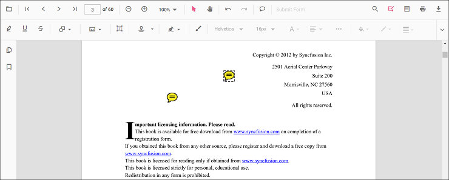
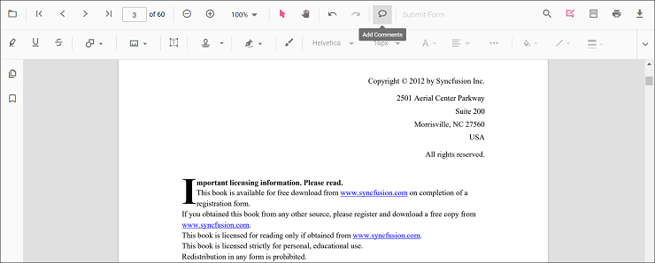
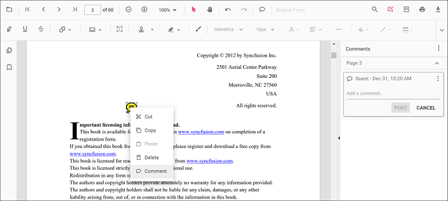
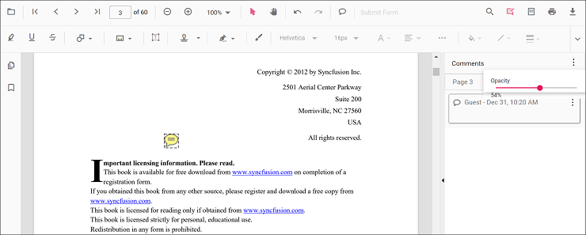
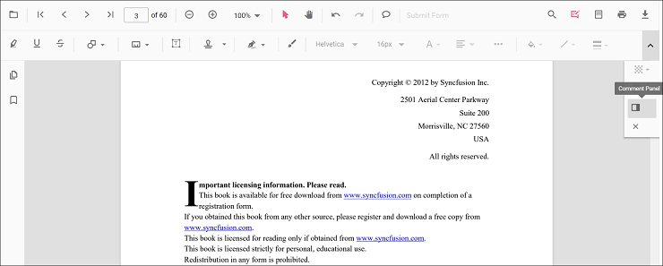
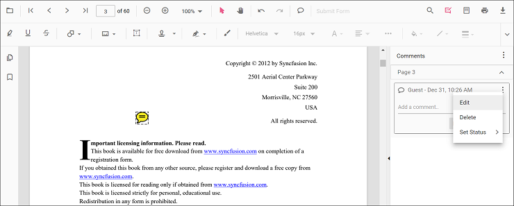

# Sticky notes annotation in Vue PDF Viewer control

The PDF Viewer control provides options to add, edit, and delete sticky note annotations in the PDF document.

## Add a sticky note annotation to the PDF document

Sticky note annotations can be added to the PDF document using the annotation toolbar.

* Click the **Comments** button in the PDF Viewer toolbar. The annotation toolbar appears below it.
* Click the position where the sticky note annotation should be added.
* The sticky note annotation is added at the clicked position.

Annotation comments can be added using the comment panel.

* Select a sticky note annotation in the PDF document and right-click it.
* Select Comment from the context menu.
* Add comments, replies, and status using the comment panel.

## Add a sticky note annotation to the PDF document programmatically

The PDF Viewer library allows adding a sticky note annotation programmatically using the [addAnnotation()](https://ej2.syncfusion.com/vue/documentation/api/pdfviewer/annotation#addannotation) method.

Here is an example showing how to add a sticky note annotation programmatically using addAnnotation():




<template>
  

    <button v-on:click="addAnnotation">Add Annotation programatically</button>
    <ejs-pdfviewer id="pdfViewer" ref="pdfviewer" :documentPath="documentPath" :resourceUrl="resourceUrl">
    </ejs-pdfviewer>
  

</template>




<template>
  

    <button v-on:click="addAnnotation">Add Annotation programatically</button>
    <ejs-pdfviewer id="pdfViewer" ref="pdfviewer" :documentPath="documentPath" :resourceUrl="resourceUrl">
    </ejs-pdfviewer>
  

</template>




<template>
  

    <button v-on:click="addAnnotation">Add Annotation programatically</button>
    <ejs-pdfviewer id="pdfViewer" ref="pdfviewer" :documentPath="documentPath" :serviceUrl="serviceUrl">
    </ejs-pdfviewer>
  

</template>




<template>
  

    <button v-on:click="addAnnotation">Add Annotation programatically</button>
    <ejs-pdfviewer id="pdfViewer" ref="pdfviewer" :documentPath="documentPath" :serviceUrl="serviceUrl">
    </ejs-pdfviewer>
  

</template>




## Edit an existing sticky note annotation programmatically

To modify an existing sticky note annotation programmatically, use the editAnnotation() method.

Here is an example of using editAnnotation():




<template>
  

    <button v-on:click="editAnnotation">Edit Annotation programatically</button>
    <ejs-pdfviewer id="pdfViewer" ref="pdfviewer" :documentPath="documentPath" :resourceUrl="resourceUrl">
    </ejs-pdfviewer>
  

</template>




<template>
  

    <button v-on:click="editAnnotation">Edit Annotation programatically</button>
    <ejs-pdfviewer id="pdfViewer" ref="pdfviewer" :documentPath="documentPath" :resourceUrl="resourceUrl">
    </ejs-pdfviewer>
  

</template>




<template>
  

    <button v-on:click="editAnnotation">Edit Annotation programatically</button>
    <ejs-pdfviewer id="pdfViewer" ref="pdfviewer" :documentPath="documentPath" :serviceUrl="serviceUrl">
    </ejs-pdfviewer>
  

</template>




<template>
  

    <button v-on:click="editAnnotation">Edit Annotation programatically</button>
    <ejs-pdfviewer id="pdfViewer" ref="pdfviewer" :documentPath="documentPath" :serviceUrl="serviceUrl">
    </ejs-pdfviewer>
  

</template>




## Edit the properties of sticky note annotations

### Editing opacity

Edit opacity using the range slider in the Edit Opacity tool.

### Editing comments

Comment text, replies, and status can be edited using the comment panel.

* Open the comment panel using the Comment Panel button in the annotation toolbar.

Modify or delete comments or replies, and change status using the menu options in the comment panel.

## Set default properties during control initialization

Default properties for sticky note annotations can be set before creating the control using StickyNotesSettings.

After changing default opacity using the Edit Opacity tool, the selected value is applied. The following example sets default sticky note annotation settings.




<template>
  

    <ejs-pdfviewer id="pdfViewer" ref="pdfviewer" :documentPath="documentPath" :resourceUrl="resourceUrl"
      :stickyNotesSettings="stickyNotesSettings">
    </ejs-pdfviewer>
  

</template>




<template>
  

    <ejs-pdfviewer id="pdfViewer" ref="pdfviewer" :documentPath="documentPath" :resourceUrl="resourceUrl"
      :stickyNotesSettings="stickyNotesSettings">
    </ejs-pdfviewer>
  

</template>




<template>
  

    <ejs-pdfviewer id="pdfViewer" ref="pdfviewer" :serviceUrl="serviceUrl" :documentPath="documentPath"
      :stickyNotesSettings="stickyNotesSettings">
    </ejs-pdfviewer>
  

</template>




<template>
  

    <ejs-pdfviewer id="pdfViewer" ref="pdfviewer" :serviceUrl="serviceUrl" :documentPath="documentPath"
      :stickyNotesSettings="stickyNotesSettings">
    </ejs-pdfviewer>
  

</template>




## Disable sticky note annotations

The PDF Viewer control provides an option to disable sticky note annotations. The following example disables the feature.




<template>
  

    <ejs-pdfviewer id="pdfViewer" ref="pdfviewer" :documentPath="documentPath" :resourceUrl="resourceUrl"
      :enableStickyNotesAnnotation="enableStickyNotesAnnotation">
    </ejs-pdfviewer>
  

</template>




<template>
  

    <ejs-pdfviewer id="pdfViewer" ref="pdfviewer" :documentPath="documentPath" :resourceUrl="resourceUrl"
      :enableStickyNotesAnnotation="enableStickyNotesAnnotation">
    </ejs-pdfviewer>
  

</template>




<template>
  

    <ejs-pdfviewer id="pdfViewer" ref="pdfviewer" :serviceUrl="serviceUrl" :documentPath="documentPath"
      :enableStickyNotesAnnotation="enableStickyNotesAnnotation">
    </ejs-pdfviewer>
  

</template>




<template>
  

    <ejs-pdfviewer id="pdfViewer" ref="pdfviewer" :serviceUrl="serviceUrl" :documentPath="documentPath"
      :enableStickyNotesAnnotation="enableStickyNotesAnnotation">
    </ejs-pdfviewer>
  

</template>


