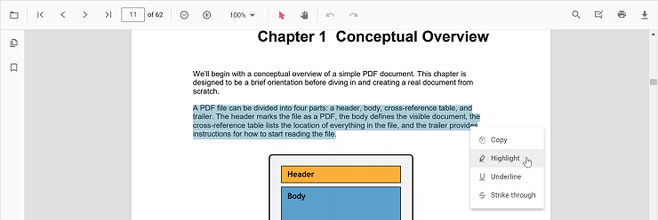
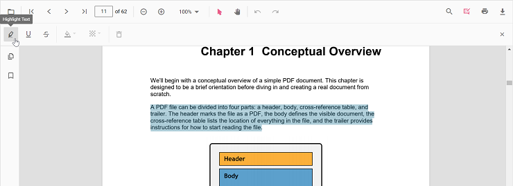
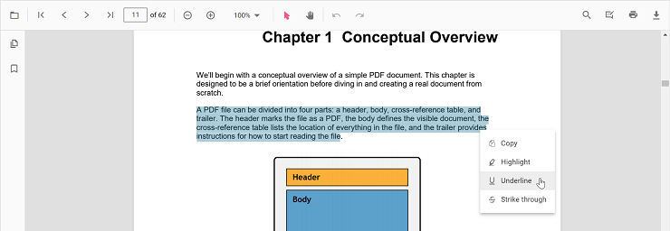
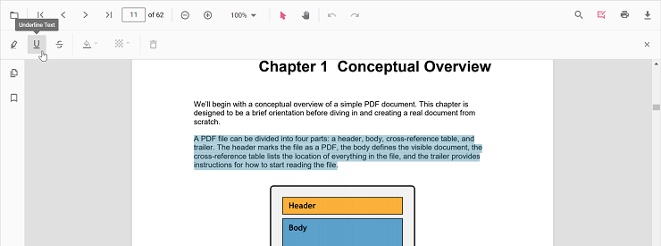
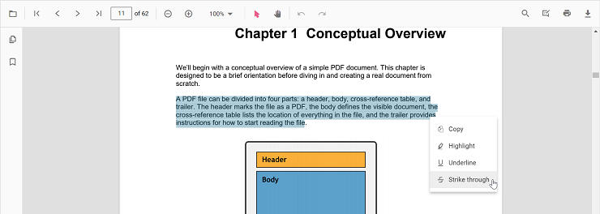
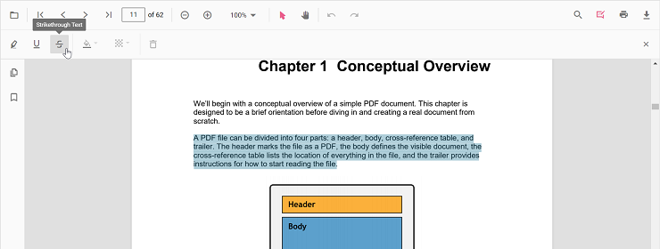
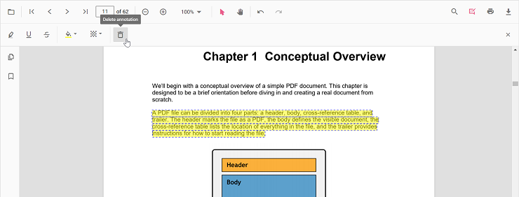
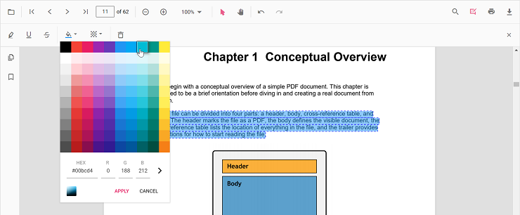
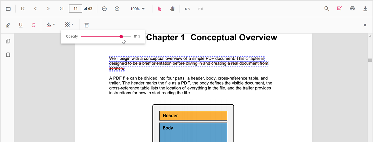

# Text markup annotation in Vue PDF Viewer

The PDF Viewer provides options to add, edit, and delete text markup annotations, including highlight, underline, strikethrough, and squiggly.

## Highlight text

There are two ways to highlight text:

1.Using the context menu
  * Select text in the PDF document and right-click it.
  * Select **Highlight** in the context menu.

  

<!-- markdownlint-disable MD029 -->
2.Using the annotation toolbar
  * Click the **Edit Annotation** button in the PDF Viewer toolbar to open the annotation toolbar.
  * Select **Highlight** to enable highlight mode.
  * Select text to add the highlight annotation.
  * Alternatively, select text first and then click **Highlight**.

  

When pan mode is active and a text markup mode is entered, the PDF Viewer switches to text selection mode to enable selection.

Refer to the following code snippet to switch to highlight mode.




<template>
  

    <button id="set">Highlight</button>
    <ejs-pdfviewer id="pdfViewer" ref="pdfviewer" :documentPath="documentPath" :resourceUrl="resourceUrl"
      :documentLoad="documentLoad">
    </ejs-pdfviewer>
  

</template>




<template>
  

    <button id="set">Highlight</button>
    <ejs-pdfviewer id="pdfViewer" ref="pdfviewer" :documentPath="documentPath" :resourceUrl="resourceUrl"
      :documentLoad="documentLoad">
    </ejs-pdfviewer>
  

</template>




<template>
  

    <button id="set">Highlight</button>
    <ejs-pdfviewer id="pdfViewer" ref="pdfviewer" :serviceUrl="serviceUrl" :documentPath="documentPath"
      :documentLoad="documentLoad">
    </ejs-pdfviewer>
  

</template>




<template>
  

    <button id="set">Highlight</button>
    <ejs-pdfviewer id="pdfViewer" ref="pdfviewer" :serviceUrl="serviceUrl" :documentPath="documentPath"
      :documentLoad="documentLoad">
    </ejs-pdfviewer>
  

</template>




Refer to the following code snippet to switch back to normal mode from highlight mode.




<template>
  

    <button id="set">Highlight</button>
    <button id="setNone">Normal Mode</button>
    <ejs-pdfviewer id="pdfViewer" ref="pdfviewer" :documentPath="documentPath" :resourceUrl="resourceUrl"
      :documentLoad="documentLoad">
    </ejs-pdfviewer>
  

</template>




<template>
  

    <button id="set">Highlight</button>
    <button id="setNone">Normal Mode</button>
    <ejs-pdfviewer id="pdfViewer" ref="pdfviewer" :documentPath="documentPath" :resourceUrl="resourceUrl"
      :documentLoad="documentLoad">
    </ejs-pdfviewer>
  

</template>




<template>
  

    <button id="set">Highlight</button>
    <button id="setNone">Normal Mode</button>
    <ejs-pdfviewer id="pdfViewer" ref="pdfviewer" :serviceUrl="serviceUrl" :documentPath="documentPath"
      :documentLoad="documentLoad">
    </ejs-pdfviewer>
  

</template>




<template>
  

    <button id="set">Highlight</button>
    <button id="setNone">Normal Mode</button>
    <ejs-pdfviewer id="pdfViewer" ref="pdfviewer" :serviceUrl="serviceUrl" :documentPath="documentPath"
      :documentLoad="documentLoad">
    </ejs-pdfviewer>
  

</template>




## Highlight text programmatically

Programmatically add highlights using the [addAnnotation()](https://ej2.syncfusion.com/vue/documentation/api/pdfviewer/annotation#addannotation) method.

Example:




<template>
  

    <button v-on:click="addAnnotation">Add Annotation programatically</button>
    <ejs-pdfviewer id="pdfViewer" ref="pdfviewer" :documentPath="documentPath" :resourceUrl="resourceUrl">
    </ejs-pdfviewer>
  

</template>




<template>
  

    <button v-on:click="addAnnotation">Add Annotation programatically</button>
    <ejs-pdfviewer id="pdfViewer" ref="pdfviewer" :documentPath="documentPath" :resourceUrl="resourceUrl">
    </ejs-pdfviewer>
  

</template>




<template>
  

    <button v-on:click="addAnnotation">Add Annotation programatically</button>
    <ejs-pdfviewer id="pdfViewer" ref="pdfviewer" :documentPath="documentPath" :serviceUrl="serviceUrl">
    </ejs-pdfviewer>
  

</template>




<template>
  

    <button v-on:click="addAnnotation">Add Annotation programatically</button>
    <ejs-pdfviewer id="pdfViewer" ref="pdfviewer" :documentPath="documentPath" :serviceUrl="serviceUrl">
    </ejs-pdfviewer>
  

</template>




## Underline text

There are two ways to underline text:

1.Using the context menu
    * Select text in the PDF document and right-click it.
    * Select **Underline** in the context menu.

  

<!-- markdownlint-disable MD029 -->
2.Using the annotation toolbar
    * Click the **Edit Annotation** button in the PDF Viewer toolbar to open the annotation toolbar.
    * Select **Underline** to enable underline mode.
    * Select text to add the underline annotation.
    * Alternatively, select text first and then click **Underline**.

  

In the pan mode, if the underline mode is entered, the PDF Viewer control will switch to text select mode to enable the text selection for underlining the text.

Refer to the following code snippet to switch to underline mode.




<template>
  

    <button id="set">Underline</button>
    <ejs-pdfviewer id="pdfViewer" ref="pdfviewer" :documentPath="documentPath" :resourceUrl="resourceUrl"
      :documentLoad="documentLoad">
    </ejs-pdfviewer>
  

</template>




<template>
  

    <button id="set">Underline</button>
    <ejs-pdfviewer id="pdfViewer" ref="pdfviewer" :documentPath="documentPath" :resourceUrl="resourceUrl"
      :documentLoad="documentLoad">
    </ejs-pdfviewer>
  

</template>




<template>
  

    <button id="set">Underline</button>
    <ejs-pdfviewer id="pdfViewer" ref="pdfviewer" :serviceUrl="serviceUrl" :documentPath="documentPath"
      :documentLoad="documentLoad">
    </ejs-pdfviewer>
  

</template>




<template>
  

    <button id="set">Underline</button>
    <ejs-pdfviewer id="pdfViewer" ref="pdfviewer" :serviceUrl="serviceUrl" :documentPath="documentPath"
      :documentLoad="documentLoad">
    </ejs-pdfviewer>
  

</template>




Refer to the following code snippet to switch back to normal mode from underline mode.




<template>
  

    <button id="set">Underline</button>
    <button id="setNone">Normal Mode</button>
    <ejs-pdfviewer id="pdfViewer" ref="pdfviewer" :documentPath="documentPath" :documentLoad="documentLoad"
      :resourceUrl="resourceUrl">
    </ejs-pdfviewer>
  

</template>




<template>
  

    <button id="set">Underline</button>
    <button id="setNone">Normal Mode</button>
    <ejs-pdfviewer id="pdfViewer" ref="pdfviewer" :documentPath="documentPath" :documentLoad="documentLoad"
      :resourceUrl="resourceUrl">
    </ejs-pdfviewer>
  

</template>




<template>
  

    <button id="set">Underline</button>
    <button id="setNone">Normal Mode</button>
    <ejs-pdfviewer id="pdfViewer" ref="pdfviewer" :serviceUrl="serviceUrl" :documentPath="documentPath"
      :documentLoad="documentLoad">
    </ejs-pdfviewer>
  

</template>




<template>
  

    <button id="set">Underline</button>
    <button id="setNone">Normal Mode</button>
    <ejs-pdfviewer id="pdfViewer" ref="pdfviewer" :serviceUrl="serviceUrl" :documentPath="documentPath"
      :documentLoad="documentLoad">
    </ejs-pdfviewer>
  

</template>




## Underline a text programmatically

Programmatically add underlines using the [addAnnotation()](https://ej2.syncfusion.com/angular/documentation/api/pdfviewer/annotation#addannotation) method.

Example:




<template>
  

    <button v-on:click="addAnnotation">Add Annotation programatically</button>
    <ejs-pdfviewer id="pdfViewer" ref="pdfviewer" :documentPath="documentPath" :resourceUrl="resourceUrl">
    </ejs-pdfviewer>
  

</template>




<template>
  

    <button v-on:click="addAnnotation">Add Annotation programatically</button>
    <ejs-pdfviewer id="pdfViewer" ref="pdfviewer" :documentPath="documentPath" :resourceUrl="resourceUrl">
    </ejs-pdfviewer>
  

</template>




<template>
  

    <button v-on:click="addAnnotation">Add Annotation programatically</button>
    <ejs-pdfviewer id="pdfViewer" ref="pdfviewer" :documentPath="documentPath" :serviceUrl="serviceUrl">
    </ejs-pdfviewer>
  

</template>




<template>
  

    <button v-on:click="addAnnotation">Add Annotation programatically</button>
    <ejs-pdfviewer id="pdfViewer" ref="pdfviewer" :documentPath="documentPath" :serviceUrl="serviceUrl">
    </ejs-pdfviewer>
  

</template>




## Strikethrough text

There are two ways to strikethrough text:

1.Using the context menu
      * Select text in the PDF document and right-click it.
      * Select **Strikethrough** in the context menu.

  

<!-- markdownlint-disable MD029 -->
2.Using the annotation toolbar
      * Click the **Edit Annotation** button in the PDF Viewer toolbar to open the annotation toolbar.
      * Select **Strikethrough** to enable strikethrough mode.
      * Select text to add the strikethrough annotation.
      * Alternatively, select text first and then click **Strikethrough**.

  

N> While in pan mode, clicking the strikethrough button switches the viewer to text select mode so text can be selected for annotation.

Refer to the following code snippet to switch to strikethrough mode.




<template>
  

    <button id="set">Strikethrough</button>
    <ejs-pdfviewer id="pdfViewer" ref="pdfviewer" :resourceUrl="resourceUrl" :documentPath="documentPath"
      :documentLoad="documentLoad">
    </ejs-pdfviewer>
  

</template>




<template>
  

    <button id="set">Strikethrough</button>
    <ejs-pdfviewer id="pdfViewer" ref="pdfviewer" :resourceUrl="resourceUrl" :documentPath="documentPath"
      :documentLoad="documentLoad">
    </ejs-pdfviewer>
  

</template>




<template>
  

    <button id="set">Strikethrough</button>
    <ejs-pdfviewer id="pdfViewer" ref="pdfviewer" :serviceUrl="serviceUrl" :documentPath="documentPath"
      :documentLoad="documentLoad">
    </ejs-pdfviewer>
  

</template>




<template>
  

    <button id="set">Strikethrough</button>
    <ejs-pdfviewer id="pdfViewer" ref="pdfviewer" :serviceUrl="serviceUrl" :documentPath="documentPath"
      :documentLoad="documentLoad">
    </ejs-pdfviewer>
  

</template>




Refer to the following code snippet to switch back to normal mode from strikethrough mode.




<template>
  

    <button id="set">Strikethrough</button>
    <button id="setNone">Normal Mode</button>
    <ejs-pdfviewer id="pdfViewer" ref="pdfviewer" :documentPath="documentPath" :resourceUrl="resourceUrl"
      :documentLoad="documentLoad">
    </ejs-pdfviewer>
  

</template>




<template>
  

    <button id="set">Strikethrough</button>
    <button id="setNone">Normal Mode</button>
    <ejs-pdfviewer id="pdfViewer" ref="pdfviewer" :documentPath="documentPath" :resourceUrl="resourceUrl"
      :documentLoad="documentLoad">
    </ejs-pdfviewer>
  

</template>




<template>
  

    <button id="set">Strikethrough</button>
    <button id="setNone">Normal Mode</button>
    <ejs-pdfviewer id="pdfViewer" ref="pdfviewer" :serviceUrl="serviceUrl" :documentPath="documentPath"
      :documentLoad="documentLoad">
    </ejs-pdfviewer>
  

</template>




<template>
  

    <button id="set">Strikethrough</button>
    <button id="setNone">Normal Mode</button>
    <ejs-pdfviewer id="pdfViewer" ref="pdfviewer" :serviceUrl="serviceUrl" :documentPath="documentPath"
      :documentLoad="documentLoad">
    </ejs-pdfviewer>
  

</template>




## Strikethrough text programmatically

Programmatically add strikethrough using the [addAnnotation](https://ej2.syncfusion.com/vue/documentation/api/pdfviewer/annotation#addannotation) method.

Here's an example of how you can use the **addAnnotation()** method to apply Strikethrough programmatically:




<template>
  

    <button v-on:click="addAnnotation">Add Annotation programatically</button>
    <ejs-pdfviewer id="pdfViewer" ref="pdfviewer" :documentPath="documentPath" :resourceUrl="resourceUrl">
    </ejs-pdfviewer>
  

</template>




<template>
  

    <button v-on:click="addAnnotation">Add Annotation programatically</button>
    <ejs-pdfviewer id="pdfViewer" ref="pdfviewer" :documentPath="documentPath" :resourceUrl="resourceUrl">
    </ejs-pdfviewer>
  

</template>




<template>
  

    <button v-on:click="addAnnotation">Add Annotation programatically</button>
    <ejs-pdfviewer id="pdfViewer" ref="pdfviewer" :documentPath="documentPath" :serviceUrl="serviceUrl">
    </ejs-pdfviewer>
  

</template>




<template>
  

    <button v-on:click="addAnnotation">Add Annotation programatically</button>
    <ejs-pdfviewer id="pdfViewer" ref="pdfviewer" :documentPath="documentPath" :serviceUrl="serviceUrl">
    </ejs-pdfviewer>
  

</template>




## Add squiggly to text

There are two ways to add squiggly to text:

1.Using the context menu
      * Select text in the PDF document and right-click it.
      * Select **Squiggly** in the context menu.

  

<!-- markdownlint-disable MD029 -->
2.Using the annotation toolbar
      * Click the **Edit Annotation** button in the PDF Viewer toolbar. A toolbar appears below it.
      * Select the **Squiggly** button in the annotation toolbar. It enables the squiggly mode.
      * Select the text and the squiggly annotation will be added.
      * You can also select the text and apply the squiggly annotation using the **Squiggly** button.

  

N> While in pan mode, clicking the squiggly button switches the viewer to text select mode so text can be selected for annotation.

Refer to the following code snippet to switch to squiggly mode.




<template>
  

    <button id="set">Squiggly</button>
    <ejs-pdfviewer id="pdfViewer" ref="pdfviewer" :resourceUrl="resourceUrl" :documentPath="documentPath"
      :documentLoad="documentLoad">
    </ejs-pdfviewer>
  

</template>




<template>
  

    <button id="set">Squiggly</button>
    <ejs-pdfviewer id="pdfViewer" ref="pdfviewer" :resourceUrl="resourceUrl" :documentPath="documentPath"
      :documentLoad="documentLoad">
    </ejs-pdfviewer>
  

</template>




<template>
  

    <button id="set">Squiggly</button>
    <ejs-pdfviewer id="pdfViewer" ref="pdfviewer" :serviceUrl="serviceUrl" :documentPath="documentPath"
      :documentLoad="documentLoad">
    </ejs-pdfviewer>
  

</template>




<template>
  

    <button id="set">Squiggly</button>
    <ejs-pdfviewer id="pdfViewer" ref="pdfviewer" :serviceUrl="serviceUrl" :documentPath="documentPath"
      :documentLoad="documentLoad">
    </ejs-pdfviewer>
  

</template>




Refer to the following code snippet to switch back to normal mode from squiggly mode.




<template>
  

    <button id="set">Squiggly</button>
    <button id="setNone">Normal Mode</button>
    <ejs-pdfviewer id="pdfViewer" ref="pdfviewer" :documentPath="documentPath" :resourceUrl="resourceUrl"
      :documentLoad="documentLoad">
    </ejs-pdfviewer>
  

</template>




<template>
  

    <button id="set">Squiggly</button>
    <button id="setNone">Normal Mode</button>
    <ejs-pdfviewer id="pdfViewer" ref="pdfviewer" :documentPath="documentPath" :resourceUrl="resourceUrl"
      :documentLoad="documentLoad">
    </ejs-pdfviewer>
  

</template>




<template>
  

    <button id="set">Squiggly</button>
    <button id="setNone">Normal Mode</button>
    <ejs-pdfviewer id="pdfViewer" ref="pdfviewer" :serviceUrl="serviceUrl" :documentPath="documentPath"
      :documentLoad="documentLoad">
    </ejs-pdfviewer>
  

</template>




<template>
  

    <button id="set">Squiggly</button>
    <button id="setNone">Normal Mode</button>
    <ejs-pdfviewer id="pdfViewer" ref="pdfviewer" :serviceUrl="serviceUrl" :documentPath="documentPath"
      :documentLoad="documentLoad">
    </ejs-pdfviewer>
  

</template>




## Squiggly a text programmatically

Refer to the following code snippet to switch back to normal mode from squiggly mode. Use the [addAnnotation()](https://ej2.syncfusion.com/vue/documentation/api/pdfviewer/annotation#addannotation) API to add squiggly annotations.

Here's an example of how you can use the **addAnnotation()** method to apply Squiggly programmatically:




<template>
  

    <button v-on:click="addAnnotation">Add Annotation programatically</button>
    <ejs-pdfviewer id="pdfViewer" ref="pdfviewer" :documentPath="documentPath" :resourceUrl="resourceUrl">
    </ejs-pdfviewer>
  

</template>




<template>
  

    <button v-on:click="addAnnotation">Add Annotation programatically</button>
    <ejs-pdfviewer id="pdfViewer" ref="pdfviewer" :documentPath="documentPath" :resourceUrl="resourceUrl">
    </ejs-pdfviewer>
  

</template>




<template>
  

    <button v-on:click="addAnnotation">Add Annotation programatically</button>
    <ejs-pdfviewer id="pdfViewer" ref="pdfviewer" :documentPath="documentPath" :serviceUrl="serviceUrl">
    </ejs-pdfviewer>
  

</template>




<template>
  

    <button v-on:click="addAnnotation">Add Annotation programatically</button>
    <ejs-pdfviewer id="pdfViewer" ref="pdfviewer" :documentPath="documentPath" :serviceUrl="serviceUrl">
    </ejs-pdfviewer>
  

</template>




## Deleting a text markup annotation

The selected annotation can be deleted by the following ways:

1.Using Delete key
    * Select the annotation to be deleted.
    * Click the Delete key in the keyboard. The selected annotation will be deleted.

2.Using the annotation toolbar
      * Select the annotation to be deleted.
      * Click the **Delete Annotation** button in the annotation toolbar. The selected annotation will be deleted.

  

## Edit text markup annotation properties

The color and opacity of text markup annotations can be edited using the Edit Color and Edit Opacity tools in the annotation toolbar.

### Edit color

Use the color palette in the Edit Color tool to change the annotation color.

### Edit opacity

Use the range slider in the Edit Opacity tool to change annotation opacity.

## Set default properties during control initialization

The properties of the text markup annotation can be set before creating the control using highlightSettings, underlineSettings,  strikethroughSettings, squigglySettings.

N> After editing default color and opacity with the Edit Color and Edit Opacity tools, the default values update to the selected settings.

Refer to the following code snippet to set the default annotation settings.




<template>
  

    <ejs-pdfviewer id="pdfViewer" ref="pdfviewer" :documentPath="documentPath" :resourceUrl="resourceUrl"
      :highlightSettings="highlightSettings" :underlineSettings="underlineSettings"
      :strikethroughSettings="strikethroughSettings" :squigglySettings="squigglySettings">
    </ejs-pdfviewer>
  

</template>




<template>
  

    <ejs-pdfviewer id="pdfViewer" ref="pdfviewer" :documentPath="documentPath" :resourceUrl="resourceUrl"
      :highlightSettings="highlightSettings" :underlineSettings="underlineSettings"
      :strikethroughSettings="strikethroughSettings" :squigglySettings="squigglySettings">
    </ejs-pdfviewer>
  

</template>




<template>
  

    <ejs-pdfviewer id="pdfViewer" ref="pdfviewer" :serviceUrl="serviceUrl" :documentPath="documentPath"
      :highlightSettings="highlightSettings" :underlineSettings="underlineSettings"
      :strikethroughSettings="strikethroughSettings" :squigglySettings="squigglySettings">
    </ejs-pdfviewer>
  

</template>




<template>
  

    <ejs-pdfviewer id="pdfViewer" ref="pdfviewer" :serviceUrl="serviceUrl" :documentPath="documentPath"
      :highlightSettings="highlightSettings" :underlineSettings="underlineSettings"
      :strikethroughSettings="strikethroughSettings" :squigglySettings="squigglySettings">
    </ejs-pdfviewer>
  

</template>




## Performing undo and redo

The PDF Viewer performs undo and redo for the changes made in the PDF document. In text markup annotation, undo and redo actions are provided for:

* Inclusion of the text markup annotations.
* Deletion of the text markup annotations.
* Change of either color or opacity of the text markup annotations.

Undo and redo actions can be done by the following ways:

1.Using keyboard shortcuts:
    After performing a text markup annotation action, you can undo it by using Ctrl + Z shortcut and redo by using Ctrl + Y shortcut.
2.Using toolbar:
    Undo and redo can be done using the **Undo** tool and **Redo** tool provided in the toolbar.

Refer to the following code snippet for calling undo and redo actions from the client-side.




<template>
  

    <button id="undo">Undo</button>
    <button id="redo">Redo</button>
    <ejs-pdfviewer id="pdfViewer" ref="pdfviewer" :documentPath="documentPath" :resourceUrl="resourceUrl"
      :documentLoad="documentLoad">
    </ejs-pdfviewer>
  

</template>




<template>
  

    <button id="undo">Undo</button>
    <button id="redo">Redo</button>
    <ejs-pdfviewer id="pdfViewer" ref="pdfviewer" :documentPath="documentPath" :resourceUrl="resourceUrl"
      :documentLoad="documentLoad">
    </ejs-pdfviewer>
  

</template>




<template>
  

    <button id="undo">Undo</button>
    <button id="redo">Redo</button>
    <ejs-pdfviewer id="pdfViewer" ref="pdfviewer" :serviceUrl="serviceUrl" :documentPath="documentPath"
      :documentLoad="documentLoad">
    </ejs-pdfviewer>
  

</template>




<template>
  

    <button id="undo">Undo</button>
    <button id="redo">Redo</button>
    <ejs-pdfviewer id="pdfViewer" ref="pdfviewer" :serviceUrl="serviceUrl" :documentPath="documentPath"
      :documentLoad="documentLoad">
    </ejs-pdfviewer>
  

</template>




## Saving the text markup annotation

When you click the download tool in the toolbar, the text markup annotations will be saved in the PDF document. This action will not affect the original document.

## Printing the text markup annotation

When the print tool is selected in the toolbar, the PDF document will be printed along with the text markup annotations added to the pages. This action will not affect the original document.

## Disabling text markup annotation

The PDF Viewer control provides an option to disable the text markup annotation feature. The code snippet for disabling the feature is as follows.




<template>
  

    <ejs-pdfviewer id="pdfViewer" ref="pdfviewer" :documentPath="documentPath" :resourceUrl="resourceUrl"
      :enableTextMarkupAnnotation="false">
    </ejs-pdfviewer>
  

</template>




<template>
  

    <ejs-pdfviewer id="pdfViewer" ref="pdfviewer" :documentPath="documentPath" :resourceUrl="resourceUrl"
      :enableTextMarkupAnnotation="false">
    </ejs-pdfviewer>
  

</template>




<template>
  

    <ejs-pdfviewer id="pdfViewer" ref="pdfviewer" :documentPath="documentPath" :serviceUrl="serviceUrl"
      :enableTextMarkupAnnotation="false">
    </ejs-pdfviewer>
  

</template>




<template>
  

    <ejs-pdfviewer id="pdfViewer" ref="pdfviewer" :documentPath="documentPath" :serviceUrl="serviceUrl"
      :enableTextMarkupAnnotation="false">
    </ejs-pdfviewer>
  

</template>




## See also

* [Toolbar items](../toolbar)
* [Feature Modules](../feature-module)