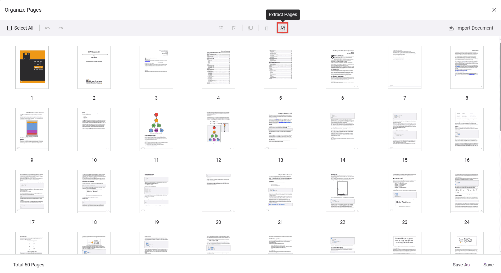
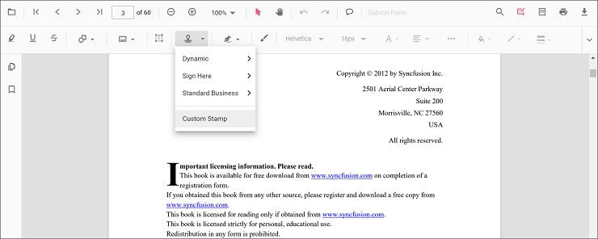

# Pre-process PDF Document Before Displaying in Vue PDF Viewer

This section explains why preprocessing is useful, what operations you can perform using the Syncfusion PDF Library, and how to load the processed document in the Vue PDF Viewer.

## Why Preprocessing Is Needed
Preprocessing a PDF before sending it to the viewer helps you:
- Reduce file size and improve load time
- Merge multiple documents into one
- Extract only required pages for faster loading
- Flatten form fields and annotations for performance & security
- Apply branding elements such as watermarks or stamps

These enhancements ensure a better, faster, and more controlled viewing experience.

## Merge PDF Documents
### UI-Level Merging
You can visually merge pages in the **Organize Pages** UI inside the PDF Viewer. Users can import another PDF, insert its pages into the current file, reorder pages, or delete unwanted pages.


### Programmatically Merge PDFs
Using the Syncfusion PDF Library, you can merge documents before loading them into the viewer.
```js
import { PdfDocument } from '@syncfusion/ej2-pdf';

const document1 = await PdfDocument.load('file1.pdf');
const document2 = await PdfDocument.load('file2.pdf');

document1.merge(document2);
const mergedBytes = await document1.save();
```
You can then load the merged PDF into the viewer using Blob or Base64.

## Extract Pages
### UI-Level Extraction
Using the Viewer's [**Organize Pages**](../organize-pages/overview) window, users can select and extract required pages and download them separately.



### Programmatically Extract Pages
```js
import { PdfDocument } from '@syncfusion/ej2-pdf';

const original = await PdfDocument.load('sample.pdf');
const extracted = original.extractPages([2,3,4]);
const resultBytes = await extracted.save();
```
This reduces file size and improves performance when loading large documents.

## Flatten Form Fields & Annotations
### Why Flattening Helps
- Prevents users from editing form fields
- Improves rendering speed
- Ensures consistent appearance across all devices

### Programmatic Flattening
```js
import { PdfDocument } from '@syncfusion/ej2-pdf';

const doc = await PdfDocument.load('form.pdf');
doc.formFields.flattenAllFields();
doc.annotations.flattenAllAnnotations();
const bytes = await doc.save();
```

### Flatten on Load

Use the following code-snippet, when you want uploaded PDFs to be flattened before they are loaded into the viewer.



<template>
  <div class="control-section">
    <!-- Native hidden file input (reliable) -->
    <input
      ref="fileInput"
      type="file"
      accept=".pdf"
      style="display: none"
      @change="onFileChange"
    />

    <!-- PDF Viewer -->
    <div style="height: 100vh">
      <ejs-pdfviewer
        ref="pdfViewer"
        id="container"
        :documentPath="documentPath"
        :resourceUrl="resourceUrl"
        :enableAnnotation="true"
        :enableFormFields="true"
        :toolbarSettings="toolbarSettings"
        @toolbarClick="toolbarClick"
        style="height: 100%"
      >
      </ejs-pdfviewer>
    </div>
  </div>
</template>

<script>
import {
  PdfViewerComponent,
  Toolbar,
  Annotation,
  FormFields,
  Magnification,
  Navigation,
  TextSearch,
  TextSelection,
  Print,
  LinkAnnotation,
  BookmarkView,
  ThumbnailView,
} from '@syncfusion/ej2-vue-pdfviewer';

import { PdfDocument } from '@syncfusion/ej2-pdf';

export default {
  name: 'PdfViewerSample',

  components: {
    'ejs-pdfviewer': PdfViewerComponent,
  },

  data() {
    return {
      // Default file
      documentPath: 'https://cdn.syncfusion.com/content/pdf/pdf-succinctly.pdf',
      resourceUrl: 'https://cdn.syncfusion.com/ej2/33.2.13/dist/ej2-pdfviewer-lib',

      toolbarSettings: {
        showTooltip: true,
        toolbarItems: [
          {
            prefixIcon: 'e-icons e-folder',
            id: 'openPdf',
            tooltipText: 'Open File',
            align: 'left',
          },
          'PageNavigationTool',
          'MagnificationTool',
          'PanTool',
          'SelectionTool',
          'SearchOption',
          'PrintOption',
          'UndoRedoTool',
          'AnnotationEditTool',
          'FormDesignerEditTool',
          'DownloadOption',
        ],
      },
    };
  },

  provide: {
    PdfViewer: [
      Toolbar,
      Annotation,
      FormFields,
      Magnification,
      Navigation,
      TextSearch,
      TextSelection,
      Print,
      LinkAnnotation,
      BookmarkView,
      ThumbnailView,
    ],
  },

  methods: {
    // Open File Explorer
    toolbarClick(args) {
      if (args.item && args.item.id === 'openPdf') {
        this.$refs.fileInput.click();
      }
    },

    // File selection handling
    onFileChange(event) {
      const file = event.target.files[0];

      if (!file || !file.name.toLowerCase().endsWith('.pdf')) {
        alert('Please select a valid PDF file');
        return;
      }

      const reader = new FileReader();

      reader.onload = () => {
        const base64 = reader.result.split(',')[1];

        // Convert Base64 → Uint8Array
        const binary = atob(base64);
        const bytes = new Uint8Array(binary.length);

        for (let i = 0; i < binary.length; i++) {
          bytes[i] = binary.charCodeAt(i);
        }

        // Load & flatten PDF
        const pdfDocument = new PdfDocument(bytes);
        pdfDocument.flatten = true;

        const flattened = pdfDocument.save();

        // Load into viewer
        this.$refs.pdfViewer.load(flattened, null);
      };

      reader.readAsDataURL(file);
    },
  },
};
</script>

<style>
.control-section {
  height: 100%;
  width: 100%;
}
</style>




N> Refer to the [Flatten on Download](../annotation/flatten-annotation#how-to-flatten-annotations) section for more information about flattening documents on download.

## Add Watermark or Stamp
### UI-Level Stamps
The PDF Viewer toolbar allows users to:
- Add [standard stamps](../annotation/stamp-annotation#add-stamp-annotations-to-the-pdf-document) (Approved, Draft, etc.)
- Insert [custom image stamps](../annotation/stamp-annotation#add-a-custom-stamp)



### Programmatically Add a Watermark
```js
import { PdfDocument, PdfGraphics, PdfBrushes } from '@syncfusion/ej2-pdf';

const doc = await PdfDocument.load('input.pdf');
const page = doc.getPage(0);
const g = page.graphics;

g.drawString('CONFIDENTIAL', {
    x: 150,
    y: 300,
    fontSize: 48,
    brush: PdfBrushes.gray,
    opacity: 0.3,
    rotateAngle: 45
});

const outputBytes = await doc.save();
```

## How-To Guide: Load the Preprocessed PDF in the Viewer
You can load the processed PDF using **Blob**, **Base64**, or a **URL**.

### Load Using Blob (Recommended)
```js
fetch('/api/processed-pdf')
  .then(res => res.blob())
  .then(blob => {
      const url = URL.createObjectURL(blob);
      this.$refs.pdfViewer.load(url);
  });
```
Best for large or dynamically processed PDFs.

### Load Using Base64
```js
this.$refs.pdfViewer.load('data:application/pdf;base64,BASE64_STRING');
```
Use for small files.

### Load Using URL
```js
this.$refs.pdfViewer.load('https://yourdomain.com/files/doc.pdf');
```
Ideal for stored/static files.
