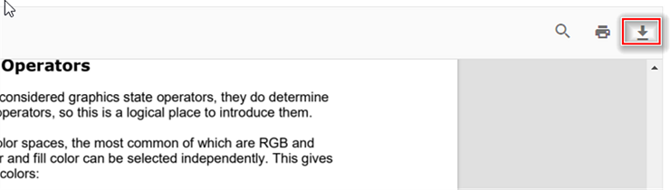

# Download in Vue PDF viewer control

The PDF Viewer supports downloading the loaded PDF document. Use the enableDownload property to enable or disable the download option, as shown below.

> Note: When loading documents from other origins, ensure that CORS is correctly configured on the server. In server-backed mode, the document is streamed through the serviceUrl endpoint, which must allow download requests.

You can invoke the download action using the following code snippet:




<template>
  

    <button v-on:click="downloadClicked">Download</button>
    <ejs-pdfviewer id="pdfviewer" ref="pdfviewer" :documentPath="documentPath" :resourceUrl="resourceUrl">
    </ejs-pdfviewer>
  

</template>




<template>
  

    <button v-on:click="downloadClicked">Download</button>
    <ejs-pdfviewer id="pdfviewer" ref="pdfviewer" :documentPath="documentPath" :resourceUrl="resourceUrl">
    </ejs-pdfviewer>
  

</template>




<template>
  

    <button v-on:click="downloadClicked">Download</button>
    <ejs-pdfviewer id="pdfViewer" ref="pdfviewer" :serviceUrl="serviceUrl" :documentPath="documentPath">
    </ejs-pdfviewer>
  

</template>




<template>
  

    <button v-on:click="downloadClicked">Download</button>
    <ejs-pdfviewer id="pdfViewer" ref="pdfviewer" :serviceUrl="serviceUrl" :documentPath="documentPath">
    </ejs-pdfviewer>
  

</template>




## See also

* [Toolbar items](./toolbar)
* [Feature Modules](./feature-module)