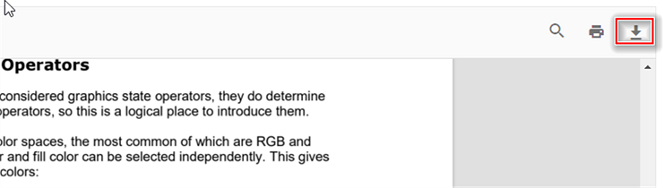

# Download in Vue PDF viewer control

The Vue PDF Viewer lets users download the currently loaded PDF. Enable the download toolbar button with `enableDownload` for both standalone and server-backed viewers. The examples below demonstrate typical configurations and how to trigger a programmatic download.

To invoke download programmatically, use the following snippet:




<template>
  

    <button v-on:click="downloadClicked">Download</button>
    <ejs-pdfviewer id="pdfviewer" ref="pdfviewer" :documentPath="documentPath" :resourceUrl="resourceUrl">
    </ejs-pdfviewer>
  

</template>




<template>
  

    <button v-on:click="downloadClicked">Download</button>
    <ejs-pdfviewer id="pdfviewer" ref="pdfviewer" :documentPath="documentPath" :resourceUrl="resourceUrl">
    </ejs-pdfviewer>
  

</template>




## See also

* [Toolbar items](./toolbar)
* [Feature Modules](./feature-module)