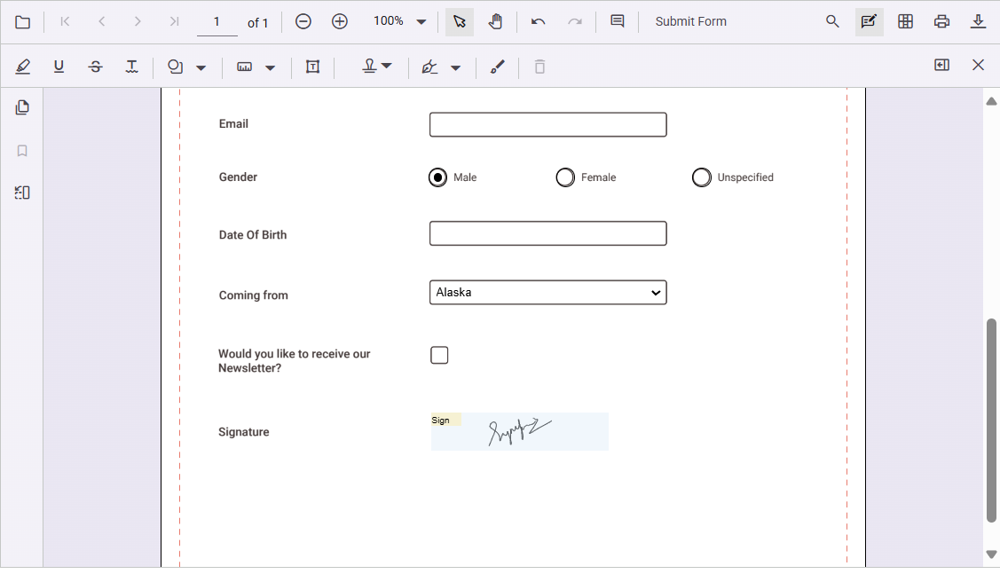

# Form filling in Vue PDF Viewer

The PDF Viewer displays existing form fields in a PDF document and enables users to interact with, validate, and export form data. Users can fill text inputs, select options, and add handwritten signatures directly within the viewer.

## Supported Form Field Types

The PDF Viewer supports the following form field types:

* Text box
* Password
* Check box
* Radio button
* List box
* Dropdown
* Signature field
* Initial field

## Disabling form fields

The PDF Viewer provides an option to prevent users from interacting with form fields. This is useful for read-only mode or when form fields should be displayed but not editable. Set the `enableFormDesigner` property to `false` to disable form field interaction:




<template>
  

    <ejs-pdfviewer id="pdfViewer"
                   :documentPath="documentPath"
                   :resourceUrl="resourceUrl"
                   :enableFormDesigner="false">
    </ejs-pdfviewer>
  

</template>




<template>
  

    <ejs-pdfviewer id="pdfViewer"
                   :documentPath="documentPath"
                   :resourceUrl="resourceUrl"
                   :enableFormDesigner="false">
    </ejs-pdfviewer>
  

</template>




### Adding a Handwritten Signature

To add a handwritten signature to a signature field:

1. Click the signature field in the PDF document to open the signature panel.

2. Draw the signature in the signature panel using your mouse or touchpad.

3. Click the **CREATE** button to apply the signature to the field.

### Removing a Signature

To remove a signature from a signature field, click the Delete option in the annotation toolbar while the signature field is selected.

## Exporting and Importing Form Field Data

The PDF Viewer provides methods to export filled form data and import previously saved data back into forms. This enables users to save their progress and restore it later.

### Supported Export/Import Formats

* FDF
* XFDF
* JSON

### Export Methods

The PDF Viewer provides the following export methods:

- `exportFormFields()` – Exports form data in the specified format (FDF, XFDF, or JSON)
- `exportFormFieldsAsObject()` – Exports form data directly as a JavaScript object for programmatic use

### Import Method

- `importFormFields()` – Imports previously exported form data into the current form

For detailed code examples and API reference, see the [Form fields documentation](https://help.syncfusion.com/document-processing/pdf/pdf-viewer/vue/form-designer/create-programmatically#export-and-import-form-fields).

## See also

* [Handwritten signature in Vue PDF Viewer](./annotations/signature-annotation)
* [Form Designer events](./form-designer/form-field-events)
