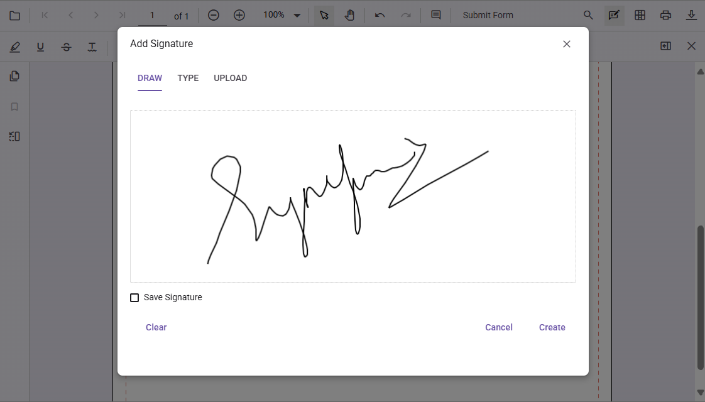

# Form filling in Vue PDF Viewer

The PDF Viewer displays existing form fields in a PDF and enables users to fill, validate, and download the filled data.

The PDF Viewer supports the following form field types:

* Text box
* Password
* Check box
* Radio button
* List box
* Dropdown
* Signature field
* Initial field

## Disabling form fields

The PDF Viewer provides an option to disable interaction with form fields. Use the following configuration to disable form fields in the viewer.




<template>
  

    <ejs-pdfviewer id="pdfViewer"
                   :documentPath="documentPath"
                   :resourceUrl="resourceUrl"
                   :enableFormDesigner="false">
    </ejs-pdfviewer>
  

</template>




<template>
  

    <ejs-pdfviewer id="pdfViewer"
                   :documentPath="documentPath"
                   :resourceUrl="resourceUrl"
                   :enableFormDesigner="false">
    </ejs-pdfviewer>
  

</template>




## Add a handwritten signature to a signature field

Add a handwritten signature to a signature field by following these steps:

* Click the signature field in the PDF document to open the signature panel.

* Draw the signature in the signature panel.

* Select **CREATE**. The drawn signature is added to the signature field.

## Delete a signature from a signature field

Delete a signature placed in a signature field by using the Delete option in the annotation toolbar.

## Export and import form fields

The PDF Viewer supports exporting and importing form field data using the `importFormFields`, `exportFormFields`, and `exportFormFieldsAsObject` methods. The following formats are supported:

* FDF
* XFDF
* JSON

For more information, see the [Form fields documentation](https://help.syncfusion.com/document-processing/pdf/pdf-viewer/vue/form-designer/create-programmatically#export-and-import-form-fields).

## See also

* [Handwritten signature in Vue PDF Viewer](./annotations/signature-annotation)
* [Form Designer events](./form-designer/form-field-events)
