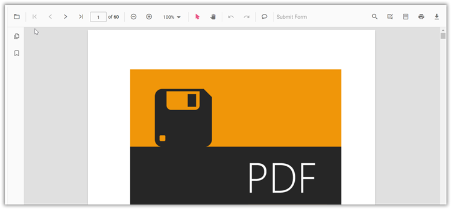

# Getting started with Syncfusion PDF Viewer in Vue 3

This guide explains how to create a Vue 3 application with Vite and integrate the Syncfusion<sup style="font-size:70%">&reg;</sup> Vue PDF Viewer component.using the [Composition API](https://vuejs.org/guide/introduction.html#composition-api) / [Options API](https://vuejs.org/guide/introduction.html#options-api).

The `Composition API` is a new feature introduced in Vue.js 3 that provides an alternative way to organize and reuse component logic. It allows developers to write components as functions that use smaller, reusable functions called composition functions to manage their properties and behavior.

The `Options API` is the traditional way of writing Vue.js components, where the component logic is organized into a series of options that define the component's properties and behavior. These options include data, methods, computed properties, watchers, life cycle hooks, and more.


## Prerequisites

Install Node.js (version 18 or later recommended) along with npm or Yarn before creating the project. Review the [system requirements for Syncfusion<sup style="font-size:70%">&reg;</sup> Vue UI components](https://ej2.syncfusion.com/vue/documentation/system-requirements) to confirm supported platforms.

## Set up the Vite project

A recommended approach for beginning with Vue is to scaffold a project using [Vite](https://vitejs.dev/). Run one of the following commands to create a new project.

```bash
npm create vite@latest
```

or

```bash
yarn create vite
```

After running the command, follow the interactive prompts shown below to configure the project:

1. Define the project name: Specify the project name directly. This guide uses `my-project`.

```bash
? Project name: » my-project
```

2. Select `Vue` as the framework to target Vue 3.

```bash
? Select a framework: » - Use arrow-keys. Return to submit.
Vanilla
> Vue
  React
  Preact
  Lit
  Svelte
  Others
```

3. Choose `JavaScript` as the variant to build the Vite project with JavaScript and Vue.

```bash
? Select a variant: » - Use arrow-keys. Return to submit.
> JavaScript
  TypeScript
  Customize with create-vue ↗
  Nuxt ↗
```

4. After the scaffold completes, install the dependencies for `my-project`:

```bash
cd my-project
npm install
```

or

```bash
cd my-project
yarn install
```

With the scaffold ready, add the Syncfusion Vue PDF Viewer component to the project.

## Add Syncfusion<sup style="font-size:70%">&reg;</sup> Vue packages

Syncfusion Vue component packages are available at [npmjs.com](https://www.npmjs.com/package/@vue-pdf-viewer/viewer). Install the Vue PDF Viewer package with one of the following commands.

This tutorial uses the [Vue PDF Viewer component](https://www.syncfusion.com/pdf-viewer-sdk). Install the `@syncfusion/ej2-vue-pdfviewer` package with the following command:

```bash
  npm install @syncfusion/ej2-vue-pdfviewer --save
```

or

```bash
yarn add @syncfusion/ej2-vue-pdfviewer
```

## Import Syncfusion<sup style="font-size:70%">&reg;</sup> CSS styles

You can import themes for the Syncfusion Vue components by using CSS or SASS assets from npm packages, a CDN, [CRG](https://ej2.syncfusion.com/javascript/documentation/common/custom-resource-generator), or [Theme Studio](https://ej2.syncfusion.com/vue/documentation/appearance/theme-studio). Refer to the [themes topic](https://ej2.syncfusion.com/vue/documentation/appearance/theme) for details about built-in themes and additional options for referencing them in a Vue project.

This tutorial applies the Material theme by importing the required CSS from the installed packages into the `<style>` section of the **src/App.vue** file.




<style>
  @import '../node_modules/@syncfusion/ej2-base/styles/material.css';
  @import '../node_modules/@syncfusion/ej2-buttons/styles/material.css';
  @import '../node_modules/@syncfusion/ej2-dropdowns/styles/material.css';
  @import '../node_modules/@syncfusion/ej2-inputs/styles/material.css';
  @import '../node_modules/@syncfusion/ej2-navigations/styles/material.css';
  @import '../node_modules/@syncfusion/ej2-popups/styles/material.css';
  @import '../node_modules/@syncfusion/ej2-splitbuttons/styles/material.css';
  @import '../node_modules/@syncfusion/ej2-lists/styles/material.css';
  @import '../node_modules/@syncfusion/ej2-pdfviewer/styles/material.css';
</style>




## Add Syncfusion<sup style="font-size:70%">&reg;</sup> Vue component

Follow these steps to add the Vue PDF Viewer component using the `Composition API` or `Options API`:

1. Import and register the PDF Viewer component and its child directives in the `script` section of the **src/App.vue** file. When using the `Composition API`, add the `setup` attribute to the `script` tag.




<script setup>
import { PdfViewerComponent as EjsPdfviewer, Toolbar, Magnification, Navigation, LinkAnnotation,
         BookmarkView, ThumbnailView, Print, TextSelection, TextSearch,
         Annotation, FormDesigner, FormFields } from '@syncfusion/ej2-vue-pdfviewer';
</script>




<script>
import { PdfViewerComponent, Toolbar, Magnification, Navigation, LinkAnnotation,
         BookmarkView,ThumbnailView, Print,TextSelection, TextSearch,
         Annotation, FormDesigner, FormFields } from '@syncfusion/ej2-vue-pdfviewer';

}
</script>




2. Add the component definition in the `template` section.




<template>
  <div id="app">
    <ejs-pdfviewer
      id="pdfViewer"
      :serviceUrl="serviceUrl"
      :documentPath="documentPath"
          :style="{ height: '800px', width: '1200px' }">
    </ejs-pdfviewer>
  </div>
</template>




3. Declare the bound properties `serviceUrl` and `documentPath` in the `script` section.




<script setup>

import { provide } from 'vue';
import { PdfViewerComponent as EjsPdfviewer, Toolbar, Magnification, Navigation, LinkAnnotation, BookmarkView,
         ThumbnailView, Print, TextSelection, TextSearch, Annotation, FormDesigner, FormFields } from '@syncfusion/ej2-vue-pdfviewer';

const serviceUrl = 'https://document.syncfusion.com/web-services/pdf-viewer/api/pdfviewer';
const documentPath = 'https://cdn.syncfusion.com/content/pdf/pdf-succinctly.pdf';
const pdfViewer = null;

provide('PdfViewer', [ Toolbar, Magnification, Navigation, LinkAnnotation, BookmarkView, ThumbnailView,
                       Print, TextSelection, TextSearch, Annotation, FormDesigner, FormFields]);
</script>




<script>

import { PdfViewerComponent, Toolbar, Magnification, Navigation, LinkAnnotation,
         BookmarkView,ThumbnailView, Print,TextSelection, TextSearch,
         Annotation, FormDesigner, FormFields } from '@syncfusion/ej2-vue-pdfviewer';

  export default {

  name: 'App',

  components: {
    "ejs-pdfviewer": PdfViewerComponent
  },

    data () {
      return {
        serviceUrl:"https://document.syncfusion.com/web-services/pdf-viewer/api/pdfviewer",
        documentPath:"https://cdn.syncfusion.com/content/pdf/pdf-succinctly.pdf"
      };
    },

    provide: {
      PdfViewer: [ Toolbar, Magnification, Navigation, LinkAnnotation, BookmarkView, ThumbnailView,
                   Print, TextSelection, TextSearch, Annotation, FormDesigner, FormFields ]}
}

</script>




Replace `serviceUrl` with the endpoint of your deployed PDF Viewer web service when hosting the component. The Syncfusion hosted URL shown above supports evaluation scenarios.

Here is the summarized code for the above steps in the **src/App.vue** file:




<template>
  <ejs-pdfviewer
    ref="pdfViewer"
    :serviceUrl="serviceUrl"
    :documentPath="documentPath"
    :style="{ height: '800px', width: '1200px' }">
  </ejs-pdfviewer>
</template>

<script setup>

import { provide } from 'vue';
import { PdfViewerComponent as EjsPdfviewer, Toolbar, Magnification, Navigation, LinkAnnotation, BookmarkView,
  ThumbnailView, Print, TextSelection, TextSearch, Annotation, FormDesigner, FormFields } from '@syncfusion/ej2-vue-pdfviewer';

const serviceUrl = 'https://document.syncfusion.com/web-services/pdf-viewer/api/pdfviewer';
const documentPath = 'https://cdn.syncfusion.com/content/pdf/pdf-succinctly.pdf';
const pdfViewer = null;

provide('PdfViewer', [ Toolbar, Magnification, Navigation, LinkAnnotation, BookmarkView, ThumbnailView,
                       Print, TextSelection, TextSearch, Annotation, FormDesigner, FormFields]);
</script>

<style>

  @import '../node_modules/@syncfusion/ej2-base/styles/material.css';
  @import '../node_modules/@syncfusion/ej2-buttons/styles/material.css';
  @import '../node_modules/@syncfusion/ej2-dropdowns/styles/material.css';
  @import '../node_modules/@syncfusion/ej2-inputs/styles/material.css';
  @import '../node_modules/@syncfusion/ej2-navigations/styles/material.css';
  @import '../node_modules/@syncfusion/ej2-popups/styles/material.css';
  @import '../node_modules/@syncfusion/ej2-splitbuttons/styles/material.css';
  @import '../node_modules/@syncfusion/ej2-lists/styles/material.css';
  @import '../node_modules/@syncfusion/ej2-pdfviewer/styles/material.css';

</style>




<template>
  <ejs-pdfviewer
    id="pdfViewer"
    :serviceUrl="serviceUrl"
    :documentPath="documentPath"
    :style="{ height: '800px', width: '1200px' }">
  </ejs-pdfviewer>
</template>

<script>
  import { PdfViewerComponent, Toolbar, Magnification, Navigation, LinkAnnotation, BookmarkView,
           ThumbnailView, Print, TextSelection, TextSearch, Annotation, FormDesigner, FormFields } from '@syncfusion/ej2-vue-pdfviewer';

  export default {
    name: 'App',

    components: {
      "ejs-pdfviewer": PdfViewerComponent
    },

    data() {
      return {
        serviceUrl: "https://document.syncfusion.com/web-services/pdf-viewer/api/pdfviewer",
        documentPath: "https://cdn.syncfusion.com/content/pdf/pdf-succinctly.pdf"
      };
    },
    provide: {
      PdfViewer: [ Toolbar, Magnification, Navigation, LinkAnnotation, BookmarkView, ThumbnailView,
                   Print, TextSelection, TextSearch, Annotation, FormDesigner, FormFields ]
    }
  }
</script>

<style>
  @import '../node_modules/@syncfusion/ej2-base/styles/material.css';
  @import '../node_modules/@syncfusion/ej2-buttons/styles/material.css';
  @import '../node_modules/@syncfusion/ej2-dropdowns/styles/material.css';
  @import '../node_modules/@syncfusion/ej2-inputs/styles/material.css';
  @import '../node_modules/@syncfusion/ej2-navigations/styles/material.css';
  @import '../node_modules/@syncfusion/ej2-popups/styles/material.css';
  @import '../node_modules/@syncfusion/ej2-splitbuttons/styles/material.css';
  @import '../node_modules/@syncfusion/ej2-lists/styles/material.css';
  @import '../node_modules/@syncfusion/ej2-pdfviewer/styles/material.css';
</style>




## Run the project

Run the development server with one of the following commands:

```bash
npm run dev
```

or

```bash
yarn run dev
```

The application renders the PDF Viewer as shown below:



[View sample in GitHub](https://github.com/SyncfusionExamples/vue-pdf-viewer-examples/tree/master/Getting%20Started%20Vue-3%20-%20Standalone).

