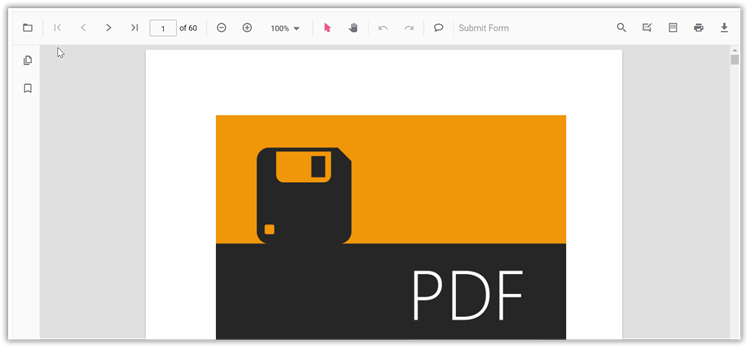

# Getting Started with Syncfusion PDF Viewer in Vue 3

This section explains how to create a Vue 3 application with Vite and integrate the Syncfusion<sup style="font-size:70%">&reg;</sup> Vue PDF Viewer component using either the [Composition API](https://vuejs.org/guide/introduction.html#composition-api) or [Options API](https://vuejs.org/guide/introduction.html#options-api).

## API Approaches

**Composition API** – A modern approach to organizing component logic by composing smaller, reusable functions. This method offers better code organization and is more reusable for complex components.

**Options API** – The traditional Vue approach that organizes component logic into a series of options (data, methods, computed properties, watchers, life cycle hooks, etc.).

## Prerequisites

Install Node.js (version 18 or later recommended) along with npm or Yarn before creating the project. Review the [system requirements for Vue UI components](https://ej2.syncfusion.com/vue/documentation/system-requirements) to confirm supported platforms.

## Set up the Vite project

Use [Vite](https://vitejs.dev/) to quickly scaffold a Vue 3 project. Run one of the following commands to create a new project:



npm create vite@latest



yarn create vite



After running the command, follow the interactive prompts shown below to configure the project:

1. Define the project name: Specify the project name directly. This guide uses `my-project`.

  ```bash
  ? Project name: » my-project
  ```

2. Select `Vue` as the framework to target Vue 3.

  ```bash
  ? Select a framework: » - Use arrow-keys. Return to submit.
  Vanilla
  > Vue
    React
    Preact
    Lit
    Svelte
    Others
  ```

3. Choose `JavaScript` as the variant to build the Vite project with JavaScript and Vue.

  ```bash
  ? Select a variant: » - Use arrow-keys. Return to submit.
  > JavaScript
    TypeScript
    Customize with create-vue ↗
    Nuxt ↗
  ```

4. After the scaffold completes, install the project dependencies:

  
  
  cd my-project
  npm install
  

  
  cd my-project
  yarn install
  
  

## Add Syncfusion<sup style="font-size:70%">&reg;</sup> Vue packages

Install the `@syncfusion/ej2-vue-pdfviewer` package using npm or Yarn. This package includes the PDF Viewer component and all required dependencies:



npm install @syncfusion/ej2-vue-pdfviewer --save



yarn add @syncfusion/ej2-vue-pdfviewer



## Import Syncfusion<sup style="font-size:70%">&reg;</sup> CSS styles

This section uses the Material theme. Import the required CSS into the `<style>` section of  `src/App.vue`:




<style>
  @import '../node_modules/@syncfusion/ej2-base/styles/material.css';
  @import '../node_modules/@syncfusion/ej2-buttons/styles/material.css';
  @import '../node_modules/@syncfusion/ej2-dropdowns/styles/material.css';
  @import '../node_modules/@syncfusion/ej2-inputs/styles/material.css';
  @import '../node_modules/@syncfusion/ej2-navigations/styles/material.css';
  @import '../node_modules/@syncfusion/ej2-popups/styles/material.css';
  @import '../node_modules/@syncfusion/ej2-splitbuttons/styles/material.css';
  @import '../node_modules/@syncfusion/ej2-lists/styles/material.css';
  @import '../node_modules/@syncfusion/ej2-pdfviewer/styles/material.css';
</style>




N> For full details, see the [themes documentation](https://ej2.syncfusion.com/vue/documentation/appearance/theme).

## Add Syncfusion<sup style="font-size:70%">&reg;</sup> Vue component

Add the PDF Viewer component to your Vue 3 application by following these instructions:

### Import and register the PDF Viewer

Import the PDF Viewer component and required modules in the `<script>` section of `src/App.vue`.





import { provide } from 'vue';
import { PdfViewerComponent, Toolbar, Magnification, Navigation, LinkAnnotation, BookmarkView,
  ThumbnailView, Print, TextSelection, TextSearch, Annotation, FormDesigner, FormFields } from '@syncfusion/ej2-vue-pdfviewer';

const serviceUrl = 'https://document.syncfusion.com/web-services/pdf-viewer/api/pdfviewer';
const documentPath = 'https://cdn.syncfusion.com/content/pdf/pdf-succinctly.pdf';
const pdfViewer = null;

provide('PdfViewer', [ Toolbar, Magnification, Navigation, LinkAnnotation, BookmarkView, ThumbnailView,
                       Print, TextSelection, TextSearch, Annotation, FormDesigner, FormFields ]);




import { PdfViewerComponent, Toolbar, Magnification, Navigation, LinkAnnotation, BookmarkView,
           ThumbnailView, Print, TextSelection, TextSearch, Annotation, FormDesigner, FormFields } from '@syncfusion/ej2-vue-pdfviewer';

  export default {
    name: 'App',

    components: {
      "ejs-pdfviewer": PdfViewerComponent
    },

    data() {
      return {
        serviceUrl: "https://document.syncfusion.com/web-services/pdf-viewer/api/pdfviewer",
        documentPath: "https://cdn.syncfusion.com/content/pdf/pdf-succinctly.pdf"
      };
    },
    provide: {
      PdfViewer: [ Toolbar, Magnification, Navigation, LinkAnnotation, BookmarkView, ThumbnailView,
                   Print, TextSelection, TextSearch, Annotation, FormDesigner, FormFields ]
    }
  }




**serviceUrl** – The back-end endpoint for PDF processing. The Syncfusion-hosted URL provides evaluation capabilities. For production, replace with your deployed web service endpoint.

**documentPath** – The URL or file path to the PDF document to display.

### Initialize the PDF Viewer

Add the PDF Viewer component markup to the `<template>` section of `src/App.vue`:



<ejs-pdfviewer id="pdfViewer" :serviceUrl="serviceUrl" :documentPath="documentPath">
</ejs-pdfviewer>




## Run the project

Run the following command to start the Vue application:



npm run dev



yarn run dev



After the application starts, open the URL shown in the terminal (typically `http://localhost:5173`) to view the Vue PDF Viewer in the browser. The output will appear as shown below, with the PDF Viewer toolbar and the sample `pdf-succinctly.pdf` document loaded:



> [View sample in GitHub](https://github.com/SyncfusionExamples/vue-pdf-viewer-examples/tree/master/Getting%20Started%20Vue-3%20-%20Standalone).

## See also

- [Getting Started with Standalone Vue 2 PDF Viewer](./getting-started)
- [Getting Started with Server-Backed Vue PDF Viewer](./getting-started-with-server-backed)
- [Open PDF Files](./open-pdf-files)
- [Save PDF Files](./save-pdf-files)

