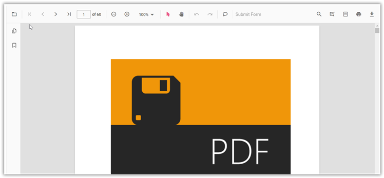

# Getting Started with Vue 3 PDF Viewer

This section explains how to create a Vue 3 application with Vite and integrate the Syncfusion<sup style="font-size:70%">&reg;</sup> Vue PDF Viewer component using either the [Composition API](https://vuejs.org/guide/introduction.html#composition-api) or [Options API](https://vuejs.org/guide/introduction.html#options-api).

## API Approaches

**Composition API** – A modern approach to organizing component logic by composing smaller, reusable functions. This method offers better code organization and is more reusable for complex components.

**Options API** – The traditional Vue approach that organizes component logic into a series of options (data, methods, computed properties, watchers, life cycle hooks, etc.).

## Prerequisites

Install Node.js (version 18 or later recommended) along with npm or Yarn before creating the project. Review the [system requirements for Vue UI components](https://ej2.syncfusion.com/vue/documentation/system-requirements) to confirm supported platforms.

## Set up the Vite project

Use [Vite](https://vitejs.dev/) to quickly scaffold a Vue 3 project. Run one of the following commands to create a new project:



npm create vite@latest



yarn create vite



After running the command, follow the interactive prompts shown below to configure the project:

1. Define the project name: Specify the project name directly. This guide uses `my-project`.

  ```bash
  ? Project name: » my-project
  ```

2. Select `Vue` as the framework to target Vue 3.

  ```bash
  ? Select a framework: » - Use arrow-keys. Return to submit.
  Vanilla
  > Vue
    React
    Preact
    Lit
    Svelte
    Others
  ```

3. Choose `JavaScript` as the variant to build the Vite project with JavaScript and Vue.

  ```bash
  ? Select a variant: » - Use arrow-keys. Return to submit.
  > JavaScript
    TypeScript
    Customize with create-vue ↗
    Nuxt ↗
  ```

4. After the scaffold completes, install the project dependencies:

  
  
  cd my-project
  npm install
  

  
  cd my-project
  yarn install
  
  

## Add Syncfusion<sup style="font-size:70%">&reg;</sup> Vue packages

Install the `@syncfusion/ej2-vue-pdfviewer` package using npm or Yarn. This package includes the PDF Viewer component and all required dependencies:



npm install @syncfusion/ej2-vue-pdfviewer --save



yarn add @syncfusion/ej2-vue-pdfviewer



## Import the required CSS styles

Themes for PDF Viewer can be applied using CSS or SASS files from the [npm theme packages](https://ej2.syncfusion.com/vue/documentation/appearance/theme#theme-packages), CDN, CRG, or [Theme Studio](https://ej2.syncfusion.com/vue/documentation/appearance/theme-studio). For more information, see the [themes documentation](https://ej2.syncfusion.com/vue/documentation/appearance/theme).

This guide uses the `Tailwind 3` theme as an example, sourced from the theme package. In this package, each component includes an `index.css` file that automatically loads all the required dependency styles. To install the [Tailwind 3](https://www.npmjs.com/package/@syncfusion/ej2-tailwind3-theme) theme package, use the following command:

```bash
npm install @syncfusion/ej2-tailwind3-theme
```

Import the PDF Viewer theme CSS into the `<style>` section of `src/App.vue`:




<style>
  @import '../node_modules/@syncfusion/ej2-tailwind3-theme/styles/pdfviewer/index.css';
</style>




N> The `index.css` file automatically includes all required dependent component styles for the PDF Viewer. You do not need to import individual dependency styles such as Base, Buttons, Dropdowns, Inputs, Navigations, Popups, SplitButtons, and Lists separately.

N> For full details, see the [themes documentation](https://ej2.syncfusion.com/vue/documentation/appearance/theme).

## Add Syncfusion<sup style="font-size:70%">&reg;</sup> Vue component

Add the PDF Viewer component to your Vue 3 application by following these instructions:

### Import and register the PDF Viewer

Import the PDF Viewer component and required modules in the `<script>` section of `src/App.vue`.





import { provide } from 'vue';
import { PdfViewerComponent, Toolbar, Magnification, Navigation, LinkAnnotation, BookmarkView,
  ThumbnailView, Print, TextSelection, TextSearch, Annotation, FormDesigner, FormFields } from '@syncfusion/ej2-vue-pdfviewer';

const serviceUrl = 'https://document.syncfusion.com/web-services/pdf-viewer/api/pdfviewer';
const documentPath = 'https://cdn.syncfusion.com/content/pdf/pdf-succinctly.pdf';
const pdfViewer = null;

provide('PdfViewer', [ Toolbar, Magnification, Navigation, LinkAnnotation, BookmarkView, ThumbnailView,
                       Print, TextSelection, TextSearch, Annotation, FormDesigner, FormFields ]);




import { PdfViewerComponent, Toolbar, Magnification, Navigation, LinkAnnotation, BookmarkView,
           ThumbnailView, Print, TextSelection, TextSearch, Annotation, FormDesigner, FormFields } from '@syncfusion/ej2-vue-pdfviewer';

  export default {
    name: 'App',

    components: {
      "ejs-pdfviewer": PdfViewerComponent
    },

    data() {
      return {
        serviceUrl: "https://document.syncfusion.com/web-services/pdf-viewer/api/pdfviewer",
        documentPath: "https://cdn.syncfusion.com/content/pdf/pdf-succinctly.pdf"
      };
    },
    provide: {
      PdfViewer: [ Toolbar, Magnification, Navigation, LinkAnnotation, BookmarkView, ThumbnailView,
                   Print, TextSelection, TextSearch, Annotation, FormDesigner, FormFields ]
    }
  }




**serviceUrl** – The back-end endpoint for PDF processing. The Syncfusion-hosted URL provides evaluation capabilities. For production, replace with your deployed web service endpoint.

**documentPath** – The URL or file path to the PDF document to display.

### Initialize the PDF Viewer

Add the PDF Viewer component markup to the `<template>` section of `src/App.vue`:



<ejs-pdfviewer id="pdfViewer" :serviceUrl="serviceUrl" :documentPath="documentPath">
</ejs-pdfviewer>




## Run the project

Run the following command to start the Vue application:



npm run dev



yarn run dev



After the application starts, open the URL shown in the terminal (typically `http://localhost:5173`) to view the Vue PDF Viewer in the browser. The output will appear as shown below, with the PDF Viewer toolbar and the sample `pdf-succinctly.pdf` document loaded:



> [View sample in GitHub](https://github.com/SyncfusionExamples/vue-pdf-viewer-examples/tree/master/Getting%20Started%20Vue-3%20-%20Standalone).

## Video tutorial

To get started quickly with Vue PDF Viewer, you can watch this video:



## Tauri Integration

This section explains how to wrap the Vue 3 PDF Viewer in a [Tauri](https://tauri.app/) desktop application. Tauri pairs a Rust-built native shell with a web view (WebView2 on Windows, WebKit on macOS, and WebKitGTK on Linux), so the same Vue code that runs in the browser also runs as a desktop app with full filesystem and dialog access through Tauri plugin.

## Prerequisites

Before creating the Tauri application, ensure the following software is installed on your development machine:

- [Node.js 22+](https://nodejs.org/en/download) (LTS recommended)
- A package manager: `npm`, `yarn`, or `pnpm`
- [Rust tool chain](https://tauri.app/start/prerequisites/#rust) (install via [rust up](https://rust-lang.org/tools/install/))
- Platform-specific Tauri prerequisites (see the [Tauri prerequisites](https://tauri.app/start/prerequisites/) page for Windows / macOS / Linux requirements such as WebView2, Xcode Command Line Tools, or `webkit2gtk-4.1`)

References:

- [Tauri prerequisites](https://tauri.app/start/prerequisites/#rust)
- [Rust installation](https://rust-lang.org/tools/install/)
- [Create a Tauri project](https://tauri.app/start/create-project/)

Verify the installed versions:

```bash
node -v
```

## Create a Tauri Project

Tauri ships a project scaffold that creates a desktop shell around a frontend framework. The official scaffold is interactive, so the prompts vary by tool. Run the following command to start the scaffold:

```bash
npm create tauri-app@latest
```

Choose the following options when prompted:

```
Project name:
tauri-vue-pdfviewer

Choose which language to use for your frontend:
TypeScript / JavaScript

Choose your package manager:
npm

Choose your UI template:
Vue
```

> Note: The exact wording of the prompts depends on the installed version of `create-tauri-app`. Pick **Vue** as the UI template and **TypeScript** as the flavor. The example below assumes a TypeScript Vue 3 + Vite project.

After the scaffold finishes, install the dependencies and verify the project builds:

```bash
cd tauri-vue-pdfviewer
npm install
npm run tauri dev
```

> The first run of `npm run tauri dev` compiles the Rust back end, which may take a few minutes. Subsequent runs are much faster.

## Install Syncfusion Vue PDF Viewer

Install the Syncfusion Vue PDF Viewer package from npm:

```bash
npm install @syncfusion/ej2-vue-pdfviewer --save
```

## Import the Required CSS

Install the Tailwind 3 theme package and add the styles to your global stylesheet. If your project already uses a different Syncfusion theme, replace the import with that theme.

```bash
npm install @syncfusion/ej2-tailwind3-theme
```

The required PDF Viewer theme styles are imported into the <style> section of the `src/App.vue` file:

```css
@import '../node_modules/@syncfusion/ej2-tailwind3-theme/styles/pdfviewer/index.css';
```

## Add the Syncfusion Vue PDF Viewer

Open `src/App.vue` and replace its contents with the following code. The viewer is mounted inside a Vue 3 single-file component and configured to load a public sample PDF and the runtime assets from the Syncfusion CDN.




<script>
import { PdfViewerComponent, Toolbar, Magnification, Navigation, LinkAnnotation,
         BookmarkView, ThumbnailView, Print, TextSelection, TextSearch,
         Annotation, FormDesigner, FormFields, PageOrganizer } from '@syncfusion/ej2-vue-pdfviewer';

export default {
  name: 'App',
  components: {
    "ejs-pdfviewer": PdfViewerComponent
  },
  data() {
    return {
      resourceUrl: 'https://cdn.syncfusion.com/ej2/31.2.2/dist/ej2-pdfviewer-lib',
      documentPath: "https://cdn.syncfusion.com/content/pdf/pdf-succinctly.pdf"
    };
  },
  provide: {
    PdfViewer: [ Toolbar, Magnification, Navigation, LinkAnnotation, BookmarkView, ThumbnailView,
                 Print, TextSelection, TextSearch, Annotation, FormDesigner, FormFields, PageOrganizer ]
  }
}
</script>

<template>
  <ejs-pdfviewer
    id="pdfViewer"
    :documentPath="documentPath"
    :resourceUrl="resourcesUrl"
    style="height:640px; display:block">
  </ejs-pdfviewer>
</template>




## Run the Application in Development

Run the following command from the project root to launch the Tauri desktop app in development mode:

```bash
npm run tauri dev
```

Tauri compiles the Rust back end, starts the Vue dev server, and opens a native window. The Vue PDF Viewer loads with the following modules enabled:

- Toolbar
- Navigation
- Magnification
- Text Selection
- Text Search
- Print
- Annotations
- Form Fields
- Form Designer

## Build the Application for Production

Run the following command from the project root to produce a release build of the Tauri desktop app:

```bash
npm run tauri build
```

Tauri compiles the Rust back end in release mode, bundles the frontend assets, and outputs platform-specific installers (such as `.msi` on Windows, `.dmg` on macOS, and `.deb`/`.AppImage` on Linux) under `src-tauri/target/release/bundle/`.

## See also

- [Getting Started with Standalone Vue 2 PDF Viewer](./getting-started)
- [Getting Started with Server-Backed Vue PDF Viewer](./getting-started-with-server-backed)
- [Open PDF Files](./open-pdf-files)
- [Save PDF Files](./save-pdf-files)
- [Tauri documentation](https://tauri.app/start/)

N> Looking for the full Vue PDF Viewer component overview, features, pricing, and documentation? Visit the [Vue PDF Viewer](https://www.syncfusion.com/pdf-viewer-sdk/vue-pdf-viewer) page.

