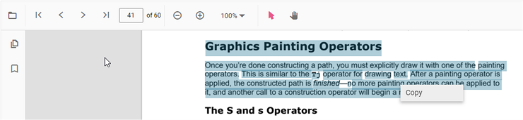
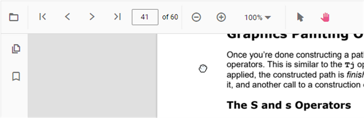

# Interaction mode in Vue PDF Viewer

The PDF Viewer provides two interaction modes for working with the loaded PDF document: selection mode and panning mode. Use these modes to control whether users select text or pan/scroll the document.

## Selection mode

In this mode, users can select text in the PDF document loaded in the PDF Viewer. Panning and touch-based scrolling are disabled in this mode. Enable or disable text selection using the following configuration:




<template>
  

    <ejs-pdfviewer id="pdfViewer" :documentPath="documentPath" :resourceUrl="resourceUrl" :enableTextSelection="true">
    </ejs-pdfviewer>
  

</template>




<template>
  

    <ejs-pdfviewer id="pdfViewer" :documentPath="documentPath" :resourceUrl="resourceUrl" :enableTextSelection="true">
    </ejs-pdfviewer>
  

</template>




<template>
  

    <ejs-pdfviewer id="pdfViewer" :serviceUrl="serviceUrl" :documentPath="documentPath" :enableTextSelection="true">
    </ejs-pdfviewer>
  

</template>




<template>
  

    <ejs-pdfviewer id="pdfViewer" :serviceUrl="serviceUrl" :documentPath="documentPath" :enableTextSelection="true">
    </ejs-pdfviewer>
  

</template>




## Panning mode

In this mode, users can pan and scroll pages (including touch). Text selection is disabled.

Switch the interaction mode of the PDF Viewer using the following configuration (set the `interactionMode` property, for example, to `InteractionMode.Pan`):




<template>
  

    <ejs-pdfviewer id="pdfViewer" :documentPath="documentPath" :resourceUrl="resourceUrl"  :enableTextSelection="false"
      :interactionMode="interactionMode">
    </ejs-pdfviewer>
  

</template>




<template>
  

    <ejs-pdfviewer id="pdfViewer" :documentPath="documentPath" :resourceUrl="resourceUrl"  :enableTextSelection="false"
      :interactionMode="interactionMode">
    </ejs-pdfviewer>
  

</template>




<template>
  

    <ejs-pdfviewer id="pdfViewer" :serviceUrl="serviceUrl" :documentPath="documentPath" :enableTextSelection="false"
      :interactionMode="interactionMode">
    </ejs-pdfviewer>
  

</template>




<template>
  

    <ejs-pdfviewer id="pdfViewer" :serviceUrl="serviceUrl" :documentPath="documentPath" :enableTextSelection="false"
      :interactionMode="interactionMode">
    </ejs-pdfviewer>
  

</template>




## See also

* [Toolbar items](./toolbar)
* [Feature Modules](./feature-module)