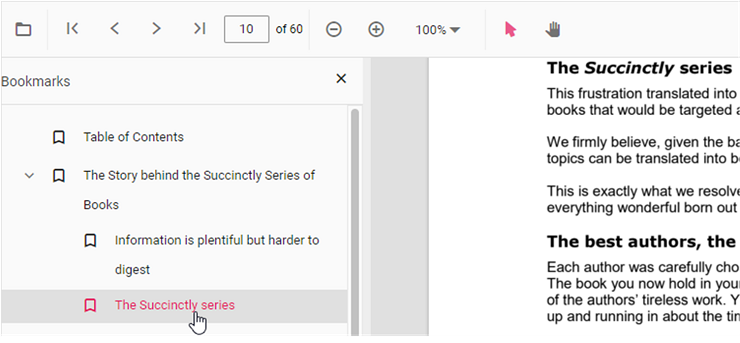

# Bookmark navigation in Vue PDF Viewer component

The PDF Viewer loads the bookmarks saved in a document so that users can quickly navigate between sections. You can enable or disable the bookmark panel by using the `enableBookmark` property.




<template>
  

    <ejs-pdfviewer
      id="pdfViewer"
      :documentPath="documentPath"
      :resourceUrl="resourceUrl"
      :enableBookmark="true"
    ></ejs-pdfviewer>
  

</template>




<template>
  

    <ejs-pdfviewer
      id="pdfViewer"
      :documentPath="documentPath"
      :resourceUrl="resourceUrl"
      :enableBookmark="true"
    ></ejs-pdfviewer>
  

</template>




<template>
  

    <ejs-pdfviewer
      id="pdfViewer"
      :serviceUrl="serviceUrl"
      :documentPath="documentPath"
      :enableBookmark="true"
    ></ejs-pdfviewer>
  

</template>




<template>
  

    <ejs-pdfviewer
      id="pdfViewer"
      :serviceUrl="serviceUrl"
      :documentPath="documentPath"
      :enableBookmark="true"
    ></ejs-pdfviewer>
  

</template>




## Programmatic bookmark navigation

Use the [**goToBookmark**](https://ej2.syncfusion.com/vue/documentation/api/pdfviewer/bookmark/#gotobookmark) method to navigate to a specific bookmark. The method throws an error if the bookmark is not available in the document.




<template>
  

    <button @click="goToBookmark">Go to bookmark</button>
    <button @click="getBookmarks">List bookmarks</button>
    <ejs-pdfviewer
      id="pdfViewer"
      ref="pdfViewer"
      :documentPath="documentPath"
      :resourceUrl="resourceUrl"
      :enableBookmark="true"
    ></ejs-pdfviewer>
  

</template>




<template>
  

    <button @click="goToBookmark">Go to bookmark</button>
    <button @click="getBookmarks">List bookmarks</button>
    <ejs-pdfviewer
      id="pdfViewer"
      ref="pdfViewer"
      :documentPath="documentPath"
      :resourceUrl="resourceUrl"
      :enableBookmark="true"
    ></ejs-pdfviewer>
  

</template>




Use the [**getBookmarks**](https://ej2.syncfusion.com/vue/documentation/api/pdfviewer/bookmark/#getbookmarks) method to retrieve the bookmark collection. Each item contains the bookmark title, destination page, and position information.

## See also

- [Bookmark navigation](https://help.syncfusion.com/document-processing/pdf/pdf-viewer/vue/interactive-pdf-navigation/bookmark-navigation/)
- [Page navigation](https://help.syncfusion.com/document-processing/pdf/pdf-viewer/vue/interactive-pdf-navigation/page-navigation/)
- [Page thumbnail navigation](https://help.syncfusion.com/document-processing/pdf/pdf-viewer/vue/interactive-pdf-navigation/page-thumbnail-navigation/)

