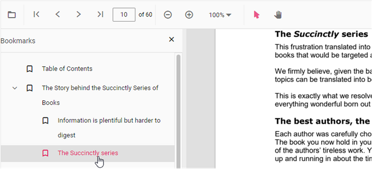

# Bookmark Navigation in Vue PDF Viewer

Bookmarks embedded in PDF files are loaded and made available for quick navigation within the viewer.
Enable or disable bookmark navigation using the examples below.

The examples show a Standalone (client-only) setup and a Server-Backed setup; the primary difference is the viewer's `resourceUrl`/`service` configuration used to locate PDF resources.




<template>
  

    <ejs-pdfviewer
      id="pdfViewer"
      :documentPath="documentPath"
      :resourceUrl="resourceUrl"
      :enableBookmark="true"
    ></ejs-pdfviewer>
  

</template>




<template>
  

    <ejs-pdfviewer
      id="pdfViewer"
      :documentPath="documentPath"
      :resourceUrl="resourceUrl"
      :enableBookmark="true"
    ></ejs-pdfviewer>
  

</template>




<template>
  

    <ejs-pdfviewer
      id="pdfViewer"
      :serviceUrl="serviceUrl"
      :documentPath="documentPath"
      :enableBookmark="true"
    ></ejs-pdfviewer>
  

</template>




<template>
  

    <ejs-pdfviewer
      id="pdfViewer"
      :serviceUrl="serviceUrl"
      :documentPath="documentPath"
      :enableBookmark="true"
    ></ejs-pdfviewer>
  

</template>




## Programmatic bookmark navigation

Use the **goToBookmark** method to navigate to a bookmark programmatically. The method expects valid bookmark coordinates (zero-based page index and a Y offset). If the specified bookmark does not exist, the call may throw an error—guard calls with error handling or verify existence first using `getBookmarks()`.




<template>
  

    <button @click="goToBookmark">Go to bookmark</button>
    <button @click="getBookmarks">List bookmarks</button>
    <ejs-pdfviewer
      id="pdfViewer"
      ref="pdfViewer"
      :documentPath="documentPath"
      :resourceUrl="resourceUrl"
      :enableBookmark="true"
    ></ejs-pdfviewer>
  

</template>




<template>
  

    <button @click="goToBookmark">Go to bookmark</button>
    <button @click="getBookmarks">List bookmarks</button>
    <ejs-pdfviewer
      id="pdfViewer"
      ref="pdfViewer"
      :documentPath="documentPath"
      :resourceUrl="resourceUrl"
      :enableBookmark="true"
    ></ejs-pdfviewer>
  

</template>




Use the [**getBookmarks**](https://ej2.syncfusion.com/vue/documentation/api/pdfviewer/bookmarkview#getbookmarks) method to retrieve the bookmark collection. Each item contains the bookmark title, destination page, and position information.

## See also

- [Page navigation](page)
- [Page thumbnail navigation](page-thumbnail)

