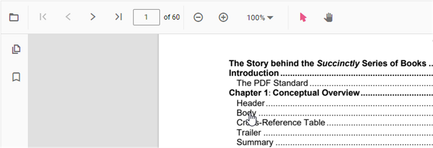
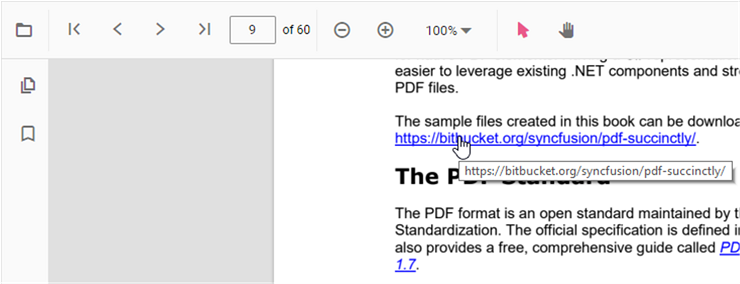

# Hyperlink navigation in Vue PDF Viewer

The PDF Viewer consolidates hyperlink-driven experiences, including inline links and table-of-contents (TOC) entries that target in-document destinations. These elements surface contextual entry points so users can jump directly to relevant sections without manual scrolling.

> **Note:** The table of contents pane and hyperlink interactions rely on the same navigation infrastructure. When these capabilities are enabled, the PDF Viewer automatically surfaces TOC entries and clickable links defined in the PDF.

## Required modules

Inject the following modules to enable both navigation experiences: `Toolbar`, `Magnification`, `Navigation`, `LinkAnnotation`, `BookmarkView`, `TextSelection`, `ThumbnailView`, and optionally `Annotation`.

## Table of contents navigation

Use the table of contents to navigate to headings and sections defined in the PDF. When the document contains a bookmarks or outline structure, the viewer exposes those entries in the table of contents (Bookmarks) pane. Selecting an entry navigates directly to the mapped destination. If the PDF does not include a table of contents, the pane will not list any entries.

## Hyperlink navigation

The PDF Viewer provides robust support for hyperlink navigation within PDF documents. This allows users to interact with embedded links, which can point to external websites or other locations within the same document. This section covers how to configure hyperlink behavior, including enabling or disabling links, controlling how they open, and responding to hyperlink-related events.

### Enable or disable hyperlinks

By default, the PDF Viewer automatically detects and enables all hyperlinks present in a loaded document. This behavior can be controlled using the `enableHyperlink` property.

- **Property**: `enableHyperlink`
- **Type**: `boolean`
- **Default**: `true`

When `enableHyperlink` is set to `false`, all hyperlinks in the document become non-interactive. This means that users cannot click them, and no hyperlink-related events will be triggered.

The following example demonstrates how to disable hyperlink navigation:



<template>
  

    <ejs-pdfviewer id="pdfViewer" :documentPath="documentPath" :resourceUrl="resourceUrl" :enableHyperlink="false">
    </ejs-pdfviewer>
  

</template>



<template>
  

    <ejs-pdfviewer id="pdfViewer" :documentPath="documentPath" :resourceUrl="resourceUrl" :enableHyperlink="false">
    </ejs-pdfviewer>
  

</template>



<template>
  

    <ejs-pdfviewer id="pdfViewer" :serviceUrl="serviceUrl" :documentPath="documentPath" :enableHyperlink="false">
    </ejs-pdfviewer>
  

</template>



<template>
  

    <ejs-pdfviewer id="pdfViewer" :serviceUrl="serviceUrl" :documentPath="documentPath" :enableHyperlink="false">
    </ejs-pdfviewer>
  

</template>




> **Note:** Disabling hyperlinks only affects the viewer's behavior and does not alter the original PDF document.

### Control link behavior

The `hyperlinkOpenState` property determines how external URLs are opened when a hyperlink is clicked.

- **Property**: `hyperlinkOpenState`
- **Type**: `'CurrentTab' | 'NewTab'`
- **Default**: `'CurrentTab'`

By default, links open in the same browser tab (`CurrentTab`). To open links in a new tab, set this property to `'NewTab'`. This is useful for preserving the user's current viewing session.

The following example configures hyperlinks to open in a new tab:



<template>
  

    <ejs-pdfviewer id="pdfViewer" :documentPath="documentPath" :resourceUrl="resourceUrl"
      :hyperlinkOpenState="hyperlinkOpenState">
    </ejs-pdfviewer>
  

</template>



<template>
  

    <ejs-pdfviewer id="pdfViewer" :documentPath="documentPath" :resourceUrl="resourceUrl"
      :hyperlinkOpenState="hyperlinkOpenState">
    </ejs-pdfviewer>
  

</template>



<template>
  

    <ejs-pdfviewer id="pdfViewer" :serviceUrl="serviceUrl" :documentPath="documentPath"
      :hyperlinkOpenState="hyperlinkOpenState">
    </ejs-pdfviewer>
  

</template>



<template>
  

    <ejs-pdfviewer id="pdfViewer" :serviceUrl="serviceUrl" :documentPath="documentPath"
      :hyperlinkOpenState="hyperlinkOpenState">
    </ejs-pdfviewer>
  

</template>




### Handle hyperlink events

The PDF Viewer exposes events that allow for monitoring and customizing hyperlink interactions.

#### hyperlinkClick

The `hyperlinkClick` event is triggered when a user clicks a hyperlink. This event can be used to implement custom logic, such as validating a URL or preventing the default navigation behavior.

The event arguments provide the following information:
- `hyperlink`: The URL of the clicked hyperlink.
- `cancel`: A boolean that, when set to `true`, prevents the default navigation action.

#### hyperlinkMouseOver

The `hyperlinkMouseOver` event is triggered when the mouse pointer hovers over a hyperlink. This can be used to display custom tooltips or other visual feedback.

The event arguments include:
- `hyperlinkElement`: The HTML anchor element (`<a>`) corresponding to the hyperlink.

The following example demonstrates how to use these events:



<template>
  

    <ejs-pdfviewer id="pdfViewer" :documentPath="documentPath" :resourceUrl="resourceUrl"
      @hyperlinkClick="onHyperlinkClick" @hyperlinkMouseOver="onHyperlinkMouseOver">
    </ejs-pdfviewer>
  

</template>



<template>
  

    <ejs-pdfviewer id="pdfViewer" :documentPath="documentPath" :resourceUrl="resourceUrl"
      @hyperlinkClick="onHyperlinkClick" @hyperlinkMouseOver="onHyperlinkMouseOver">
    </ejs-pdfviewer>
  

</template>



<template>
  

    <ejs-pdfviewer id="pdfViewer" :serviceUrl="serviceUrl" :documentPath="documentPath"
      @hyperlinkClick="onHyperlinkClick" @hyperlinkMouseOver="onHyperlinkMouseOver">
    </ejs-pdfviewer>
  

</template>



<template>
  

    <ejs-pdfviewer id="pdfViewer" :serviceUrl="serviceUrl" :documentPath="documentPath"
      @hyperlinkClick="onHyperlinkClick" @hyperlinkMouseOver="onHyperlinkMouseOver">
    </ejs-pdfviewer>
  

</template>




## See also

- [Bookmark navigation](https://help.syncfusion.com/document-processing/pdf/pdf-viewer/vue/interactive-pdf-navigation/bookmark-navigation/)
- [Page navigation](https://help.syncfusion.com/document-processing/pdf/pdf-viewer/vue/interactive-pdf-navigation/page-navigation/)
- [Page thumbnail navigation](https://help.syncfusion.com/document-processing/pdf/pdf-viewer/vue/interactive-pdf-navigation/page-thumbnail-navigation/)
