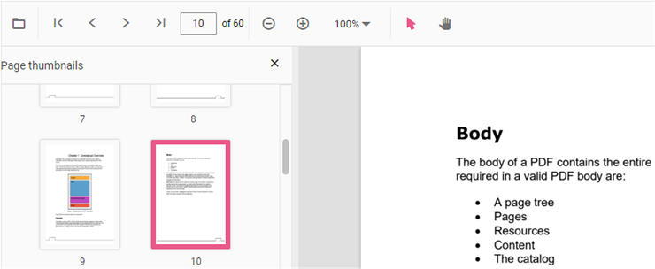

# Page thumbnail navigation in PDF Viewer

Thumbnails are miniature representations of PDF pages that let users navigate visually. This feature displays page thumbnails and supports quick navigation between pages.

Enable or disable thumbnail navigation using the examples below.



<template>
  

    <ejs-pdfviewer
      id="pdfViewer"
      :documentPath="documentPath"
      :resourceUrl="resourceUrl"
      :enableThumbnail="true">
    </ejs-pdfviewer>
  

</template>



<template>
  

    <ejs-pdfviewer
      id="pdfViewer"
      :documentPath="documentPath"
      :resourceUrl="resourceUrl"
      :enableThumbnail="true">
    </ejs-pdfviewer>
  

</template>



<template>
  

    <ejs-pdfviewer
      id="pdfViewer"
      :serviceUrl="serviceUrl"
      :documentPath="documentPath"
      :enableThumbnail="true">
    </ejs-pdfviewer>
  

</template>



<template>
  

    <ejs-pdfviewer
      id="pdfViewer"
      :serviceUrl="serviceUrl"
      :documentPath="documentPath"
      :enableThumbnail="true">
    </ejs-pdfviewer>
  

</template>




## See also

* [Toolbar items](https://help.syncfusion.com/document-processing/pdf/pdf-viewer/vue/toolbar/)
* [Feature modules](https://help.syncfusion.com/document-processing/pdf/pdf-viewer/vue/feature-module/)
