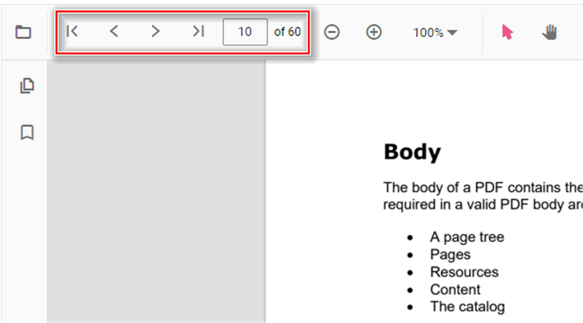

# Page navigation in PDF Viewer

The Vue PDF Viewer supports internal and external navigation methods.

## Toolbar page navigation options

The PDF Viewer default toolbar includes the following page navigation options:

* [**Go to page**](https://ej2.syncfusion.com/vue/documentation/api/pdfviewer/navigation/#gotopage):- Navigates to a specified page in the PDF document.
* [**Show next page**](https://ej2.syncfusion.com/vue/documentation/api/pdfviewer/navigation/#gotonextpage):- Navigates to the next page in the PDF document.
* [**Show previous page**](https://ej2.syncfusion.com/vue/documentation/api/pdfviewer/navigation/#gotopreviouspage):- Navigates to the previous page in the PDF document.
* [**Show first page**](https://ej2.syncfusion.com/vue/documentation/api/pdfviewer/navigation/#gotofirstpage):- Navigates to the first page of the PDF document.
* [**Show last page**](https://ej2.syncfusion.com/vue/documentation/api/pdfviewer/navigation/#gotolastpage):- Navigates to the last page of the PDF document.

Enable or disable the page navigation option in the PDF Viewer using the following code snippet.



<template>
  

    <ejs-pdfviewer
      id="pdfViewer"
      :documentPath="documentPath"
      :resourceUrl="resourceUrl"
      :enableNavigation="true">
    </ejs-pdfviewer>
  

</template>



<template>
  

    <ejs-pdfviewer
      id="pdfViewer"
      :documentPath="documentPath"
      :resourceUrl="resourceUrl"
      :enableNavigation="true">
    </ejs-pdfviewer>
  

</template>



<template>
  

    <ejs-pdfviewer
      id="pdfViewer"
      :serviceUrl="serviceUrl"
      :documentPath="documentPath"
      :enableNavigation="true">
    </ejs-pdfviewer>
  

</template>



<template>
  

    <ejs-pdfviewer
      id="pdfViewer"
      :serviceUrl="serviceUrl"
      :documentPath="documentPath"
      :enableNavigation="true">
    </ejs-pdfviewer>
  

</template>




## Programmatic page navigation

Trigger navigation methods from your own UI elements—like buttons or menu items—by using the `navigation` object exposed by the PDF Viewer instance.

The following examples show how to perform page navigation programmatically.



<template>
  

    

      <button @click="goToFirstPage">Go To First Page</button>
      <button @click="goToLastPage">Go To Last Page</button>
      <button @click="goToNextPage">Go To Next Page</button>
      <button @click="goToPage">Go To Page</button>
      <button @click="goToPreviousPage">Go To Previous Page</button>
    

    <ejs-pdfviewer
      id="pdfViewer"
      ref="pdfViewer"
      :documentPath="documentPath"
      :resourceUrl="resourceUrl">
    </ejs-pdfviewer>
  

</template>



<template>
  

    

      <button @click="goToFirstPage">Go To First Page</button>
      <button @click="goToLastPage">Go To Last Page</button>
      <button @click="goToNextPage">Go To Next Page</button>
      <button @click="goToPage">Go To Page</button>
      <button @click="goToPreviousPage">Go To Previous Page</button>
    

    <ejs-pdfviewer
      id="pdfViewer"
      ref="pdfViewer"
      :documentPath="documentPath"
      :resourceUrl="resourceUrl">
    </ejs-pdfviewer>
  

</template>



<template>
  

    

      <button @click="goToFirstPage">Go To First Page</button>
      <button @click="goToLastPage">Go To Last Page</button>
      <button @click="goToNextPage">Go To Next Page</button>
      <button @click="goToPage">Go To Page</button>
      <button @click="goToPreviousPage">Go To Previous Page</button>
    

    <ejs-pdfviewer
      id="pdfViewer"
      ref="pdfViewer"
      :serviceUrl="serviceUrl"
      :documentPath="documentPath">
    </ejs-pdfviewer>
  

</template>



<template>
  

    

      <button @click="goToFirstPage">Go To First Page</button>
      <button @click="goToLastPage">Go To Last Page</button>
      <button @click="goToNextPage">Go To Next Page</button>
      <button @click="goToPage">Go To Page</button>
      <button @click="goToPreviousPage">Go To Previous Page</button>
    

    <ejs-pdfviewer
      id="pdfViewer"
      ref="pdfViewer"
      :serviceUrl="serviceUrl"
      :documentPath="documentPath">
    </ejs-pdfviewer>
  

</template>




For a runnable example, explore the [PDF Viewer page navigation sample](https://ej2.syncfusion.com/vue/demos/#/material/pdfviewer/default).

## See also

- [Bookmark navigation](https://help.syncfusion.com/document-processing/pdf/pdf-viewer/vue/interactive-pdf-navigation/bookmark-navigation/)
- [Page navigation](https://help.syncfusion.com/document-processing/pdf/pdf-viewer/vue/interactive-pdf-navigation/page-navigation/)
- [Page thumbnail navigation](https://help.syncfusion.com/document-processing/pdf/pdf-viewer/vue/interactive-pdf-navigation/page-thumbnail-navigation/)

- [Feature modules](https://help.syncfusion.com/document-processing/pdf/pdf-viewer/vue/feature-module/)
