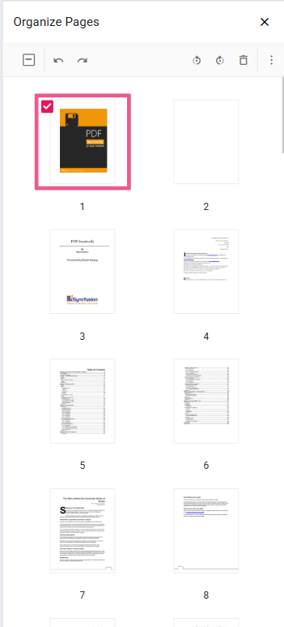

# Mobile toolbar interface in Vue PDF Viewer

The Vue PDF Viewer provides a mobile-optimized toolbar interface for viewing, searching, annotating, and managing PDF documents on mobile devices. The toolbar includes Syncfusion&reg; tools for search, download, bookmarking, annotation, and page organization. For advanced use cases, the desktop toolbar can be enabled on mobile devices to access additional features and controls.

## Mobile mode toolbar configuration

In mobile mode, the toolbar is optimized for small screens, presenting users with the most common actions for PDF interaction. The toolbar displays only the essential features to maximize screen real estate while maintaining usability.

### Main toolbar options

The following toolbar options are available in mobile mode:

**OpenOption:** Tap to load a PDF document into the viewer.

**SearchOption:** Access the search functionality to find text within the document.

**UndoRedoTool:** Quickly undo or redo annotation changes.

**OrganizePagesTool:** Enable page organization features to reorder, delete, or rotate document pages.

**AnnotationEditTool:** Activate annotation editing to add or modify annotations on the PDF.

N> In mobile mode, the annotation toolbar is displayed at the bottom of the viewer for easy access.

### More options menu

The "more options" menu provides additional actions:

**DownloadOption:** Tap to download the currently open PDF document to the device.

**BookmarkOption:** View and navigate to bookmarks within the document.

## Enable desktop mode on mobile devices

By default, the PDF Viewer automatically detects the device type and displays the optimized toolbar layout. For applications that require the full desktop toolbar experience on mobile devices, enable desktop mode using the `enableDesktopMode` property. This provides access to all available toolbar actions and controls typically reserved for desktop platforms.

### Steps to enable desktop mode

**Step 1**: Set the `enableDesktopMode` property to `true` in your PDF Viewer configuration.

**Step 2**: The mobile toolbar is replaced with the desktop toolbar layout, providing access to additional actions and controls.




<template>
  

      <ejs-pdfviewer
          id="pdfViewer"
          ref="pdfviewer"
          :documentPath="documentPath"
          :resourceUrl="resourceUrl"
          :enableDesktopMode=true>
      </ejs-pdfviewer>
  

</template>



<template>
  

      <ejs-pdfviewer
          id="pdfViewer"
          ref="pdfviewer"
          :serviceUrl="serviceUrl"
          :documentPath="documentPath"
          :enableDesktopMode=true>
      </ejs-pdfviewer>
  

</template>




## Optimize touch scrolling in desktop mode

When using desktop mode on mobile devices, text selection may interfere with natural touch scrolling. To ensure smooth document scrolling with touch gestures, disable text selection by setting `enableTextSelection` to `false`. This allows users to scroll documents naturally without accidentally triggering text selection.




<template>
  

      <ejs-pdfviewer
          id="pdfViewer"
          ref="pdfviewer"
          :documentPath="documentPath"
          :resourceUrl="resourceUrl"
          :enableDesktopMode=true
          :enableTextSelection=false>
      </ejs-pdfviewer>
  

</template>



<template>
  

      <ejs-pdfviewer
          id="pdfViewer"
          ref="pdfviewer"
          :serviceUrl="serviceUrl"
          :documentPath="documentPath"
          :enableDesktopMode=true
          :enableTextSelection=false>
      </ejs-pdfviewer>
  

</template>




## Access print functionality on mobile

The Print option is not available in the default mobile toolbar. To access print functionality on mobile devices, enable desktop mode by setting `enableDesktopMode` to `true`. Once desktop mode is active, the print option becomes available in the toolbar, allowing users to print PDF documents directly from their mobile device.

N> Print functionality on mobile devices typically opens the native print dialog, allowing users to save as PDF, print to wireless printers, or use other platform-specific print options.