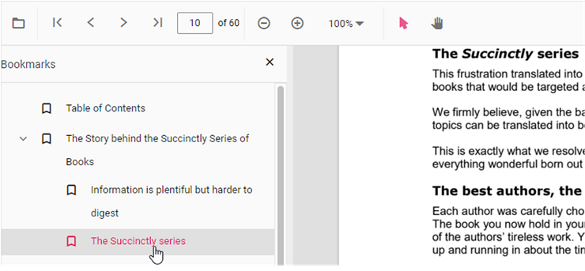
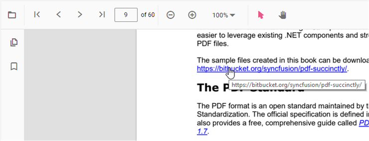

# Navigation in Vue PDF viewer control

The Vue PDF Viewer supports several internal and external navigation methods.

## Toolbar page navigation option

The default toolbar of PDF Viewer contains the following navigation options

* [**Go to page**](https://ej2.syncfusion.com/vue/documentation/api/pdfviewer/navigation/#gotopage):- Navigates to the specific page of a PDF document.
* [**Show next page**](https://ej2.syncfusion.com/vue/documentation/api/pdfviewer/navigation/#gotonextpage):- Navigates to the next page of PDF a document.
* [**Show previous page**](https://ej2.syncfusion.com/vue/documentation/api/pdfviewer/navigation/#gotopreviouspage):- Navigates to the previous page of a PDF document.
* [**Show first page**](https://ej2.syncfusion.com/vue/documentation/api/pdfviewer/navigation/#gotofirstpage):-  Navigates to the first page of a PDF document.
* [**Show last page**](https://ej2.syncfusion.com/vue/documentation/api/pdfviewer/navigation/#gotolastpage):- Navigates to the last page of a PDF document.

You can enable or disable page navigation in the PDF Viewer using the following code snippet.




<template>
  

    <ejs-pdfviewer id="pdfViewer" :documentPath="documentPath" :resourceUrl="resourceUrl" :enableNavigation="true">
    </ejs-pdfviewer>
  

</template>




<template>
  

    <ejs-pdfviewer id="pdfViewer" :documentPath="documentPath" :resourceUrl="resourceUrl" :enableNavigation="true">
    </ejs-pdfviewer>
  

</template>




<template>
  

    <ejs-pdfviewer id="pdfViewer" :serviceUrl="serviceUrl" :documentPath="documentPath" :enableNavigation="true">
    </ejs-pdfviewer>
  

</template>




<template>
  

    <ejs-pdfviewer id="pdfViewer" :serviceUrl="serviceUrl" :documentPath="documentPath" :enableNavigation="true">
    </ejs-pdfviewer>
  

</template>




Also, you can programmatically perform page navigation options as follows.




<template>
  

    <button v-on:click="goToFirstPage">Go To First Page</button>
    <button v-on:click="goToLastPage">Go To last Page</button>
    <button v-on:click="goToNextPage">Go To Next Page</button>
    <button v-on:click="goToPage">Go To Page</button>
    <button v-on:click="goToPreviousPage">Go To Previous Page</button>
    <ejs-pdfviewer id="pdfViewer" ref="pdfviewer" :documentPath="documentPath" :resourceUrl="resourceUrl">
    </ejs-pdfviewer>
  

</template>




<template>
  

    <button v-on:click="goToFirstPage">Go To First Page</button>
    <button v-on:click="goToLastPage">Go To last Page</button>
    <button v-on:click="goToNextPage">Go To Next Page</button>
    <button v-on:click="goToPage">Go To Page</button>
    <button v-on:click="goToPreviousPage">Go To Previous Page</button>
    <ejs-pdfviewer id="pdfViewer" ref="pdfviewer":documentPath="documentPath" :resourceUrl="resourceUrl" >
    </ejs-pdfviewer>
  

</template>




<template>
  

    <button v-on:click="goToFirstPage">Go To First Page</button>
    <button v-on:click="goToLastPage">Go To last Page</button>
    <button v-on:click="goToNextPage">Go To Next Page</button>
    <button v-on:click="goToPage">Go To Page</button>
    <button v-on:click="goToPreviousPage">Go To Previous Page</button>
    <ejs-pdfviewer id="pdfViewer" ref="pdfviewer" :serviceUrl="serviceUrl" :documentPath="documentPath">
    </ejs-pdfviewer>
  

</template>




<template>
  

    <button v-on:click="goToFirstPage">Go To First Page</button>
    <button v-on:click="goToLastPage">Go To last Page</button>
    <button v-on:click="goToNextPage">Go To Next Page</button>
    <button v-on:click="goToPage">Go To Page</button>
    <button v-on:click="goToPreviousPage">Go To Previous Page</button>
    <ejs-pdfviewer id="pdfViewer" ref="pdfviewer" :serviceUrl="serviceUrl" :documentPath="documentPath">
    </ejs-pdfviewer>
  

</template>




Find the [here](https://www.syncfusion.com/downloads/support/directtrac/general/ze/quickstart970554908.zip) to perform the page navigation options programmatically.

## Bookmark navigation

Bookmarks stored in a PDF are loaded for quick navigation to document sections. You can enable or disable bookmark navigation using the following code snippet.




<template>
  

    <ejs-pdfviewer id="pdfViewer" :documentPath="documentPath" :resourceUrl="resourceUrl" :enableBookmark="false">
    </ejs-pdfviewer>
  

</template>




<template>
  

    <ejs-pdfviewer id="pdfViewer" :documentPath="documentPath" :resourceUrl="resourceUrl" :enableBookmark="false">
    </ejs-pdfviewer>
  

</template>




<template>
  

    <ejs-pdfviewer id="pdfViewer" :serviceUrl="serviceUrl" :documentPath="documentPath" :enableBookmark="false">
    </ejs-pdfviewer>
  

</template>




<template>
  

    <ejs-pdfviewer id="pdfViewer" :serviceUrl="serviceUrl" :documentPath="documentPath" :enableBookmark="false">
    </ejs-pdfviewer>
  

</template>




## Thumbnail navigation

Thumbnails are miniature representations of PDF pages. This feature displays page thumbnails to help users jump directly to a page. You can enable or disable thumbnail navigation using the following code snippet.




<template>
  

    <ejs-pdfviewer id="pdfViewer" :serviceUrl="serviceUrl" :documentPath="documentPath" :enableTextSearch="true">
    </ejs-pdfviewer>
  

</template>




<template>
  

    <ejs-pdfviewer id="pdfViewer" :serviceUrl="serviceUrl" :documentPath="documentPath" :enableTextSearch="true">
    </ejs-pdfviewer>
  

</template>




<template>
  

    <ejs-pdfviewer id="pdfViewer" :serviceUrl="serviceUrl" :documentPath="documentPath" :enableTextSearch="true">
    </ejs-pdfviewer>
  

</template>




<template>
  

    <ejs-pdfviewer id="pdfViewer" :serviceUrl="serviceUrl" :documentPath="documentPath" :enableTextSearch="true">
    </ejs-pdfviewer>
  

</template>







<template>
  

    <ejs-pdfviewer id="pdfViewer" :documentPath="documentPath" :resourceUrl="resourceUrl" :enableThumbnail="true">
    </ejs-pdfviewer>
  

</template>




<template>
  

    <ejs-pdfviewer id="pdfViewer" :documentPath="documentPath" :resourceUrl="resourceUrl" :enableThumbnail="true">
    </ejs-pdfviewer>
  

</template>




<template>
  

    <ejs-pdfviewer id="pdfViewer" :documentPath="documentPath" :serviceUrl="serviceUrl" :enableThumbnail="true">
    </ejs-pdfviewer>
  

</template>




<template>
  

    <ejs-pdfviewer id="pdfViewer" :documentPath="documentPath" :serviceUrl="serviceUrl" :enableThumbnail="true">
    </ejs-pdfviewer>
  

</template>




## Hyperlink navigation

Hyperlink navigation enables opening external URLs embedded in a PDF file.

## Table of contents navigation

Table of contents navigation allows users to jump to sections listed in the PDF's table of contents. You can enable or disable link navigation using the following code snippet.




<template>
  

    <ejs-pdfviewer id="pdfViewer" :documentPath="documentPath" :resourceUrl="resourceUrl" :enableHyperlink="true">
    </ejs-pdfviewer>
  

</template>




<template>
  

    <ejs-pdfviewer id="pdfViewer" :documentPath="documentPath" :resourceUrl="resourceUrl" :enableHyperlink="true">
    </ejs-pdfviewer>
  

</template>




<template>
  

    <ejs-pdfviewer id="pdfViewer" :documentPath="documentPath" :serviceUrl="serviceUrl" :enableHyperlink="true">
    </ejs-pdfviewer>
  

</template>




<template>
  

    <ejs-pdfviewer id="pdfViewer" :documentPath="documentPath" :serviceUrl="serviceUrl" :enableHyperlink="true">
    </ejs-pdfviewer>
  

</template>




You can change how hyperlinks open in the PDF Viewer (for example, in a new tab) using the following code snippet.




<template>
  

    <ejs-pdfviewer id="pdfViewer" :documentPath="documentPath" :resourceUrl="resourceUrl" :enableHyperlink="true"
      :hyperlinkOpenState="hyperlinkOpenState">
    </ejs-pdfviewer>
  

</template>




<template>
  

    <ejs-pdfviewer id="pdfViewer" :documentPath="documentPath" :resourceUrl="resourceUrl" :enableHyperlink="true"
      :hyperlinkOpenState="hyperlinkOpenState">
    </ejs-pdfviewer>
  

</template>




<template>
  

    <ejs-pdfviewer id="pdfViewer" :serviceUrl="serviceUrl" :documentPath="documentPath" :enableHyperlink="true"
      :hyperlinkOpenState="hyperlinkOpenState">
    </ejs-pdfviewer>
  

</template>




<template>
  

    <ejs-pdfviewer id="pdfViewer" :serviceUrl="serviceUrl" :documentPath="documentPath" :enableHyperlink="true"
      :hyperlinkOpenState="hyperlinkOpenState">
    </ejs-pdfviewer>
  

</template>




## See also

* [Toolbar items](https://help.syncfusion.com/document-processing/pdf/pdf-viewer/vue/toolbar)
* [Feature Modules](https://help.syncfusion.com/document-processing/pdf/pdf-viewer/vue/feature-module)