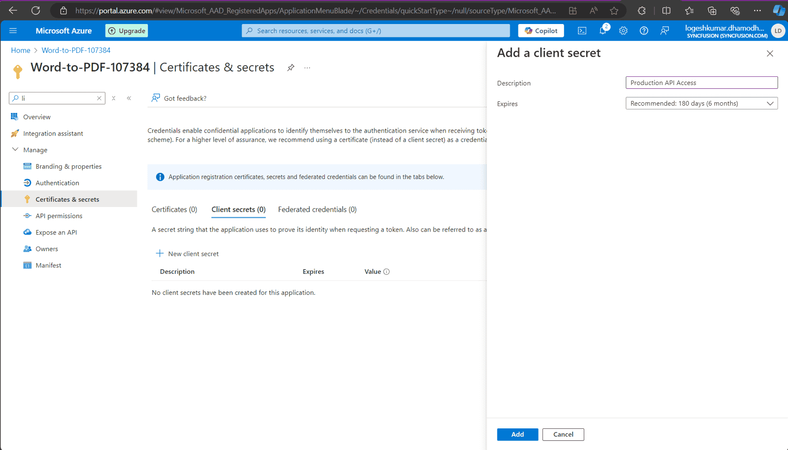
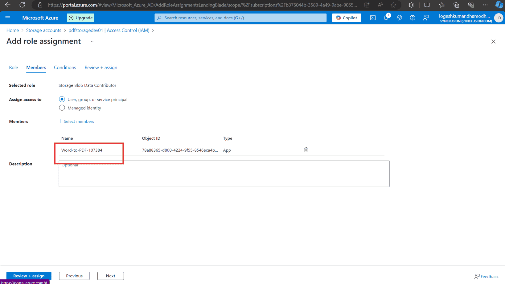

# Open PDF from Azure Active Directory

### Overview

The Vue PDF Viewer component supports loading and saving PDF files with Azure Active Directory (AAD). The following steps explain how to securely load and store PDFs using AAD.

### Steps to open a PDF from Azure Active Directory

---

### Step 1: Register an application in Azure Active Directory (AAD)

1. **Go to the Azure portal**:
   - Navigate to [Azure Portal](https://portal.azure.com).

2. **Register your application**:
   - In the Azure portal, go to **Azure Active Directory** > **App registrations** > **New registration**.
   - Register your application and note the **Application (client) ID** and **Directory (tenant) ID**.

   

3. **Create a client secret**:
   - In the registered application, go to **Certificates & secrets**.
   - Click **New client secret**.
   - Provide a description, set an expiration period, and click **Add**.
   - Copy the client secret value immediately, as it will be hidden later. Store it securely.

   

---

### Step 2: Create the Azure Storage account

1. **Create a storage account**:
   - In the Azure portal, search for **Storage accounts**.
   - Create a new storage account by entering the required details (for example, name, location, resource group).

    

---

### Step 3: Assign a role to the application

1. **Open your storage account**:
   - Navigate to **Access control (IAM)** > **Add role assignment** in your Azure Storage account.

2. **Assign a role**:
   - Assign the **Storage Blob Data Contributor** role to your registered application.
   - In the **Assign access to** drop-down, choose **User, group, or service principal**.
   - Click **Select members**, search for your registered application by name or client ID, choose it, and click **Select**.
   - Click **Review + assign** to complete the role assignment.

    
---

### Step 4: Upload the PDF to Azure Storage

1. **Navigate to data storage**:
   - In the Azure portal, go to **Data storage** > **Containers**.

2. **Upload the PDF file**:
   - Create a new container and upload the PDF document you want to access in the PDF Viewer.

    
---

### Step 5: Server-side configuration

1. **Configure server-side code**:
   - Open the server-side application (for example, ASP.NET Core) and configure the following details in the `PdfViewerController` file:
     - `tenantId` (your Azure AD tenant ID),
     - `clientId` (your registered application client ID),
     - `clientSecret` (your registered application client secret),
     - `blobServiceEndpoint` (your storage account blob service URL),
     - `containerName` (your container name in Azure Blob Storage).

2. **Run the web service**:
   - After saving the configuration values, run the web service so that the Vue application can reach it.

---

### Step 6: Client-side configuration

1. **Run the Vue sample**:
   - Start the Vue sample that includes the Syncfusion PDF Viewer component.

2. **Load a PDF from AAD**:
   - When the user selects **Load From AAD**, the Vue client sends an HTTP request to the server-side API to fetch the PDF from Azure Blob Storage.
   - The server retrieves the PDF from Azure, converts it to a Base64 string, and returns it to the client.

3. **Display the PDF in the viewer**:
   - After the Base64 string is received, the PDF Viewer loads the document by calling `viewer.load()`.

---

### Step 7: Save the PDF to Azure

1. **Save PDF to AAD**:
   - When the user selects **Save To AAD**, the application uploads any PDF changes back to Azure Blob Storage.
   - The server converts the updated PDF into a byte array and writes it to the specified Azure Blob container.

---

### Server-side code
```csharp
string tenantId = "Provide the tenant id here";
string clientId = "Provide the clientid here";
string clientSecret = "Provide the client secret here";
string blobServiceEndpoint = "https://your-storage-account.blob.core.windows.net";
string containerName = "Provide the container name here";


[HttpPost("LoadFromAAD")]
[Route("[controller]/LoadFromAAD")]
public async Task<IActionResult> LoadFromAAD(string fileName)
{
    var clientSecretCredential = new ClientSecretCredential(tenantId, clientId, clientSecret);
    var blobServiceClient = new BlobServiceClient(new Uri(blobServiceEndpoint), clientSecretCredential);
    var containerClient = blobServiceClient.GetBlobContainerClient(containerName);
    var blobClient = containerClient.GetBlobClient(fileName);

    // Download the PDF file to a local stream
    using MemoryStream pdfStream = new MemoryStream();
    await blobClient.DownloadToAsync(pdfStream);
    var base64 = Convert.ToBase64String(pdfStream.ToArray());
    return Content("data:application/pdf;base64," + base64);
}

[AcceptVerbs("SaveToAAD")]
[HttpPost("SaveToAAD")]
[Route("[controller]/SaveToAAD")]
public async Task<IActionResult> SaveToAAD([FromBody] Dictionary<string, string> jsonObject)
{
    PdfRenderer pdfviewer = new PdfRenderer(_cache);
    var fileName = jsonObject.ContainsKey("documentId") ? jsonObject["documentId"] : "Test.pdf";
    string documentBase = pdfviewer.GetDocumentAsBase64(jsonObject);
    string convertedBase = documentBase.Substring(documentBase.LastIndexOf(',') + 1);
    // Decode the Base64 string to a byte array
    byte[] byteArray = Convert.FromBase64String(convertedBase);
    // Create a MemoryStream from the byte array
    MemoryStream stream = new MemoryStream(byteArray);
    // Create a new BlobServiceClient using the DefaultAzureCredential
    var clientSecretCredential = new ClientSecretCredential(tenantId, clientId, clientSecret);
    var blobServiceClient = new BlobServiceClient(new Uri(blobServiceEndpoint), clientSecretCredential);
    // Get a reference to the container
    var containerClient = blobServiceClient.GetBlobContainerClient(containerName);
    // Get a reference to the blob
    var blobClient = containerClient.GetBlobClient(fileName);
    //FileStream uploadFileStream = new FileStream();
    await blobClient.UploadAsync(stream, true);
    stream.Close();
    return Content(string.Empty);
}

```


### Client-side code




<template>
  <div id="app">
    <!-- PDF Viewer Component -->
    <ejs-pdfviewer
      id="pdfViewer"
      ref="pdfviewer"
      :documentPath="documentPath"
      :serviceUrl="serviceUrl"
      :toolbar-settings="toolbarSettings"
      @toolbar-click="toolbarClick">
    </ejs-pdfviewer>
  </div>
</template>

<script>
import { PdfViewerComponent, Toolbar, Magnification, Navigation,
         LinkAnnotation, BookmarkView, Annotation, ThumbnailView,
         Print, TextSelection, TextSearch, FormFields, FormDesigner,
         PageOrganizer } from '@syncfusion/ej2-vue-pdfviewer';

export default {
  name: 'App',
  components: {
    "ejs-pdfviewer": PdfViewerComponent
  },
  data () {
    // Toolbar items configuration
    const toolItem1 = {
      text: 'Load From AAD',
      id: 'LoadFromAAD',
      tooltipText: 'Custom toolbar item',
      align: 'left'
    };
    const toolItem2 = {
      id: 'SaveToAAD',
      text: 'Save To AAD',
      tooltipText: 'Custom toolbar item',
      align: 'left'
    };

    return {
      // Path to the document
      documentPath: "",  // You can set this to an initial document URL or keep it empty
      // URL for the service (used by the Syncfusion PDF Viewer)
      serviceUrl: "https://localhost:44308/pdfviewer",
      // Toolbar settings
      toolbarSettings: {
        toolbarItems: [
          toolItem1, toolItem2,
          'OpenOption', 'PageNavigationTool', 'MagnificationTool',
          'PanTool', 'SelectionTool', 'SearchOption', 'PrintOption',
          'DownloadOption', 'UndoRedoTool', 'AnnotationEditTool',
          'FormDesignerEditTool', 'CommentTool', 'SubmitForm'
        ]
      }
    };
  },

  provide: {
    PdfViewer: [Toolbar, Magnification, Navigation, LinkAnnotation, BookmarkView, ThumbnailView,
                Print, TextSelection, TextSearch, Annotation, FormDesigner, FormFields, PageOrganizer]
  },

  methods: {
    // Handle toolbar button clicks
    toolbarClick(args) {
      const viewer = this.$refs.pdfviewer.ej2Instances;  // Reference to the PdfViewer instance

      if (args.item) {
        if (args.item.id === 'LoadFromAAD') {
          // Handle 'Load From AAD' logic
          this.loadFromAAD(viewer);
        } else if (args.item.id === 'SaveToAAD') {
          // Handle 'Save To AAD' logic
          this.saveToAAD(viewer);
        }
      }
    },

    // Load PDF from AAD (simulated logic)
    loadFromAAD(viewer) {
      console.log('Loading PDF from AAD...');
      const xhr = new XMLHttpRequest();
      //modify the url based on the file name
      xhr.open('POST', `https://localhost:44308/pdfviewer/LoadFromAAD?fileName=pdf-succinctly.pdf`, true);
      xhr.onreadystatechange = () => {
        if (xhr.readyState === 4 && xhr.status === 200) {
          const data = xhr.responseText;
          console.log('Loaded PDF:', data);
          viewer.load(data);  // Load the document into the PDF Viewer
        } else if (xhr.readyState === 4) {
          console.error('Error loading PDF from AAD');
        }
      };
      xhr.send();
    },

    // Save PDF to AAD (simulated logic)
    saveToAAD(viewer) {
      console.log('Saving PDF to AAD...');
      viewer.serverActionSettings.download = "SaveToAAD"; // Custom download action
      viewer.download();  // Trigger the download action for saving
    }
  }
};
</script>




[View sample in GitHub](https://github.com/SyncfusionExamples/open-save-pdf-documents-in-aad).