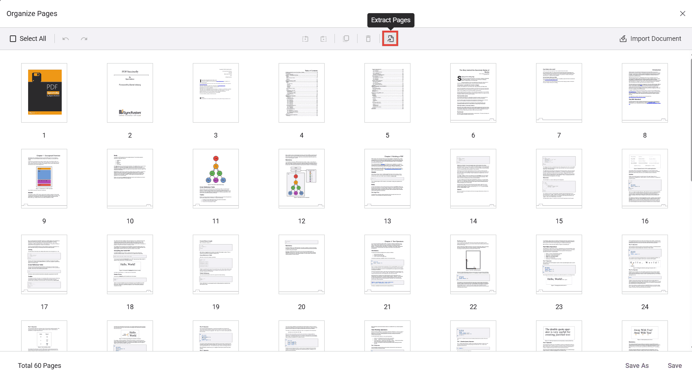
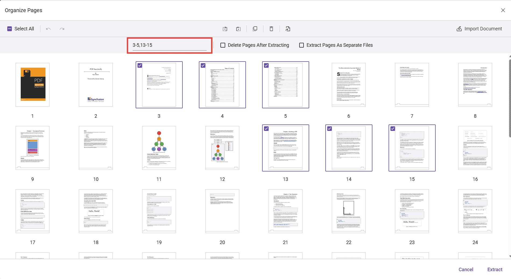

# Extract pages in Vue PDF Viewer

The PDF Viewer component enables users to extract pages from a document using the Extract Pages option in the Organize Pages UI and to control extraction programmatically. The Extract Pages tool is available by default in Organize Pages.

## Extract Pages in Organize Pages

- Open the Organize Pages panel in the PDF Viewer toolbar.
- Locate and click the Extract Pages option.

When selected, a secondary toolbar dedicated to extraction is displayed.

## Extract pages using the UI

You can extract by typing page numbers/ranges or by selecting thumbnails.

1. Click Extract Pages in the Organize Pages panel.
2. In the input box, enter the pages to extract. Supported formats include:
   - Single pages: 1,3,5
   - Ranges: 2-6
   - Combinations: 1,4,7-9
3. Alternatively, select the page thumbnails you want instead of typing values.
4. Click Extract to download the extracted pages as a new PDF. Click Cancel to close the tool.

Note: Page numbers are 1-based (first page is 1). Invalid or out-of-range entries are ignored.

## Extraction options (checkboxes)

Two options appear in the secondary toolbar:

- **Delete Pages After Extracting:**
  - When enabled, the selected/entered pages are removed from the document opened in the viewer after the extraction completes. The extracted pages are still downloaded as a new file.
  - Example: If you enter 1,2 and extract, a PDF containing pages 1 and 2 is downloaded, and pages 1 and 2 are removed from the currently loaded document in the viewer.

- **Extract Pages As Separate Files:**
  - When enabled, every selected page is exported as an individual PDF file.
  - Example: If you select pages 3, 5, and 6, three separate PDFs are downloaded (3.pdf, 5.pdf, and 6.pdf). If you enter a range (e.g., 2-4), pages 2, 3, and 4 are each downloaded as separate PDFs.

## Programmatic options and APIs

You can control the Extract Pages experience via settings and invoke extraction through code.

### Enable/disable Extract Pages

Use the `canExtractPages` API to enable or disable the Extract Pages option. When set to `false`, the Extract Pages tool is disabled in the toolbar. The default value is `true`.

Use the following code snippet to enable or disable the Extract Pages option:



<template>
  

  <button v-on:click="extractPage">Extract Page</button>
      <ejs-pdfviewer
          id="pdfViewer"
          ref="pdfviewer"
          :resourceUrl="resourceUrl"
          :documentPath="documentPath">
      </ejs-pdfviewer>
  

</template>




Use the `showExtractPagesOption` API to show or hide the Extract Pages option. When set to `false`, the Extract Pages tool is removed from the toolbar. The default value is `true`.

Use the following code snippet to remove the Extract Pages option:



<template>
  

  <button v-on:click="extractPage">Extract Page</button>
      <ejs-pdfviewer
          id="pdfViewer"
          ref="pdfviewer"
          :resourceUrl="resourceUrl"
          :documentPath="documentPath">
      </ejs-pdfviewer>
  

</template>




### Extract pages and load the result programmatically

You can extract pages programmatically using the `extractPages` method.
The following example extracts pages 1 and 2, then immediately loads the extracted pages back into the viewer. The returned value is a byte array (e.g., Uint8Array) representing the PDF file contents.



<template>
  

  <button v-on:click="extractPage">Extract Page</button>
      <ejs-pdfviewer
          id="pdfViewer"
          ref="pdfviewer"
          :resourceUrl="resourceUrl"
          :documentPath="documentPath"
          :pageOrganizerSettings="pageOrganizerSettings">
      </ejs-pdfviewer>
  

</template>




[View sample in GitHub](https://github.com/SyncfusionExamples/vue-pdf-viewer-examples/tree/master/How%20to)

## See also

- [Overview](../overview)
- [UI interactions](../ui-interactions)
- [Programmatic support](../programmatic-support)
- [Toolbar](../toolbar)
- [Events](../events)
- [Mobile view](../mobile-view)
