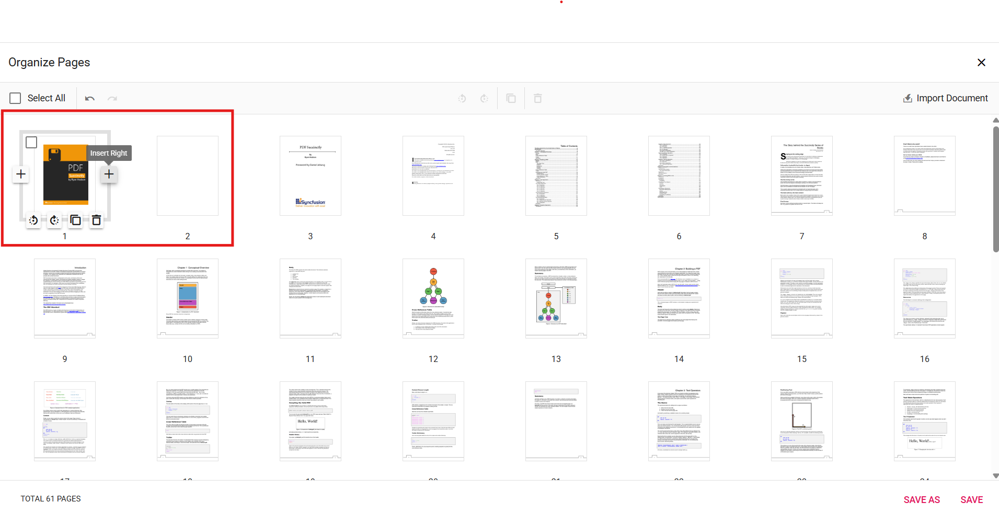

# Insert blank pages using the Organize Pages tool in Vue

## Overview

This guide describes inserting new blank pages into a PDF using the **Organize Pages** UI in the EJ2 Vue PDF Viewer.

**Outcome**: A blank page is added at the chosen position and will appear in thumbnails and exports.

## Prerequisites

- EJ2 Vue PDF Viewer installed
- `PageOrganizer` services injected into the PDF Viewer component
- [`resourceUrl`](https://ej2.syncfusion.com/vue/documentation/api/pdfviewer#resourceurl) for standalone mode or [`serviceUrl`](https://ej2.syncfusion.com/vue/documentation/api/pdfviewer#serviceurl) for server-backed mode configured as required

## Steps

1. Open the Organize Pages view

	- Click the **Organize Pages** button in the viewer navigation toolbar to open the panel.

2. Select insertion point

	- Hover over the thumbnail before or after which you want the blank page added.

3. Insert a blank page

	- Click the **Insert Left** / **Insert Right** option and choose the position (Before / After). A new blank thumbnail appears in the sequence.

    

4. Adjust and confirm

	- Reposition or remove the inserted blank page if needed using drag-and-drop or delete options.

5. Persist the change

	- Click **Save** or **Save As** to include the blank page in the exported PDF.

## Expected result

- A blank page thumbnail appears at the chosen position and is present in any saved or downloaded PDF.

## Enable or disable Insert Pages button

To enable or disable the **Insert Pages** button in the page thumbnails, update the [`pageOrganizerSettings`](https://ej2.syncfusion.com/vue/documentation/api/pdfviewer/pageorganizersettings). See [Organize pages toolbar customization](./toolbar#show-or-hide-the-insert-option) for the guidelines

## Code snippet

To enable the insert blank pages feature, use the following code snippet:



<template>
  

    <ejs-pdfviewer id="pdfViewer" :documentPath="documentPath" :resourceUrl="resourceUrl" :pageOrganizerSettings="{ canInsert: true }">
    </ejs-pdfviewer>
  

</template>




## Troubleshooting

- **Organize Pages button missing**: Verify `PageOrganizer` is included in the modules and `Toolbar` is enabled.
- **Inserted page not saved**: Confirm [`resourceUrl`](https://ej2.syncfusion.com/vue/documentation/api/pdfviewer#resourceurl) or [`serviceUrl`](https://ej2.syncfusion.com/vue/documentation/api/pdfviewer#serviceurl) is configured for your selected processing mode.
- **Insert options disabled**: Ensure [`pageOrganizerSettings.canInsert`](https://ej2.syncfusion.com/vue/documentation/api/pdfviewer/pageorganizersettingsmodel#caninsert) is set to `true` to enable insert option.

## Related topics

- [Organize pages toolbar customization](./toolbar)
- [Organize pages event reference](./events)
- [Remove pages in Organize Pages](./remove-pages)
- [Reorder pages in Organize Pages](./reorder-pages)
