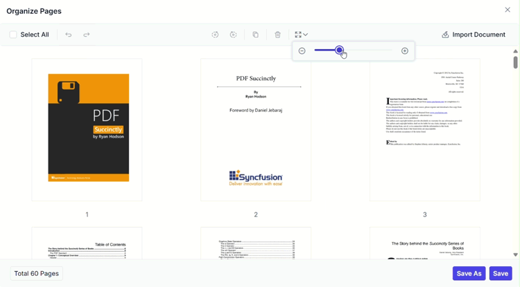

# Zoom pages using the Organize Pages tool in Vue

## Overview

This guide explains how to change the thumbnail zoom level in the **Organize Pages** UI so you can view more detail or an overview of more pages.

**Outcome**: Page thumbnails resize interactively to suit your task.

## Prerequisites

- EJ2 Vue PDF Viewer installed
- `Toolbar` and `PageOrganizer` services injected in PDF Viewer
- [`pageOrganizerSettings.showImageZoomingSlider`](https://ej2.syncfusion.com/vue/documentation/api/pdfviewer/pageorganizersettingsmodel#showimagezoomingslider) is set to `true`

## Steps

1. Open the Organize Pages view

	- Click the **Organize Pages** button in the viewer toolbar to open the thumbnails panel.

2. Locate the zoom control

	- Find the thumbnail zoom slider in the Organize Pages toolbar.

3. Adjust zoom

	- Drag the slider to increase or decrease thumbnail size.

    

4. Choose an optimal zoom level

	- Select a zoom level that balances page detail and the number of visible thumbnails for your task.

## Expected result

- Thumbnails resize interactively; larger thumbnails show more detail while smaller thumbnails allow viewing more pages at once.

## Show or hide Zoom Pages button

To enable or disable the **Zoom Pages** button in the Organize Pages toolbar, update the [`pageOrganizerSettings`](https://ej2.syncfusion.com/vue/documentation/api/pdfviewer/pageorganizersettings). See [Organize pages toolbar customization](./toolbar#show-or-hide-the-zoom-pages-option) for the guidelines

## Code snippet

To enable the zoom pages feature with the zoom slider, use the following code snippet:



<template>
  

    <ejs-pdfviewer id="pdfViewer" :documentPath="documentPath" :resourceUrl="resourceUrl" :pageOrganizerSettings="{ showImageZoomingSlider: true }">
    </ejs-pdfviewer>
  

</template>




## Troubleshooting

- **Zoom control not visible**: Confirm [`pageOrganizerSettings.showImageZoomingSlider`](https://ej2.syncfusion.com/vue/documentation/api/pdfviewer/pageorganizersettingsmodel#showimagezoomingslider) is set to `true`.

## Related topics

- [Organize pages toolbar customization](./toolbar)
- [Organize pages event reference](./events)
