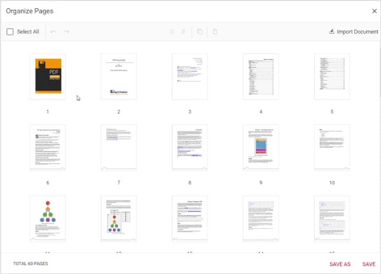
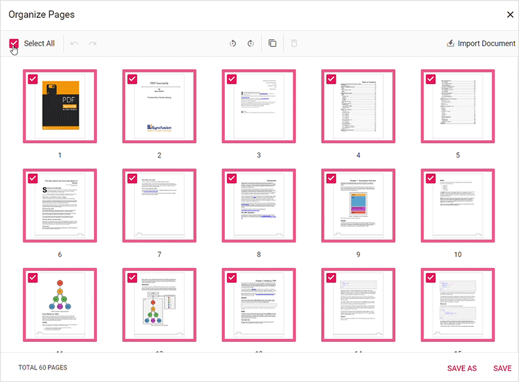

# Organize Pages in Vue PDF Viewer component

The PDF Viewer allows you to manage your PDF documents efficiently by organizing pages seamlessly. Whether you need to add new pages, remove unnecessary ones, rotate pages, move pages within the document, and copy or duplicate pages, the PDF Viewer facilitates these tasks effortlessly.

## Getting started

To access the organize pages feature, simply open the PDF document in the PDF Viewer and navigate to the left vertical toolbar. Look for the `Organize Pages` option to begin utilizing these capabilities.


The page organization support enables you to perform various actions such as rotating, rearranging, inserting, copying, and deleting pages within a PDF document using organize pages dialog.

### Rotating PDF pages

You can adjust the orientation of PDF pages to ensure proper alignment. The rotate icon offers the following options:

* `Rotate clockwise`: Rotate the selected pages 90 degrees clockwise.
* `Rotate counter-clockwise`: Rotate the selected pages 90 degrees counter-clockwise.

### Rearranging PDF pages

You can easily change the sequence of pages within your document using the drag and drop method:

* `Drag and drop`: Click and drag a page thumbnail to the desired position within the document, then release it to rearrange the page order.


### Inserting new pages

Effortlessly add new pages to your document with the following options:

* `Insert blank page left`: Insert a blank page to the left of the selected page using the respective icon.
* `Insert blank page right`: Insert a blank page to the right of the selected page using the corresponding icon.

### Deleting PDF pages

Removing unwanted pages from your document is straight forward:

* `Select pages to delete`: Click on the page thumbnails you wish to remove. You can select multiple pages at once.
* `Delete selected pages`: Use the delete option in the organize pages pane to remove the selected pages from the document.

### Copying PDF pages

Duplicate the pages within your PDF document effortlessly:

* `Select pages to copy`: Click on the page thumbnails you wish to duplicate. Use the copy option to create duplicates. When a page is copied, the duplicate is automatically added to the right of the selected page. Multiple copies can be made using the toolbar action.



### Importing a PDF Document

Seamlessly import a PDF document into your existing document:

* `Import PDF document`: Click the **Import Document** button to import a PDF. If a page is selected, the imported document’s thumbnail will be inserted to the right of the selected page. If multiple or no pages are selected, the thumbnail will be added as the first page. When **Save** or **Save As** is clicked, the imported PDF will be merged with the current document. You can insert a blank page to the left or right of the imported thumbnail, delete it, or drag and drop it to reposition as needed.


### Selecting all pages

Make comprehensive adjustments by selecting all pages simultaneously. This facilitates efficient editing and formatting across the entire document.



### Zooming Page Thumbnails

Adjust the size of page thumbnails within the organizer panel for better visibility and precision when editing. The zoom functionality allows you to:

* Increase or decrease the size of page thumbnails using the zoom slider
* See more details on pages when zoomed in
* View more pages simultaneously when zoomed out

This feature is especially useful when working with documents containing complex layouts or small details that need careful examination during organization.


### Real-time updates

Witness instant changes in page organization reflected within the PDF Viewer. Simply click the **Save** button to preserve your modifications.

### SaveAs functionality

Safeguard your edits by utilizing the **Save As** feature. This enables you to download the modified version of the PDF document for future reference, ensuring that your changes are securely stored.

## API's supported

**enablePageOrganizer:** This API enables or disables the page organizer feature in the PDF Viewer. By default, it is set to `true`, indicating that the page organizer is enabled.




<template>
  <div id="app">
      <ejs-pdfviewer
          id="pdfViewer"
          ref="pdfviewer"
          :documentPath="documentPath"
          :resourceUrl="resourceUrl"
          :enablePageOrganizer=true>
      </ejs-pdfviewer>
  </div>
</template>

<script>
import Vue from 'vue';
import {  PdfViewerPlugin, Toolbar, Magnification, Navigation, LinkAnnotation,
          BookmarkView, Annotation, ThumbnailView, Print, TextSelection,
          TextSearch, FormFields, FormDesigner, PageOrganizer } from '@syncfusion/ej2-vue-pdfviewer';
Vue.use(PdfViewerPlugin);

export default {
  name: 'app',
  data () {
    return {
      documentPath:"https://cdn.syncfusion.com/content/pdf/pdf-succinctly.pdf",
      resourceUrl: 'https://cdn.syncfusion.com/ej2/25.1.35/dist/ej2-pdfviewer-lib',
    };
  },

  provide: {
    PdfViewer: [ Toolbar, Magnification, Navigation, LinkAnnotation, BookmarkView, ThumbnailView,
                 Print, TextSelection, TextSearch, Annotation, FormFields, FormDesigner, PageOrganizer ]},

}
</script>



<template>
  <div id="app">
      <ejs-pdfviewer
          id="pdfViewer"
          ref="pdfviewer"
          :serviceUrl="serviceUrl"
          :documentPath="documentPath"
          :enablePageOrganizer=true>
      </ejs-pdfviewer>
  </div>
</template>

<script>
import Vue from 'vue';
import {  PdfViewerPlugin, Toolbar, Magnification, Navigation, LinkAnnotation,
          BookmarkView, Annotation, ThumbnailView, Print, TextSelection,
          TextSearch, FormFields, FormDesigner, PageOrganizer } from '@syncfusion/ej2-vue-pdfviewer';
Vue.use(PdfViewerPlugin);

export default {
  name: 'app',
  data () {
    return {
      serviceUrl:"https://document.syncfusion.com/web-services/pdf-viewer/api/pdfviewer",
      documentPath:"https://cdn.syncfusion.com/content/pdf/pdf-succinctly.pdf",
    };
  },

  provide: {
    PdfViewer: [ Toolbar, Magnification, Navigation, LinkAnnotation, BookmarkView, ThumbnailView,
                 Print, TextSelection, TextSearch, Annotation, FormFields, FormDesigner, PageOrganizer ]},

}
</script>



**isPageOrganizerOpen:** This API determines whether the page organizer dialog will be displayed automatically when a document is loaded into the PDF Viewer. By default, it is set to `false`, meaning the dialog is not displayed initially.




<template>
  <div id="app">
      <ejs-pdfviewer
          id="pdfViewer"
          ref="pdfviewer"
          :documentPath="documentPath"
          :resourceUrl="resourceUrl"
          :isPageOrganizerOpen = true>
      </ejs-pdfviewer>
  </div>
</template>

<script>
import Vue from 'vue';
import {  PdfViewerPlugin, Toolbar, Magnification, Navigation, LinkAnnotation,
          BookmarkView, Annotation, ThumbnailView, Print, TextSelection,
          TextSearch, FormFields, FormDesigner, PageOrganizer } from '@syncfusion/ej2-vue-pdfviewer';
Vue.use(PdfViewerPlugin);

export default {
  name: 'app',
  data () {
    return {
      documentPath:"https://cdn.syncfusion.com/content/pdf/pdf-succinctly.pdf",
      resourceUrl: 'https://cdn.syncfusion.com/ej2/25.1.35/dist/ej2-pdfviewer-lib',
    };
  },

  provide: {
    PdfViewer: [ Toolbar, Magnification, Navigation, LinkAnnotation, BookmarkView, ThumbnailView,
                 Print, TextSelection, TextSearch, Annotation, FormFields, FormDesigner, PageOrganizer ]},

}
</script>



<template>
  <div id="app">
      <ejs-pdfviewer
          id="pdfViewer"
          ref="pdfviewer"
          :serviceUrl="serviceUrl"
          :documentPath="documentPath"
          :isPageOrganizerOpen = true>
      </ejs-pdfviewer>
  </div>
</template>

<script>
import Vue from 'vue';
import {  PdfViewerPlugin, Toolbar, Magnification, Navigation, LinkAnnotation,
          BookmarkView, Annotation, ThumbnailView, Print, TextSelection,
          TextSearch, FormFields, FormDesigner, PageOrganizer } from '@syncfusion/ej2-vue-pdfviewer';
Vue.use(PdfViewerPlugin);

export default {
  name: 'app',
  data () {
    return {
      serviceUrl:"https://document.syncfusion.com/web-services/pdf-viewer/api/pdfviewer",
      documentPath:"https://cdn.syncfusion.com/content/pdf/pdf-succinctly.pdf",
    };
  },

  provide: {
    PdfViewer: [ Toolbar, Magnification, Navigation, LinkAnnotation, BookmarkView, ThumbnailView,
                 Print, TextSelection, TextSearch, Annotation, FormFields, FormDesigner, PageOrganizer ]},

}
</script>



**pageOrganizerSettings:** This API allows control over various page management functionalities within the PDF Viewer. It includes options to enable or disable actions such as deleting, inserting, rotating, copying, importing and rearranging pages, as well as configuring thumbnail zoom settings. By default, all these actions are enabled and standard zoom settings are applied.




<template>
  <div id="app">
      <ejs-pdfviewer
          id="pdfViewer"
          ref="pdfviewer"
          :documentPath="documentPath"
          :resourceUrl="resourceUrl"
          :pageOrganizerSettings="pageOrganizerSettings">
      </ejs-pdfviewer>
  </div>
</template>

<script>
import Vue from 'vue';
import {  PdfViewerPlugin, Toolbar, Magnification, Navigation, LinkAnnotation,
          BookmarkView, Annotation, ThumbnailView, Print, TextSelection,
          TextSearch, FormFields, FormDesigner, PageOrganizer } from '@syncfusion/ej2-vue-pdfviewer';
Vue.use(PdfViewerPlugin);

export default {
  name: 'app',
  data () {
    return {
      documentPath:"https://cdn.syncfusion.com/content/pdf/pdf-succinctly.pdf",
      resourceUrl: 'https://cdn.syncfusion.com/ej2/25.1.35/dist/ej2-pdfviewer-lib',
      pageOrganizerSettings : {canDelete: true, canInsert: true, canRotate: true, canCopy: true, canRearrange: true, canImport: true, imageZoom: 1, showImageZoomingSlider: true, imageZoomMin: 1, imageZoomMax: 5}
    };
  },

  provide: {
    PdfViewer: [ Toolbar, Magnification, Navigation, LinkAnnotation, BookmarkView, ThumbnailView,
                 Print, TextSelection, TextSearch, Annotation, FormFields, FormDesigner, PageOrganizer ]},

}
</script>



<template>
  <div id="app">
      <ejs-pdfviewer
          id="pdfViewer"
          ref="pdfviewer"
          :serviceUrl="serviceUrl"
          :documentPath="documentPath"
          :pageOrganizerSettings="pageOrganizerSettings">
      </ejs-pdfviewer>
  </div>
</template>

<script>
import Vue from 'vue';
import {  PdfViewerPlugin, Toolbar, Magnification, Navigation, LinkAnnotation,
          BookmarkView, Annotation, ThumbnailView, Print, TextSelection,
          TextSearch, FormFields, FormDesigner, PageOrganizer } from '@syncfusion/ej2-vue-pdfviewer';
Vue.use(PdfViewerPlugin);

export default {
  name: 'app',
  data () {
    return {
      serviceUrl:"https://document.syncfusion.com/web-services/pdf-viewer/api/pdfviewer",
      documentPath:"https://cdn.syncfusion.com/content/pdf/pdf-succinctly.pdf",
      pageOrganizerSettings : {canDelete: true, canInsert: true, canRotate: true, canCopy: true, canRearrange: true, canImport: true, imageZoom: 1, showImageZoomingSlider: true, imageZoomMin: 1, imageZoomMax: 5}
    };
  },

  provide: {
    PdfViewer: [ Toolbar, Magnification, Navigation, LinkAnnotation, BookmarkView, ThumbnailView,
                 Print, TextSelection, TextSearch, Annotation, FormFields, FormDesigner, PageOrganizer ]},

}
</script>



**openPageOrganizer:** This API opens the page organizer dialog within the PDF Viewer, providing access to manage PDF pages.

```html
<button v-on:click="openPageOrganizer">Open PageOrganizer Pane</button>
```

```ts
openPageOrganizer: function () {
   var viewer = this.$refs.pdfviewer.ej2Instances;
   // Open Page Organizer panel.
   viewer.pageOrganizer.openPageOrganizer();
}
```

**closePageOrganizer:** This API closes the currently open page organizer dialog within the PDF Viewer, if it is present. It allows users to dismiss the dialog when done with page organization tasks.

```html
 <button v-on:click="closePageOrganizer">Close PageOrganizer Pane</button>
```

```ts
closePageOrganizer: function () {
   var viewer = this.$refs.pdfviewer.ej2Instances;
   // Close Page Organizer panel.
    viewer.pageOrganizer.closePageOrganizer();
}
```

## Keyboard shortcuts

The following keyboard shortcuts are available at the organize pages dialog.

* **Ctrl+Z** : Undo the last action performed.
* **Ctrl+Y** : Redo the action that was undone
* **Ctrl+Scroll** : Zoom in and zoom out page thumbnails for better visibility.


#### Conclusion

With the Organize Pages feature in the PDF Viewer, managing your PDF documents has never been easier. Whether you are adding new content, adjusting page orientation, moving the pages, duplicating the pages, or removing unnecessary pages, this feature provides the tools you need to streamline your document management workflow. Explore these capabilities today and take control of your PDF documents with ease!

[View sample in GitHub](https://github.com/SyncfusionExamples/vue-pdf-viewer-examples/tree/master/How%20to/Organize%20pdf)