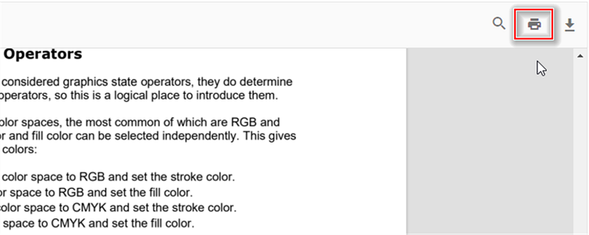

# Print in Vue PDF Viewer

The Syncfusion Vue PDF Viewer component lets users print a loaded PDF document through the built-in toolbar or programmatic calls. Control whether printing is available by setting the `enablePrint` property.

The following HTML and Vue component examples render the PDF Viewer with printing enabled in standalone and server-backed applications.

```
<!DOCTYPE html>
<html lang="en">

<head>
    <title>Essential JS 2</title>
    <meta charset="utf-8" />
    <meta name="viewport" content="width=device-width, initial-scale=1.0, user-scalable=no" />
    <meta name="description" content="Essential JS 2" />
    <meta name="author" content="Syncfusion" />
    <link rel="shortcut icon" href="resources/favicon.ico" />
    <link href="https://maxcdn.bootstrapcdn.com/bootstrap/3.3.7/css/bootstrap.min.css" rel="stylesheet" />

    <!--style reference from app-->
    <link href="/styles/styles.css" rel="stylesheet" />

    <!--system js reference and configuration-->
    <script src="node_modules/systemjs/dist/system.src.js" type="text/javascript"></script>
    <script src="system.config.js" type="text/javascript"></script>
</head>

<body>
    <!--Element which will render as PdfViewer -->
    <div id="PdfViewer"></div>
</body>

</html>
```

```ts
import { PdfViewer, Toolbar, Magnification, Navigation, LinkAnnotation, Annotation, ThumbnailView,BookmarkView, TextSelection} from '@syncfusion/ej2-pdfviewer';

PdfViewer.Inject(Toolbar,Magnification,Navigation, LinkAnnotation, Annotation, ThumbnailView,BookmarkView, TextSelection);

let pdfviewer: PdfViewer = new PdfViewer({enablePrint: true, documentPath:'PDF_Succinctly.pdf'});
pdfviewer.serviceUrl = 'https://document.syncfusion.com/web-services/pdf-viewer/api/pdfviewer';
pdfviewer.appendTo('#PdfViewer');

```

Select **Print** in the built-in toolbar to open the browser print dialog.



Call the `print.print()` method from your component logic to start printing when a custom action occurs.




<template>
  <div id="app">
    <button v-on:click="printClicked">Print</button>
    <ejs-pdfviewer id="pdfViewer" ref="pdfviewer" :documentPath="documentPath" :resourceUrl="resourceUrl">
    </ejs-pdfviewer>
  </div>
</template>

<script setup>
import {
  PdfViewerComponent as EjsPdfviewer, Toolbar, Magnification, Navigation,
  LinkAnnotation, BookmarkView, Annotation, ThumbnailView,
  Print, TextSelection, TextSearch, FormFields, FormDesigner
} from '@syncfusion/ej2-vue-pdfviewer';
import { provide, ref } from 'vue';

const pdfviewer = ref(null);
const documentPath = "https://cdn.syncfusion.com/content/pdf/pdf-succinctly.pdf";
const resourceUrl = "https://cdn.syncfusion.com/ej2/24.1.41/dist/ej2-pdfviewer-lib";

provide('PdfViewer', [Toolbar, Magnification, Navigation, LinkAnnotation, BookmarkView, Annotation,
  ThumbnailView, Print, TextSelection, TextSearch, FormFields, FormDesigner])

const printClicked = function (args) {
  pdfviewer.value.ej2Instances.print.print();
}

</script>




<template>
  <div id="app">
    <button v-on:click="printClicked">Print</button>
    <ejs-pdfviewer id="pdfViewer" ref="pdfviewer" :documentPath="documentPath" :resourceUrl="resourceUrl" >
    </ejs-pdfviewer>
  </div>
</template>

<script>
import {
  PdfViewerComponent, Toolbar, Magnification, Navigation,
  LinkAnnotation, BookmarkView, Annotation, ThumbnailView,
  Print, TextSelection, TextSearch, FormFields, FormDesigner
} from '@syncfusion/ej2-vue-pdfviewer';

export default {
  name: "App",
  components: {
    "ejs-pdfviewer": PdfViewerComponent
  },
  data() {
    return {
      documentPath: "https://cdn.syncfusion.com/content/pdf/pdf-succinctly.pdf",
      resourceUrl: "https://cdn.syncfusion.com/ej2/24.1.41/dist/ej2-pdfviewer-lib"
    };
  },
  provide: {
    PdfViewer: [Toolbar, Magnification, Navigation, LinkAnnotation, BookmarkView, Annotation,
      ThumbnailView, Print, TextSelection, TextSearch, FormFields, FormDesigner]
  },
  methods: {
    printClicked: function (args) {
      this.$refs.pdfviewer.ej2Instances.print.print();
    }
  }
}
</script>




<template>
  <div id="app">
    <button v-on:click="printClicked">Print</button>
    <ejs-pdfviewer id="pdfViewer" ref="pdfviewer" :serviceUrl="serviceUrl" :documentPath="documentPath">
    </ejs-pdfviewer>

  </div>
</template>

<script setup>
import {
  PdfViewerComponent as EjsPdfviewer, Toolbar, Magnification, Navigation,
  LinkAnnotation, BookmarkView, Annotation, ThumbnailView,
  Print, TextSelection, TextSearch, FormFields, FormDesigner
} from '@syncfusion/ej2-vue-pdfviewer';
import { provide, ref } from 'vue';

const pdfviewer = ref(null);
const serviceUrl = "https://document.syncfusion.com/web-services/pdf-viewer/api/pdfviewer";
const documentPath = "https://cdn.syncfusion.com/content/pdf/pdf-succinctly.pdf";

provide('PdfViewer', [Toolbar, Magnification, Navigation, LinkAnnotation, BookmarkView, Annotation,
  ThumbnailView, Print, TextSelection, TextSearch, FormFields, FormDesigner])

const printClicked = function (args) {
  pdfviewer.value.ej2Instances.print.print();
}
</script>




<template>
  <div id="app">
    <button v-on:click="printClicked">Print</button>
    <ejs-pdfviewer id="pdfViewer" ref="pdfviewer" :serviceUrl="serviceUrl" :documentPath="documentPath">
    </ejs-pdfviewer>

  </div>
</template>

<script>
import {
  PdfViewerComponent, Toolbar, Magnification, Navigation,
  LinkAnnotation, BookmarkView, Annotation, ThumbnailView,
  Print, TextSelection, TextSearch, FormFields, FormDesigner
} from '@syncfusion/ej2-vue-pdfviewer';

export default {
  name: "App",
  components: {
    "ejs-pdfviewer": PdfViewerComponent
  },
  data() {
    return {
      serviceUrl: "https://document.syncfusion.com/web-services/pdf-viewer/api/pdfviewer",
      documentPath: "https://cdn.syncfusion.com/content/pdf/pdf-succinctly.pdf"
    };
  },
  provide: {
    PdfViewer: [Toolbar, Magnification, Navigation, LinkAnnotation, BookmarkView, Annotation,
      ThumbnailView, Print, TextSelection, TextSearch, FormFields, FormDesigner]
  },

  methods: {
    printClicked: function (args) {
      this.$refs.pdfviewer.ej2Instances.print.print();
    }
  }
}
</script>




## Customize print quality using the printScaleFactor API

The PDF Viewer allows you to adjust the print rendering quality by setting the [printScaleFactor](https://ej2.syncfusion.com/vue/documentation/api/pdfviewer/#printScaleFactor) property. Valid values range from 0.5 to 5. Higher values produce sharper output but also increase rendering time.

By default, `printScaleFactor` is set to 1.

N> Values outside the 0.5–5 range revert to the standard print quality (value 1).

The following examples demonstrate how to set `printScaleFactor` in Vue applications.





<template>
  <div id="app">
    <button v-on:click="printClicked">Print</button>
    <ejs-pdfviewer id="pdfViewer" ref="pdfviewer" :documentPath="documentPath" :resourceUrl="resourceUrl"
    {/*By changing the printScaleFactor value we can adjust the quality of the PDF file*/}
    :printScaleFactor=0.5>
    </ejs-pdfviewer>
  </div>
</template>

<script setup>
import {
  PdfViewerComponent as EjsPdfviewer, Toolbar, Magnification, Navigation,
  LinkAnnotation, BookmarkView, Annotation, ThumbnailView,
  Print, TextSelection, TextSearch, FormFields, FormDesigner
} from '@syncfusion/ej2-vue-pdfviewer';
import { provide, ref } from 'vue';

const pdfviewer = ref(null);
const documentPath = "https://cdn.syncfusion.com/content/pdf/pdf-succinctly.pdf";
const resourceUrl = "https://cdn.syncfusion.com/ej2/27.1.48/dist/ej2-pdfviewer-lib";

provide('PdfViewer', [Toolbar, Magnification, Navigation, LinkAnnotation, BookmarkView, Annotation,
  ThumbnailView, Print, TextSelection, TextSearch, FormFields, FormDesigner])

const printClicked = function (args) {
  pdfviewer.value.ej2Instances.print.print();
}

</script>




<template>
  <div id="app">
    <button v-on:click="printClicked">Print</button>
    <ejs-pdfviewer id="pdfViewer" ref="pdfviewer"
    :documentPath="documentPath" :resourceUrl="resourceUrl"
     {/*By changing the printScaleFactor value we can adjust the quality of the PDF file*/}
     :printScaleFactor=printScaleFactor >
    </ejs-pdfviewer>
  </div>
</template>

<script>
import {
  PdfViewerComponent, Toolbar, Magnification, Navigation,
  LinkAnnotation, BookmarkView, Annotation, ThumbnailView,
  Print, TextSelection, TextSearch, FormFields, FormDesigner
} from '@syncfusion/ej2-vue-pdfviewer';

export default {
  name: "App",
  components: {
    "ejs-pdfviewer": PdfViewerComponent
  },
  data() {
    return {
      documentPath: "https://cdn.syncfusion.com/content/pdf/pdf-succinctly.pdf",
      resourceUrl: "https://cdn.syncfusion.com/ej2/27.1.48/dist/ej2-pdfviewer-lib",
      //By Changing the printScaleFactor value we can adjust the quality of the PDF file.
      printScaleFactor: 0.5,
    };
  },
  provide: {
    PdfViewer: [Toolbar, Magnification, Navigation, LinkAnnotation, BookmarkView, Annotation,
      ThumbnailView, Print, TextSelection, TextSearch, FormFields, FormDesigner]
  },
  methods: {
    printClicked: function (args) {
      this.$refs.pdfviewer.ej2Instances.print.print();
    }
  }
}
</script>




<template>
  <div id="app">
    <button v-on:click="printClicked">Print</button>
    <ejs-pdfviewer id="pdfViewer" ref="pdfviewer" :serviceUrl="serviceUrl" :documentPath="documentPath"
     {/*By changing the printScaleFactor value we can adjust the quality of the PDF file*/}
    :printScaleFactor=0.5>
    </ejs-pdfviewer>

  </div>
</template>

<script setup>
import {
  PdfViewerComponent as EjsPdfviewer, Toolbar, Magnification, Navigation,
  LinkAnnotation, BookmarkView, Annotation, ThumbnailView,
  Print, TextSelection, TextSearch, FormFields, FormDesigner
} from '@syncfusion/ej2-vue-pdfviewer';
import { provide, ref } from 'vue';

const pdfviewer = ref(null);
const serviceUrl = "https://document.syncfusion.com/web-services/pdf-viewer/api/pdfviewer";
const documentPath = "https://cdn.syncfusion.com/content/pdf/pdf-succinctly.pdf";

provide('PdfViewer', [Toolbar, Magnification, Navigation, LinkAnnotation, BookmarkView, Annotation,
  ThumbnailView, Print, TextSelection, TextSearch, FormFields, FormDesigner])

const printClicked = function (args) {
  pdfviewer.value.ej2Instances.print.print();
}
</script>




<template>
  <div id="app">
    <button v-on:click="printClicked">Print</button>
    <ejs-pdfviewer id="pdfViewer" ref="pdfviewer" :serviceUrl="serviceUrl" :documentPath="documentPath"
     {/*By changing the printScaleFactor value we can adjust the quality of the PDF file*/}
    :printScaleFactor=printScaleFactor>
    </ejs-pdfviewer>

  </div>
</template>

<script>
import {
  PdfViewerComponent, Toolbar, Magnification, Navigation,
  LinkAnnotation, BookmarkView, Annotation, ThumbnailView,
  Print, TextSelection, TextSearch, FormFields, FormDesigner
} from '@syncfusion/ej2-vue-pdfviewer';

export default {
  name: "App",
  components: {
    "ejs-pdfviewer": PdfViewerComponent
  },
  data() {
    return {
      serviceUrl: "https://document.syncfusion.com/web-services/pdf-viewer/api/pdfviewer",
      documentPath: "https://cdn.syncfusion.com/content/pdf/pdf-succinctly.pdf",
      //By Changing the printScaleFactor value we can adjust the quality of the PDF file.
      printScaleFactor: 0.5,
    };
  },
  provide: {
    PdfViewer: [Toolbar, Magnification, Navigation, LinkAnnotation, BookmarkView, Annotation,
      ThumbnailView, Print, TextSelection, TextSearch, FormFields, FormDesigner]
  },

  methods: {
    printClicked: function (args) {
      this.$refs.pdfviewer.ej2Instances.print.print();
    }
  }
}
</script>




[View sample in GitHub](https://github.com/SyncfusionExamples/vue-pdf-viewer-examples/tree/master/How%20to/Customization%20of%20PrintQuality)

## Enable print rotation in the PDF Viewer

Set the `enablePrintRotation` property to control whether landscape pages are rotated automatically to fit the paper orientation. Keep it enabled to minimize clipping, or disable it to preserve the original orientation.




<template>
  <div id="app">
    <ejs-pdfviewer id="pdfViewer" :documentPath="documentPath" :enablePrintRotation="true" :resourceUrl="resourceUrl">
    </ejs-pdfviewer>
  </div>
</template>

<script setup>
import {
  PdfViewerComponent as EjsPdfviewer, Toolbar, Magnification, Navigation,
  LinkAnnotation, BookmarkView, Annotation, ThumbnailView,
  Print, TextSelection, TextSearch, FormFields, FormDesigner
} from '@syncfusion/ej2-vue-pdfviewer';
import { provide } from 'vue';

const documentPath = "https://cdn.syncfusion.com/content/pdf/pdf-succinctly.pdf";
const resourceUrl = "https://cdn.syncfusion.com/ej2/27.1.48/dist/ej2-pdfviewer-lib";

provide('PdfViewer', [Toolbar, Magnification, Navigation, LinkAnnotation, BookmarkView, Annotation,
  ThumbnailView, Print, TextSelection, TextSearch, FormFields, FormDesigner])

</script>




<template>
  <div id="app">
    <ejs-pdfviewer id="pdfViewer" :documentPath="documentPath" :enablePrintRotation="true"
      :resourceUrl="resourceUrl">
    </ejs-pdfviewer>
  </div>
</template>

<script>
import {
  PdfViewerComponent, Toolbar, Magnification, Navigation,
  LinkAnnotation, BookmarkView, Annotation, ThumbnailView,
  Print, TextSelection, TextSearch, FormFields, FormDesigner
} from '@syncfusion/ej2-vue-pdfviewer';

export default {
  name: "App",
  components: {
    "ejs-pdfviewer": PdfViewerComponent
  },
  data() {
    return {
      documentPath: "https://cdn.syncfusion.com/content/pdf/pdf-succinctly.pdf",
      resourceUrl: "https://cdn.syncfusion.com/ej2/27.1.48/dist/ej2-pdfviewer-lib"
    };
  },
  provide: {
    PdfViewer: [Toolbar, Magnification, Navigation, LinkAnnotation, BookmarkView, Annotation,
      ThumbnailView, Print, TextSelection, TextSearch, FormFields, FormDesigner]
  }
}
</script>




<template>
  <div id="app">
    <ejs-pdfviewer id="pdfViewer" :serviceUrl="serviceUrl" :documentPath="documentPath"
      :enablePrintRotation="true">
    </ejs-pdfviewer>
  </div>
</template>

<script setup>
import {
  PdfViewerComponent as EjsPdfviewer, Toolbar, Magnification, Navigation,
  LinkAnnotation, BookmarkView, Annotation, ThumbnailView,
  Print, TextSelection, TextSearch, FormFields, FormDesigner
} from '@syncfusion/ej2-vue-pdfviewer';
import { provide } from 'vue';

const serviceUrl = "https://document.syncfusion.com/web-services/pdf-viewer/api/pdfviewer";
const documentPath = "https://cdn.syncfusion.com/content/pdf/pdf-succinctly.pdf";

provide('PdfViewer', [Toolbar, Magnification, Navigation, LinkAnnotation, BookmarkView, Annotation,
  ThumbnailView, Print, TextSelection, TextSearch, FormFields, FormDesigner])
</script>




<template>
  <div id="app">
    <ejs-pdfviewer id="pdfViewer" :serviceUrl="serviceUrl" :documentPath="documentPath"
      :enablePrintRotation="true">
    </ejs-pdfviewer>
  </div>
</template>

<script>
import {
  PdfViewerComponent, Toolbar, Magnification, Navigation,
  LinkAnnotation, BookmarkView, Annotation, ThumbnailView,
  Print, TextSelection, TextSearch, FormFields, FormDesigner
} from '@syncfusion/ej2-vue-pdfviewer';

export default {
  name: "App",
  components: {
    "ejs-pdfviewer": PdfViewerComponent
  },
  data() {
    return {
      serviceUrl: "https://document.syncfusion.com/web-services/pdf-viewer/api/pdfviewer",
      documentPath: "https://cdn.syncfusion.com/content/pdf/pdf-succinctly.pdf"
    };
  },
  provide: {
    PdfViewer: [Toolbar, Magnification, Navigation, LinkAnnotation, BookmarkView, Annotation,
      ThumbnailView, Print, TextSelection, TextSearch, FormFields, FormDesigner]
  }
}
</script>




## Print modes in the PDF Viewer

Use the `printMode` property to choose how the document is printed.

The supported values are:
*   `Default`: Prints the document from the same window.
*   `NewWindow`: Prints the document from a new window or tab, which can help with browser pop-up policies.

N> Browser pop-up blockers must allow new windows or tabs when you use `PrintMode.NewWindow`.




<template>
  <div id="app">
    <ejs-pdfviewer id="pdfViewer" :documentPath="documentPath"
      :printMode="printMode" :resourceUrl="resourceUrl">
    </ejs-pdfviewer>
  </div>
</template>

<script setup>
import {
  PdfViewerComponent as EjsPdfviewer, Toolbar, Magnification, Navigation,
  LinkAnnotation, BookmarkView, Annotation, ThumbnailView,
  Print, TextSelection, TextSearch, FormFields, FormDesigner, PrintMode
} from '@syncfusion/ej2-vue-pdfviewer';
import { provide, ref } from 'vue';

const documentPath = "https://cdn.syncfusion.com/content/pdf/pdf-succinctly.pdf";
const resourceUrl = "https://cdn.syncfusion.com/ej2/27.1.48/dist/ej2-pdfviewer-lib";
const printMode = ref(PrintMode.NewWindow);

provide('PdfViewer', [Toolbar, Magnification, Navigation, LinkAnnotation, BookmarkView, Annotation,
  ThumbnailView, Print, TextSelection, TextSearch, FormFields, FormDesigner])

</script>




<template>
  <div id="app">
    <ejs-pdfviewer id="pdfViewer" :documentPath="documentPath"
      :printMode="printMode" :resourceUrl="resourceUrl">
    </ejs-pdfviewer>
  </div>
</template>

<script>
import {
  PdfViewerComponent, Toolbar, Magnification, Navigation,
  LinkAnnotation, BookmarkView, Annotation, ThumbnailView,
  Print, TextSelection, TextSearch, FormFields, FormDesigner, PrintMode
} from '@syncfusion/ej2-vue-pdfviewer';

export default {
  name: "App",
  components: {
    "ejs-pdfviewer": PdfViewerComponent
  },
  data() {
    return {
      documentPath: "https://cdn.syncfusion.com/content/pdf/pdf-succinctly.pdf",
      resourceUrl: "https://cdn.syncfusion.com/ej2/27.1.48/dist/ej2-pdfviewer-lib",
      printMode: PrintMode.NewWindow
    };
  },
  provide: {
    PdfViewer: [Toolbar, Magnification, Navigation, LinkAnnotation, BookmarkView, Annotation,
      ThumbnailView, Print, TextSelection, TextSearch, FormFields, FormDesigner]
  }
}
</script>




<template>
  <div id="app">
    <ejs-pdfviewer id="pdfViewer" :serviceUrl="serviceUrl" :documentPath="documentPath"
      :printMode="printMode">
    </ejs-pdfviewer>
  </div>
</template>

<script setup>
import {
  PdfViewerComponent as EjsPdfviewer, Toolbar, Magnification, Navigation,
  LinkAnnotation, BookmarkView, Annotation, ThumbnailView,
  Print, TextSelection, TextSearch, FormFields, FormDesigner, PrintMode
} from '@syncfusion/ej2-vue-pdfviewer';
import { provide, ref } from 'vue';

const serviceUrl = "https://document.syncfusion.com/web-services/pdf-viewer/api/pdfviewer";
const documentPath = "https://cdn.syncfusion.com/content/pdf/pdf-succinctly.pdf";
const printMode = ref(PrintMode.NewWindow);

provide('PdfViewer', [Toolbar, Magnification, Navigation, LinkAnnotation, BookmarkView, Annotation,
  ThumbnailView, Print, TextSelection, TextSearch, FormFields, FormDesigner])
</script>




<template>
  <div id="app">
    <ejs-pdfviewer id="pdfViewer" :serviceUrl="serviceUrl" :documentPath="documentPath"
      :printMode="printMode">
    </ejs-pdfviewer>
  </div>
</template>

<script>
import {
  PdfViewerComponent, Toolbar, Magnification, Navigation,
  LinkAnnotation, BookmarkView, Annotation, ThumbnailView,
  Print, TextSelection, TextSearch, FormFields, FormDesigner, PrintMode
} from '@syncfusion/ej2-vue-pdfviewer';

export default {
  name: "App",
  components: {
    "ejs-pdfviewer": PdfViewerComponent
  },
  data() {
    return {
      serviceUrl: "https://document.syncfusion.com/web-services/pdf-viewer/api/pdfviewer",
      documentPath: "https://cdn.syncfusion.com/content/pdf/pdf-succinctly.pdf",
      printMode: PrintMode.NewWindow
    };
  },
  provide: {
    PdfViewer: [Toolbar, Magnification, Navigation, LinkAnnotation, BookmarkView, Annotation,
      ThumbnailView, Print, TextSelection, TextSearch, FormFields, FormDesigner]
  }
}
</script>




## Print events

Subscribe to print lifecycle events to track usage and implement custom workflows.

| Name         | Description |
|--------------|-------------|
| `printStart` | Raised when a print action begins. Use the event to log activity or cancel printing. |
| `printEnd`   | Raised after a print action completes. Use the event to notify users or clean up resources. |

### printStart event

The [`printStart`](https://ej2.syncfusion.com/vue/documentation/api/pdfviewer/#printstart) event runs when printing starts from the toolbar or from code. Use it to validate prerequisites or cancel the action.

#### Event arguments

Review [`PrintStartEventArgs`](https://ej2.syncfusion.com/vue/documentation/api/pdfviewer/printStartEventArgs/) for details such as `fileName` and the `cancel` option.

The following examples log the file being printed and show how to cancel the operation.




<template>
  <div id="app">
    <ejs-pdfviewer id="pdfViewer" :documentPath="documentPath" :resourceUrl="resourceUrl"
      :printStart="onPrintStart">
    </ejs-pdfviewer>
  </div>
</template>

<script setup>
import {
  PdfViewerComponent as EjsPdfviewer, Toolbar, Magnification, Navigation,
  LinkAnnotation, BookmarkView, Annotation, ThumbnailView,
  Print, TextSelection, TextSearch, FormFields, FormDesigner
} from '@syncfusion/ej2-vue-pdfviewer';
import { provide } from 'vue';

const documentPath = "https://cdn.syncfusion.com/content/pdf/pdf-succinctly.pdf";
const resourceUrl = "https://cdn.syncfusion.com/ej2/27.1.48/dist/ej2-pdfviewer-lib";

provide('PdfViewer', [Toolbar, Magnification, Navigation, LinkAnnotation, BookmarkView, Annotation,
  ThumbnailView, Print, TextSelection, TextSearch, FormFields, FormDesigner])

function onPrintStart(args) {
  console.log('Print action has started for file: ' + args.fileName);
  // To cancel the print action
  // args.cancel = true;
}
</script>




<template>
  <div id="app">
    <ejs-pdfviewer id="pdfViewer" :documentPath="documentPath" :resourceUrl="resourceUrl"
      :printStart="onPrintStart">
    </ejs-pdfviewer>
  </div>
</template>

<script>
import {
  PdfViewerComponent, Toolbar, Magnification, Navigation,
  LinkAnnotation, BookmarkView, Annotation, ThumbnailView,
  Print, TextSelection, TextSearch, FormFields, FormDesigner
} from '@syncfusion/ej2-vue-pdfviewer';

export default {
  name: "App",
  components: { 'ejs-pdfviewer': PdfViewerComponent },
  data() {
    return {
      documentPath: "https://cdn.syncfusion.com/content/pdf/pdf-succinctly.pdf",
      resourceUrl: "https://cdn.syncfusion.com/ej2/27.1.48/dist/ej2-pdfviewer-lib"
    };
  },
  provide: {
    PdfViewer: [Toolbar, Magnification, Navigation, LinkAnnotation, BookmarkView, Annotation,
      ThumbnailView, Print, TextSelection, TextSearch, FormFields, FormDesigner]
  },
  methods: {
    onPrintStart(args) {
      console.log('Print action has started for file: ' + args.fileName);
      // To cancel the print action
      // args.cancel = true;
    }
  }
}
</script>




<template>
  <div id="app">
    <ejs-pdfviewer id="pdfViewer" :serviceUrl="serviceUrl" :documentPath="documentPath"
      :printStart="onPrintStart">
    </ejs-pdfviewer>
  </div>
</template>

<script setup>
import {
  PdfViewerComponent as EjsPdfviewer, Toolbar, Magnification, Navigation,
  LinkAnnotation, BookmarkView, Annotation, ThumbnailView,
  Print, TextSelection, TextSearch, FormFields, FormDesigner
} from '@syncfusion/ej2-vue-pdfviewer';
import { provide } from 'vue';

const serviceUrl = "https://document.syncfusion.com/web-services/pdf-viewer/api/pdfviewer";
const documentPath = "https://cdn.syncfusion.com/content/pdf/pdf-succinctly.pdf";

provide('PdfViewer', [Toolbar, Magnification, Navigation, LinkAnnotation, BookmarkView, Annotation,
  ThumbnailView, Print, TextSelection, TextSearch, FormFields, FormDesigner])

function onPrintStart(args) {
  console.log('Print action has started for file: ' + args.fileName);
  // To cancel the print action
  // args.cancel = true;
}
</script>




<template>
  <div id="app">
    <ejs-pdfviewer id="pdfViewer" :serviceUrl="serviceUrl" :documentPath="documentPath"
      :printStart="onPrintStart">
    </ejs-pdfviewer>
  </div>
</template>

<script>
import {
  PdfViewerComponent, Toolbar, Magnification, Navigation,
  LinkAnnotation, BookmarkView, Annotation, ThumbnailView,
  Print, TextSelection, TextSearch, FormFields, FormDesigner
} from '@syncfusion/ej2-vue-pdfviewer';

export default {
  name: "App",
  components: { 'ejs-pdfviewer': PdfViewerComponent },
  data() {
    return {
      serviceUrl: "https://document.syncfusion.com/web-services/pdf-viewer/api/pdfviewer",
      documentPath: "https://cdn.syncfusion.com/content/pdf/pdf-succinctly.pdf"
    };
  },
  provide: {
    PdfViewer: [Toolbar, Magnification, Navigation, LinkAnnotation, BookmarkView, Annotation,
      ThumbnailView, Print, TextSelection, TextSearch, FormFields, FormDesigner]
  },
  methods: {
    onPrintStart(args) {
      console.log('Print action has started for file: ' + args.fileName);
      // To cancel the print action
      // args.cancel = true;
    }
  }
}
</script>




### printEnd event

The [`printEnd`](https://ej2.syncfusion.com/vue/documentation/api/pdfviewer/#printend) event triggers after printing completes. Use it to finalize analytics or inform users that printing finished.

#### Event arguments

See [`PrintEndEventArgs`](https://ej2.syncfusion.com/vue/documentation/api/pdfviewer/printEndEventArgs/) for available values such as `fileName`.

The following examples log the printed file name.




<template>
  <div id="app">
    <ejs-pdfviewer id="pdfViewer" :documentPath="documentPath" :resourceUrl="resourceUrl"
      :printEnd="onPrintEnd">
    </ejs-pdfviewer>
  </div>
</template>

<script setup>
import {
  PdfViewerComponent as EjsPdfviewer, Toolbar, Magnification, Navigation,
  LinkAnnotation, BookmarkView, Annotation, ThumbnailView,
  Print, TextSelection, TextSearch, FormFields, FormDesigner
} from '@syncfusion/ej2-vue-pdfviewer';
import { provide } from 'vue';

const documentPath = "https://cdn.syncfusion.com/content/pdf/pdf-succinctly.pdf";
const resourceUrl = "https://cdn.syncfusion.com/ej2/27.1.48/dist/ej2-pdfviewer-lib";

provide('PdfViewer', [Toolbar, Magnification, Navigation, LinkAnnotation, BookmarkView, Annotation,
  ThumbnailView, Print, TextSelection, TextSearch, FormFields, FormDesigner])

function onPrintEnd(args) {
  console.log('Printed File Name: ' + args.fileName);
}
</script>




<template>
  <div id="app">
    <ejs-pdfviewer id="pdfViewer" :documentPath="documentPath" :resourceUrl="resourceUrl"
      :printEnd="onPrintEnd">
    </ejs-pdfviewer>
  </div>
</template>

<script>
import {
  PdfViewerComponent, Toolbar, Magnification, Navigation,
  LinkAnnotation, BookmarkView, Annotation, ThumbnailView,
  Print, TextSelection, TextSearch, FormFields, FormDesigner
} from '@syncfusion/ej2-vue-pdfviewer';

export default {
  name: "App",
  components: { 'ejs-pdfviewer': PdfViewerComponent },
  data() {
    return {
      documentPath: "https://cdn.syncfusion.com/content/pdf/pdf-succinctly.pdf",
      resourceUrl: "https://cdn.syncfusion.com/ej2/27.1.48/dist/ej2-pdfviewer-lib"
    };
  },
  provide: {
    PdfViewer: [Toolbar, Magnification, Navigation, LinkAnnotation, BookmarkView, Annotation,
      ThumbnailView, Print, TextSelection, TextSearch, FormFields, FormDesigner]
  },
  methods: {
    onPrintEnd(args) {
      console.log('Printed File Name: ' + args.fileName);
    }
  }
}
</script>




<template>
  <div id="app">
    <ejs-pdfviewer id="pdfViewer" :serviceUrl="serviceUrl" :documentPath="documentPath"
      :printEnd="onPrintEnd">
    </ejs-pdfviewer>
  </div>
</template>

<script setup>
import {
  PdfViewerComponent as EjsPdfviewer, Toolbar, Magnification, Navigation,
  LinkAnnotation, BookmarkView, Annotation, ThumbnailView,
  Print, TextSelection, TextSearch, FormFields, FormDesigner
} from '@syncfusion/ej2-vue-pdfviewer';
import { provide } from 'vue';

const serviceUrl = "https://document.syncfusion.com/web-services/pdf-viewer/api/pdfviewer";
const documentPath = "https://cdn.syncfusion.com/content/pdf/pdf-succinctly.pdf";

provide('PdfViewer', [Toolbar, Magnification, Navigation, LinkAnnotation, BookmarkView, Annotation,
  ThumbnailView, Print, TextSelection, TextSearch, FormFields, FormDesigner])

function onPrintEnd(args) {
  console.log('Printed File Name: ' + args.fileName);
}
</script>




<template>
  <div id="app">
    <ejs-pdfviewer id="pdfViewer" :serviceUrl="serviceUrl" :documentPath="documentPath"
      :printEnd="onPrintEnd">
    </ejs-pdfviewer>
  </div>
</template>

<script>
import {
  PdfViewerComponent, Toolbar, Magnification, Navigation,
  LinkAnnotation, BookmarkView, Annotation, ThumbnailView,
  Print, TextSelection, TextSearch, FormFields, FormDesigner
} from '@syncfusion/ej2-vue-pdfviewer';

export default {
  name: "App",
  components: { 'ejs-pdfviewer': PdfViewerComponent },
  data() {
    return {
      serviceUrl: "https://document.syncfusion.com/web-services/pdf-viewer/api/pdfviewer",
      documentPath: "https://cdn.syncfusion.com/content/pdf/pdf-succinctly.pdf"
    };
  },
  provide: {
    PdfViewer: [Toolbar, Magnification, Navigation, LinkAnnotation, BookmarkView, Annotation,
      ThumbnailView, Print, TextSelection, TextSearch, FormFields, FormDesigner]
  },
  methods: {
    onPrintEnd(args) {
      console.log('Printed File Name: ' + args.fileName);
    }
  }
}
</script>




## See also

* [Toolbar items](./toolbar)
* [Feature Modules](./feature-module)