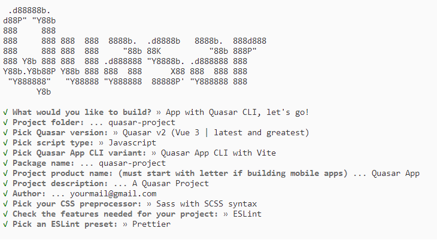
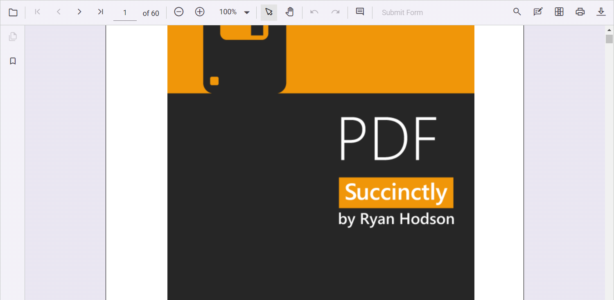

# Getting started with Vue PDF Viewer in Quasar Framework

This guide provides step-by-step instructions for integrating the Syncfusion<sup style="font-size:70%">&reg;</sup> Vue PDF Viewer component into a [Quasar Framework](https://quasar.dev/) project using the Composition API.

Quasar is a Vue.js-based open-source framework that enables developers to create high-performance, responsive applications across web, mobile, and desktop platforms. The Syncfusion Vue PDF Viewer integrates seamlessly with Quasar's architecture, providing a complete PDF viewing and annotation solution.

## Prerequisites

Before you begin, ensure the following are in place:

* [System requirements for Syncfusion<sup style="font-size:70%">&reg;</sup> Vue UI components](../system-requirements)
* Node.js v14.15.0 or later

## Set up the Quasar project

To create a new Quasar project, use the following command:

```bash
npm init quasar
```

When prompted for configuration options, select **Vue 3** with the **Composition API** to align with the examples in this guide. Follow the setup wizard:



When prompted to install dependencies, respond with **yes** to proceed with npm install:


Navigate to your project directory:

```bash
cd quasar-project
```

Your Quasar project is now ready. Proceed to add the Syncfusion<sup style="font-size:70%">&reg;</sup> Vue PDF Viewer component.

## Add the Syncfusion<sup style="font-size:70%">&reg;</sup> Vue packages

Syncfusion<sup style="font-size:70%">&reg;</sup> packages are available on [npmjs.com](https://www.npmjs.com/search?q=ej2-vue). Install the `@syncfusion/ej2-vue-pdfviewer` package to add the Vue PDF Viewer component:

```bash
npm install @syncfusion/ej2-vue-pdfviewer --save
```

## Import Syncfusion<sup style="font-size:70%">&reg;</sup> CSS styles

Syncfusion<sup style="font-size:70%">&reg;</sup> Vue components support multiple theme options. Refer to the [themes documentation](https://ej2.syncfusion.com/vue/documentation/appearance/theme/) for details about built-in themes and different import approaches.

In this example, the `Material 3` theme is applied using CSS styles from the installed packages. Import the required Material 3 CSS styles for the PDF Viewer and its dependencies into the `<style>` section of the **src/app.vue** file:




<style>
  @import '../node_modules/@syncfusion/ej2-base/styles/material3.css';
  @import '../node_modules/@syncfusion/ej2-buttons/styles/material3.css';
  @import '../node_modules/@syncfusion/ej2-dropdowns/styles/material3.css';
  @import '../node_modules/@syncfusion/ej2-inputs/styles/material3.css';
  @import '../node_modules/@syncfusion/ej2-navigations/styles/material3.css';
  @import '../node_modules/@syncfusion/ej2-popups/styles/material3.css';
  @import '../node_modules/@syncfusion/ej2-splitbuttons/styles/material3.css';
  @import '../node_modules/@syncfusion/ej2-lists/styles/material3.css';
  @import '../node_modules/@syncfusion/ej2-vue-pdfviewer/styles/material3.css';
</style>




> The order of importing CSS styles should be in line with their dependency graph.

## Add the Syncfusion<sup style="font-size:70%">&reg;</sup> Vue component

Follow these steps to integrate the PDF Viewer component into your Quasar application:

**Step 1**: Import the PDF Viewer component and its required modules in the `script setup` section of **src/app.vue**:




<script setup>
import { PdfViewerComponent as EjsPdfviewer, Toolbar, Magnification, Navigation, LinkAnnotation,
         BookmarkView, ThumbnailView, Print, TextSelection, TextSearch,
         Annotation, FormDesigner, FormFields } from '@syncfusion/ej2-vue-pdfviewer';
</script>




**Step 2**: Define the PDF Viewer component in the template section:




<template>
  <div id="app">
    <ejs-pdfviewer
      id="pdfViewer"
      :serviceUrl="serviceUrl"
      :documentPath="documentPath"
      :style="{ height: '800px', width: '1200px' }">
    </ejs-pdfviewer>
  </div>
</template>




**Step 3**: Declare the `serviceUrl` and `documentPath` properties, and provide the required modules:




<script setup>

import { provide } from 'vue';
import { PdfViewerComponent as EjsPdfviewer, Toolbar, Magnification, Navigation, LinkAnnotation, BookmarkView,
         ThumbnailView, Print, TextSelection, TextSearch, Annotation, FormDesigner, FormFields } from '@syncfusion/ej2-vue-pdfviewer';

const serviceUrl = 'https://document.syncfusion.com/web-services/pdf-viewer/api/pdfviewer';
const documentPath = 'https://cdn.syncfusion.com/content/pdf/pdf-succinctly.pdf';
const pdfViewer = null;

provide('PdfViewer', [ Toolbar, Magnification, Navigation, LinkAnnotation, BookmarkView, ThumbnailView,
                       Print, TextSelection, TextSearch, Annotation, FormDesigner, FormFields]);
</script>




The following code demonstrates the complete setup for the PDF Viewer in **src/app.vue**:




<template>
  <ejs-pdfviewer
    ref="pdfViewer"
    :serviceUrl="serviceUrl"
    :documentPath="documentPath"
    :style="{ height: '800px', width: '1200px' }">
  </ejs-pdfviewer>
</template>

<script setup>

import { provide } from 'vue';
import { PdfViewerComponent as EjsPdfviewer, Toolbar, Magnification, Navigation, LinkAnnotation, BookmarkView,
  ThumbnailView, Print, TextSelection, TextSearch, Annotation, FormDesigner, FormFields } from '@syncfusion/ej2-vue-pdfviewer';

const serviceUrl = 'https://document.syncfusion.com/web-services/pdf-viewer/api/pdfviewer';
const documentPath = 'https://cdn.syncfusion.com/content/pdf/pdf-succinctly.pdf';
const pdfViewer = null;

provide('PdfViewer', [ Toolbar, Magnification, Navigation, LinkAnnotation, BookmarkView, ThumbnailView,
                       Print, TextSelection, TextSearch, Annotation, FormDesigner, FormFields]);
</script>

<style>

  @import '../node_modules/@syncfusion/ej2-base/styles/material3.css';
  @import '../node_modules/@syncfusion/ej2-buttons/styles/material3.css';
  @import '../node_modules/@syncfusion/ej2-dropdowns/styles/material3.css';
  @import '../node_modules/@syncfusion/ej2-inputs/styles/material3.css';
  @import '../node_modules/@syncfusion/ej2-navigations/styles/material3.css';
  @import '../node_modules/@syncfusion/ej2-popups/styles/material3.css';
  @import '../node_modules/@syncfusion/ej2-splitbuttons/styles/material3.css';
  @import '../node_modules/@syncfusion/ej2-lists/styles/material3.css';
  @import '../node_modules/@syncfusion/ej2-vue-pdfviewer/styles/material3.css';

</style>




## Run the application

Start the development server using the following command:

```bash
npm run dev
```

The application will run at the specified Quasar dev server URL. The PDF Viewer displays the sample document with the complete toolbar interface, allowing users to interact with PDF features like zoom, search, annotations, and navigation.

