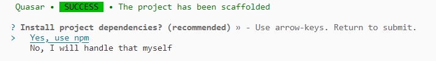
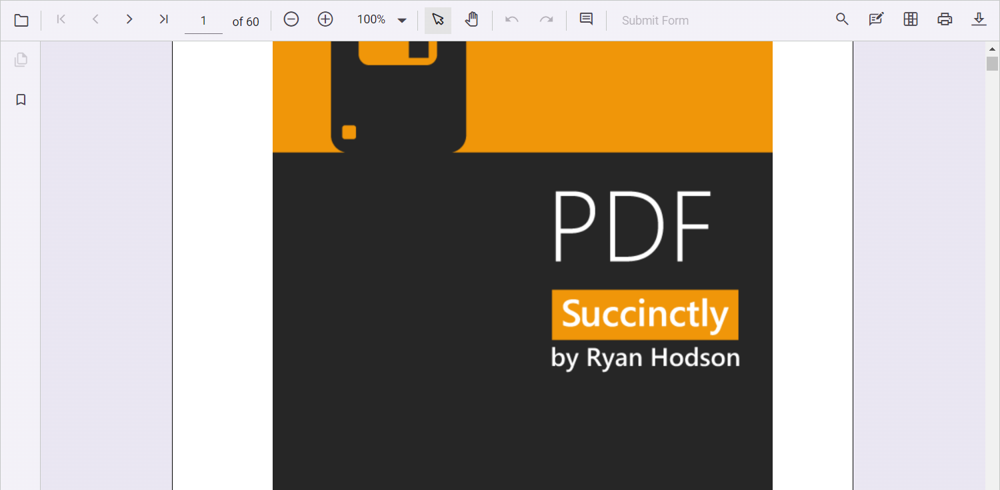

# Getting Started with Vue PDF Viewer in Quasar Framework

This section explains step-by-step instructions for integrating the Syncfusion<sup style="font-size:70%">&reg;</sup> Vue PDF Viewer component into a [Quasar Framework](https://quasar.dev/) project using the Composition API.

Quasar is a Vue.js-based open-source framework that enables developers to create high-performance, responsive applications across web, mobile, and desktop platforms. The Vue PDF Viewer integrates seamlessly with Quasar's architecture, providing a complete PDF viewing and annotation solution.

## Prerequisites

Before you begin, ensure the following are in place:

* [System requirements for Vue UI components](../system-requirements)
* Node.js v14.15.0 or later

## Set up the Quasar project

To create a new Quasar project, use the following command:



npm init quasar



When prompted for configuration options, select **Vue 3** with the **Composition API** to align with the examples in this guide. Follow the setup wizard:


When prompted to install dependencies, type `y` and press Enter to proceed with the npm install:



Navigate to your project directory:



cd quasar-project



Your Quasar project is now ready. Proceed to add the Vue PDF Viewer component.

## Add the Syncfusion<sup style="font-size:70%">&reg;</sup> Vue packages

Syncfusion<sup style="font-size:70%">&reg;</sup> packages are available on [npmjs.com](https://www.npmjs.com/search?q=ej2-vue). Install the `@syncfusion/ej2-vue-pdfviewer` package to add the Vue PDF Viewer component:



npm install @syncfusion/ej2-vue-pdfviewer --save



## Import Syncfusion<sup style="font-size:70%">&reg;</sup> CSS styles

Syncfusion<sup style="font-size:70%">&reg;</sup> Vue components support multiple theme options. In this example, the `Material 3` theme is applied using CSS styles from the installed packages. Import the required Material 3 CSS styles for the PDF Viewer and its dependencies into the `<style>` section of the `src/App.vue` file.





<style>
  @import '../node_modules/@syncfusion/ej2-base/styles/material3.css';
  @import '../node_modules/@syncfusion/ej2-buttons/styles/material3.css';
  @import '../node_modules/@syncfusion/ej2-dropdowns/styles/material3.css';
  @import '../node_modules/@syncfusion/ej2-inputs/styles/material3.css';
  @import '../node_modules/@syncfusion/ej2-navigations/styles/material3.css';
  @import '../node_modules/@syncfusion/ej2-popups/styles/material3.css';
  @import '../node_modules/@syncfusion/ej2-splitbuttons/styles/material3.css';
  @import '../node_modules/@syncfusion/ej2-lists/styles/material3.css';
  @import '../node_modules/@syncfusion/ej2-vue-pdfviewer/styles/material3.css';
</style>




N> The order of importing CSS styles should be in line with their dependency graph.
N> Refer to the [Themes topic](https://ej2.syncfusion.com/vue/documentation/appearance/theme) to learn more about built-in themes and different ways to refer to themes in a Vue project.

## Add the Syncfusion<sup style="font-size:70%">&reg;</sup> Vue component

Add the PDF Viewer component to your Quasar application. The component is added to the root `src/App.vue` file, which is the default entry point for a Quasar Vite project.

### Import and register the PDF Viewer

Import the PDF Viewer component and its required modules in the `<script setup>` section of `src/App.vue`, declare the `serviceUrl` and `documentPath` properties, and provide the required modules:




import { provide } from 'vue';
import { PdfViewerComponent as EjsPdfviewer, Toolbar, Magnification, Navigation, LinkAnnotation, BookmarkView,
         ThumbnailView, Print, TextSelection, TextSearch, Annotation, FormDesigner, FormFields } from '@syncfusion/ej2-vue-pdfviewer';

const serviceUrl = 'https://document.syncfusion.com/web-services/pdf-viewer/api/pdfviewer';
const documentPath = 'https://cdn.syncfusion.com/content/pdf/pdf-succinctly.pdf';
const pdfViewer = null;

provide('PdfViewer', [ Toolbar, Magnification, Navigation, LinkAnnotation, BookmarkView, ThumbnailView,
                       Print, TextSelection, TextSearch, Annotation, FormDesigner, FormFields]);




**serviceUrl** – The back-end web service endpoint that processes PDF rendering, search, and annotation requests. The Syncfusion-hosted URL shown above is provided for evaluation only; for production, replace it with your deployed web service.

**documentPath** – The URL or file path of the PDF document to display. You can provide a remote URL, a Base64 string, or a local file path.

### Initialize the PDF Viewer

Define the PDF Viewer component in the `<template>` section of `src/App.vue`:




<template>
  <ejs-pdfviewer id="pdfViewer" :serviceUrl="serviceUrl" :documentPath="documentPath">
  </ejs-pdfviewer>
</template>




## Run the application

Start the Quasar dev server with the following command:



npm run dev



The application will run at the Quasar dev server URL, which by default is `http://localhost:9000`. The terminal output will look similar to the following:

```bash
App URL............. http://localhost:9000/
Dev mode............ spa
```

Open the printed URL in a browser to view the PDF Viewer with the sample document and the complete toolbar interface, allowing users to interact with features like zoom, search, annotations, and navigation.


