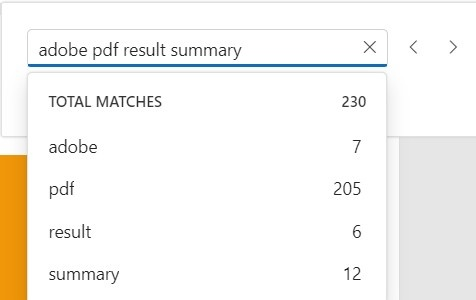
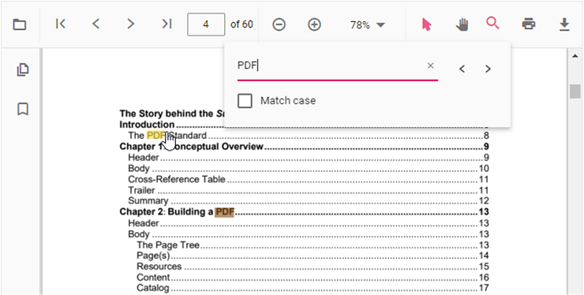

# Text search in Vue PDF viewer control

The text search feature in the PDF Viewer locates and highlights matching content within a document. Enable or disable this capability with the following configuration.




<template>
  <div id="app">
    <ejs-pdfviewer id="pdfViewer" :documentPath="documentPath" :resourceUrl="resourceUrl" :enableTextSearch="true">
    </ejs-pdfviewer>
  </div>
</template>

<script setup>
import {
  PdfViewerComponent as EjsPdfviewer, Toolbar, Magnification, Navigation,
  LinkAnnotation, BookmarkView, Annotation, ThumbnailView,
  Print, TextSelection, TextSearch
} from '@syncfusion/ej2-vue-pdfviewer';
import { provide } from 'vue';

const documentPath = "https://cdn.syncfusion.com/content/pdf/pdf-succinctly.pdf";
const resourceUrl = "https://cdn.syncfusion.com/ej2/24.1.41/dist/ej2-pdfviewer-lib";

provide('PdfViewer', [Toolbar, Magnification, Navigation, LinkAnnotation, BookmarkView,
  Annotation, ThumbnailView, Print, TextSelection, TextSearch])
</script>




<template>
  <div id="app">
    <ejs-pdfviewer id="pdfViewer" :documentPath="documentPath" :resourceUrl="resourceUrl" :enableTextSearch="true">
    </ejs-pdfviewer>
  </div>
</template>

<script>
import {
  PdfViewerComponent, Toolbar, Magnification, Navigation,
  LinkAnnotation, BookmarkView, Annotation, ThumbnailView,
  Print, TextSelection, TextSearch
} from '@syncfusion/ej2-vue-pdfviewer';

export default {
  name: "App",
  components: {
    "ejs-pdfviewer": PdfViewerComponent
  },
  data() {
    return {
      documentPath: "https://cdn.syncfusion.com/content/pdf/pdf-succinctly.pdf",
      resourceUrl: "https://cdn.syncfusion.com/ej2/24.1.41/dist/ej2-pdfviewer-lib"
    };
  },
  provide: {
    PdfViewer: [Toolbar, Magnification, Navigation, LinkAnnotation, BookmarkView,
      Annotation, ThumbnailView, Print, TextSelection, TextSearch]
  }
}
</script>




<template>
  <div id="app">
    <ejs-pdfviewer id="pdfViewer" :serviceUrl="serviceUrl" :documentPath="documentPath" :enableTextSearch="true">
    </ejs-pdfviewer>
  </div>
</template>

<script setup>
import {
  PdfViewerComponent as EjsPdfviewer, Toolbar, Magnification, Navigation,
  LinkAnnotation, BookmarkView, Annotation, ThumbnailView,
  Print, TextSelection, TextSearch
} from '@syncfusion/ej2-vue-pdfviewer';
import { provide } from 'vue';

const serviceUrl = "https://document.syncfusion.com/web-services/pdf-viewer/api/pdfviewer";
const documentPath = "https://cdn.syncfusion.com/content/pdf/pdf-succinctly.pdf";

provide('PdfViewer', [Toolbar, Magnification, Navigation, LinkAnnotation, BookmarkView,
  Annotation, ThumbnailView, Print, TextSelection, TextSearch])
</script>




<template>
  <div id="app">
    <ejs-pdfviewer id="pdfViewer" :serviceUrl="serviceUrl" :documentPath="documentPath" :enableTextSearch="true">
    </ejs-pdfviewer>
  </div>
</template>

<script>
import {
  PdfViewerComponent, Toolbar, Magnification, Navigation,
  LinkAnnotation, BookmarkView, Annotation, ThumbnailView,
  Print, TextSelection, TextSearch
} from '@syncfusion/ej2-vue-pdfviewer';

export default {
  name: "App",
  components: {
    "ejs-pdfviewer": PdfViewerComponent
  },
  data() {
    return {
      serviceUrl: "https://document.syncfusion.com/web-services/pdf-viewer/api/pdfviewer",
      documentPath: "https://cdn.syncfusion.com/content/pdf/pdf-succinctly.pdf"
    };
  },
  provide: {
    PdfViewer: [Toolbar, Magnification, Navigation, LinkAnnotation, BookmarkView,
      Annotation, ThumbnailView, Print, TextSelection, TextSearch]
  }
}
</script>




## Text search features

### Real-time search suggestions while typing
Typing in the search box immediately surfaces suggestions that match the entered text. The list refreshes on every keystroke so users can quickly jump to likely results without completing the entire term.


### Select search suggestions from the popup
After typing in the search box, the popup lists relevant matches. Selecting an item jumps directly to the corresponding occurrence in the PDF.


### Search text with the Match Case option
Enable the Match Case checkbox to limit results to case-sensitive matches. Navigation commands then step through each exact match in sequence.


### Search text without Match Case
Leave the Match Case option cleared to highlight every occurrence of the query, regardless of capitalization, and navigate through each result.


### Search a list of words with Match Any Word
Enable Match Any Word to split the query into separate words. The popup proposes matches for each word and highlights them throughout the document.



### Programmatic search with settings

While the PDF Viewer toolbar offers an interactive search experience, you can also trigger and customize searches programmatically by calling the `searchText` method with tailored options.

#### Using `searchText`

Use the `searchText` method to start a search with optional filters that control case sensitivity and whole-word behavior. In Vue, obtain the PDF Viewer instance (for example, through a template reference) and call `viewer.textSearch.searchText('search text', false, false);`.

- `isMatchCase` (optional boolean): Determines whether the search should be case-sensitive.
- `isMatchWholeWord` (optional boolean): Ensures the entire string is matched as a standalone word.


<template>
  <div id="app">
    <div class="controls">
      <button @click="searchBasic">Search Text</button>
      <button @click="searchMatchCase">Match Case</button>
      <button @click="searchWholeWord">Match Whole Word</button>
    </div>
    <ejs-pdfviewer ref="pdfViewer" id="pdfViewer" :documentPath="documentPath" :resourceUrl="resourceUrl" :enableTextSearch="true">
    </ejs-pdfviewer>
  </div>
</template>

<script setup>
import { ref } from 'vue';
import {
  PdfViewerComponent as EjsPdfviewer, Toolbar, Magnification, Navigation,
  LinkAnnotation, BookmarkView, Annotation, ThumbnailView,
  Print, TextSelection, TextSearch
} from '@syncfusion/ej2-vue-pdfviewer';
import { provide } from 'vue';

const pdfViewer = ref(null);
const documentPath = 'https://cdn.syncfusion.com/content/pdf/pdf-succinctly.pdf';
const resourceUrl = 'https://cdn.syncfusion.com/ej2/24.1.41/dist/ej2-pdfviewer-lib';

provide('PdfViewer', [Toolbar, Magnification, Navigation, LinkAnnotation, BookmarkView,
  Annotation, ThumbnailView, Print, TextSelection, TextSearch]);

function searchBasic() {
  pdfViewer.value.ej2Instances.textSearch.searchText('search text', false, false);
}

function searchMatchCase() {
  pdfViewer.value.ej2Instances.textSearch.searchText('PDF', true);
}

function searchWholeWord() {
  pdfViewer.value.ej2Instances.textSearch.searchText('pdf', false, true);
}
</script>


#### Match Case

Set the `isMatchCase` parameter to `true` to perform a case-sensitive search that mirrors the Match Case option in the search panel. The following Options API sample shows how to trigger a case-sensitive search programmatically.

```html
<template>
  <div id="app">
    <button v-on:click="matchCase">Match Case</button>
    <ejs-pdfviewer ref="pdfViewer" id="pdfViewer" :documentPath="documentPath" :resourceUrl="resourceUrl" :enableTextSearch="true"></ejs-pdfviewer>
  </div>
</template>

<script>
import { PdfViewerComponent, Toolbar, Magnification, Navigation, LinkAnnotation,
  BookmarkView, Annotation, ThumbnailView, Print, TextSelection, TextSearch } from '@syncfusion/ej2-vue-pdfviewer';

export default {
  name: 'App',
  components: {
    'ejs-pdfviewer': PdfViewerComponent
  },
  data() {
    return {
      documentPath: 'https://cdn.syncfusion.com/content/pdf/pdf-succinctly.pdf',
      resourceUrl: 'https://cdn.syncfusion.com/ej2/24.1.41/dist/ej2-pdfviewer-lib'
    };
  },
  provide: {
    PdfViewer: [Toolbar, Magnification, Navigation, LinkAnnotation, BookmarkView,
      Annotation, ThumbnailView, Print, TextSelection, TextSearch]
  },
  methods: {
    matchCase() {
      const viewer = this.$refs.pdfViewer.ej2Instances;
      viewer.textSearch.searchText('PDF', true);
    }
  }
};
</script>
```

#### Match Whole Word

Set the `isMatchWholeWord` parameter to `true` to restrict results to whole-word matches. The following example searches for the whole word "pdf" when a button is clicked.

```html
<template>
  <div id="app">
    <button v-on:click="wholeWord">Match Whole Word</button>
    <ejs-pdfviewer ref="pdfViewer" id="pdfViewer" :documentPath="documentPath" :resourceUrl="resourceUrl" :enableTextSearch="true"></ejs-pdfviewer>
  </div>
</template>

<script>
import { PdfViewerComponent, Toolbar, Magnification, Navigation, LinkAnnotation,
  BookmarkView, Annotation, ThumbnailView, Print, TextSelection, TextSearch } from '@syncfusion/ej2-vue-pdfviewer';

export default {
  name: 'App',
  components: {
    'ejs-pdfviewer': PdfViewerComponent
  },
  data() {
    return {
      documentPath: 'https://cdn.syncfusion.com/content/pdf/pdf-succinctly.pdf',
      resourceUrl: 'https://cdn.syncfusion.com/ej2/24.1.41/dist/ej2-pdfviewer-lib'
    };
  },
  provide: {
    PdfViewer: [Toolbar, Magnification, Navigation, LinkAnnotation, BookmarkView,
      Annotation, ThumbnailView, Print, TextSelection, TextSearch]
  },
  methods: {
    wholeWord() {
      const viewer = this.$refs.pdfViewer.ej2Instances;
      viewer.textSearch.searchText('pdf', false, true);
    }
  }
};
</script>
```

**Note on Match Any Word:** The Match Any Word checkbox in the toolbar splits the input into multiple words and searches for each term individually. This differs from the `isMatchWholeWord` parameter, which enforces a whole-word match on the entire query string.

The following text search methods are available in the PDF Viewer,

* [**Search text**](https://ej2.syncfusion.com/vue/documentation/api/pdfviewer/textSearch/#searchtext): Searches the target text in the PDF document and highlights each occurrence in the pages.
* [**Search next**](https://ej2.syncfusion.com/vue/documentation/api/pdfviewer/textSearch/#searchnext): Searches the next occurrence of the current query from the active match.
* [**Search previous**](https://ej2.syncfusion.com/vue/documentation/api/pdfviewer/textSearch/#searchprevious): Searches the previous occurrence of the current query from the active match.
* [**Cancel text search**](https://ej2.syncfusion.com/vue/documentation/api/pdfviewer/textSearch/#canceltextsearch): Cancels the current text search and removes the highlighted occurrences from the PDF Viewer.



## Find text method
Use the `findText` method to locate a string or an array of strings and return the bounding rectangles for each match. Optional parameters support case-sensitive comparisons and page scoping so you can retrieve coordinates for a single page or the entire document.

### Find and get the bounds of a text
Searches for the specified text within the document and returns the bounding rectangles of the matched text. The search can be case-sensitive based on the provided parameter. It returns the bounding rectangles for all pages in the document where the text was found. The following code snippet shows how to get the bounds of the specified text:




```html
<template>
  <div id="app">
    <button v-on:click="textBounds">Form Fields Collection</button>
<ejs-pdfviewer id="pdfViewer" :resourceUrl="resourceUrl" :documentPath="documentPath"> </ejs-pdfviewer>
  </div>
</template>

<script>
import Vue from 'vue';
import { PdfViewerPlugin, Toolbar, Magnification, Navigation, LinkAnnotation, BookmarkView, ThumbnailView, Print, TextSelection, TextSearch, Annotation, FormFields, FormDesigner } from '@syncfusion/ej2-vue-pdfviewer';
Vue.use(PdfViewerPlugin);
export default {
  name: 'app',
  data () {
return {
  resourceUrl: "https://cdn.syncfusion.com/ej2/24.1.41/dist/ej2-pdfviewer-lib"
  documentPath:"PDF_Succinctly.pdf"
};
  },
  provide: {
PdfViewer: [Toolbar, Magnification, Navigation, LinkAnnotation, BookmarkView, ThumbnailView, Print, TextSelection, TextSearch, Annotation, FormFields, FormDesigner]
  },
  methods: {
  textBounds: function() {
    var viewer = document.getElementById('pdfViewer').ej2_instances[0];
    viewer.textSearch.findText('pdf', false);
  }
 }
}
</script>
```




```html
<template>
  <div id="app">
    <button v-on:click="textBounds">Form Fields Collection</button>
<ejs-pdfviewer id="pdfViewer" :serviceUrl="serviceUrl" :documentPath="documentPath"> </ejs-pdfviewer>
  </div>
</template>

<script>
import Vue from 'vue';
import { PdfViewerPlugin, Toolbar, Magnification, Navigation, LinkAnnotation, BookmarkView, ThumbnailView, Print, TextSelection, TextSearch, Annotation, FormFields, FormDesigner } from '@syncfusion/ej2-vue-pdfviewer';
Vue.use(PdfViewerPlugin);
export default {
  name: 'app',
  data () {
return {
  serviceUrl:"https://document.syncfusion.com/web-services/pdf-viewer/api/pdfviewer",
  documentPath:"PDF_Succinctly.pdf"
};
  },
  provide: {
PdfViewer: [Toolbar, Magnification, Navigation, LinkAnnotation, BookmarkView, ThumbnailView, Print, TextSelection, TextSearch, Annotation, FormFields, FormDesigner]
  },
  methods: {
  textBounds: function() {
    var viewer = document.getElementById('pdfViewer').ej2_instances[0];
    viewer.textSearch.findText('pdf', false);
  }
 }
}
</script>
```




### Find and get the bounds of a text on the desired page
Searches for the specified text within the document and returns the bounding rectangles of the matched text. The search can be case-sensitive based on the provided parameter. It returns the bounding rectangles for that page in the document where the text was found. The following code snippet shows how to retrieve bounds for the specified text on a selected page:




```html
<template>
  <div id="app">
    <button v-on:click="textBounds">Form Fields Collection</button>
<ejs-pdfviewer id="pdfViewer" :resourceUrl="resourceUrl" :documentPath="documentPath"> </ejs-pdfviewer>
  </div>
</template>

<script>
import Vue from 'vue';
import { PdfViewerPlugin, Toolbar, Magnification, Navigation, LinkAnnotation, BookmarkView, ThumbnailView, Print, TextSelection, TextSearch, Annotation, FormFields, FormDesigner } from '@syncfusion/ej2-vue-pdfviewer';
Vue.use(PdfViewerPlugin);
export default {
  name: 'app',
  data () {
return {
  resourceUrl: "https://cdn.syncfusion.com/ej2/24.1.41/dist/ej2-pdfviewer-lib"
  documentPath:"PDF_Succinctly.pdf"
};
  },
  provide: {
PdfViewer: [Toolbar, Magnification, Navigation, LinkAnnotation, BookmarkView, ThumbnailView, Print, TextSelection, TextSearch, Annotation, FormFields, FormDesigner]
  },
  methods: {
  textBounds: function() {
    var viewer = document.getElementById('pdfViewer').ej2_instances[0];
    viewer.textSearch.findText('pdf', false, 7);
  }
 }
}
</script>
```




```html
<template>
  <div id="app">
    <button v-on:click="textBounds">Form Fields Collection</button>
<ejs-pdfviewer id="pdfViewer" :serviceUrl="serviceUrl" :documentPath="documentPath"> </ejs-pdfviewer>
  </div>
</template>

<script>
import Vue from 'vue';
import { PdfViewerPlugin, Toolbar, Magnification, Navigation, LinkAnnotation, BookmarkView, ThumbnailView, Print, TextSelection, TextSearch, Annotation, FormFields, FormDesigner } from '@syncfusion/ej2-vue-pdfviewer';
Vue.use(PdfViewerPlugin);
export default {
  name: 'app',
  data () {
return {
  serviceUrl:"https://document.syncfusion.com/web-services/pdf-viewer/api/pdfviewer",
  documentPath:"PDF_Succinctly.pdf"
};
  },
  provide: {
PdfViewer: [Toolbar, Magnification, Navigation, LinkAnnotation, BookmarkView, ThumbnailView, Print, TextSelection, TextSearch, Annotation, FormFields, FormDesigner]
  },
  methods: {
  textBounds: function() {
    var viewer = document.getElementById('pdfViewer').ej2_instances[0];
    viewer.textSearch.findText('pdf', false, 7);
  }
 }
}
</script>
```




### Find and get the bounds of the list of text
Searches for an array of strings within the document and returns the bounding rectangles for each occurrence. The search can be case-sensitive based on the provided parameters. It returns the bounding rectangles for all pages in the document where the strings were found.




```html
<template>
  <div id="app">
    <button v-on:click="textBounds">Form Fields Collection</button>
<ejs-pdfviewer id="pdfViewer" :resourceUrl="resourceUrl" :documentPath="documentPath"> </ejs-pdfviewer>
  </div>
</template>

<script>
import Vue from 'vue';
import { PdfViewerPlugin, Toolbar, Magnification, Navigation, LinkAnnotation, BookmarkView, ThumbnailView, Print, TextSelection, TextSearch, Annotation, FormFields, FormDesigner } from '@syncfusion/ej2-vue-pdfviewer';
Vue.use(PdfViewerPlugin);
export default {
  name: 'app',
  data () {
return {
  resourceUrl: "https://cdn.syncfusion.com/ej2/24.1.41/dist/ej2-pdfviewer-lib"
  documentPath:"PDF_Succinctly.pdf"
};
  },
  provide: {
PdfViewer: [Toolbar, Magnification, Navigation, LinkAnnotation, BookmarkView, ThumbnailView, Print, TextSelection, TextSearch, Annotation, FormFields, FormDesigner]
  },
  methods: {
  textBounds: function() {
    var viewer = document.getElementById('pdfViewer').ej2_instances[0];
    viewer.textSearch.findText(['pdf', 'adobe'], false);
  }
 }
}
</script>
```




```html
<template>
  <div id="app">
    <button v-on:click="textBounds">Form Fields Collection</button>
<ejs-pdfviewer id="pdfViewer" :serviceUrl="serviceUrl" :documentPath="documentPath"> </ejs-pdfviewer>
  </div>
</template>

<script>
import Vue from 'vue';
import { PdfViewerPlugin, Toolbar, Magnification, Navigation, LinkAnnotation, BookmarkView, ThumbnailView, Print, TextSelection, TextSearch, Annotation, FormFields, FormDesigner } from '@syncfusion/ej2-vue-pdfviewer';
Vue.use(PdfViewerPlugin);
export default {
  name: 'app',
  data () {
return {
  serviceUrl:"https://document.syncfusion.com/web-services/pdf-viewer/api/pdfviewer",
  documentPath:"PDF_Succinctly.pdf"
};
  },
  provide: {
PdfViewer: [Toolbar, Magnification, Navigation, LinkAnnotation, BookmarkView, ThumbnailView, Print, TextSelection, TextSearch, Annotation, FormFields, FormDesigner]
  },
  methods: {
  textBounds: function() {
    var viewer = document.getElementById('pdfViewer').ej2_instances[0];
    viewer.textSearch.findText(['pdf', 'adobe'], false);
  }
 }
}
</script>
```




### Find and get the bounds of the list of text on desired page
Searches for an array of strings within the document and returns the bounding rectangles for each occurrence. The search can be case-sensitive based on the provided parameters. It returns the bounding rectangles for these search strings on that particular page where the strings were found.




```html
<template>
  <div id="app">
    <button v-on:click="textBounds">Form Fields Collection</button>
<ejs-pdfviewer id="pdfViewer" :resourceUrl="resourceUrl" :documentPath="documentPath"> </ejs-pdfviewer>
  </div>
</template>

<script>
import Vue from 'vue';
import { PdfViewerPlugin, Toolbar, Magnification, Navigation, LinkAnnotation, BookmarkView, ThumbnailView, Print, TextSelection, TextSearch, Annotation, FormFields, FormDesigner } from '@syncfusion/ej2-vue-pdfviewer';
Vue.use(PdfViewerPlugin);
export default {
  name: 'app',
  data () {
return {
  resourceUrl: "https://cdn.syncfusion.com/ej2/24.1.41/dist/ej2-pdfviewer-lib"
  documentPath:"PDF_Succinctly.pdf"
};
  },
  provide: {
PdfViewer: [Toolbar, Magnification, Navigation, LinkAnnotation, BookmarkView, ThumbnailView, Print, TextSelection, TextSearch, Annotation, FormFields, FormDesigner]
  },
  methods: {
  textBounds: function() {
    var viewer = document.getElementById('pdfViewer').ej2_instances[0];
    viewer.textSearch.findText(['pdf', 'adobe'], false, 7);
  }
 }
}
</script>
```




```html
<template>
  <div id="app">
    <button v-on:click="textBounds">Form Fields Collection</button>
<ejs-pdfviewer id="pdfViewer" :serviceUrl="serviceUrl" :documentPath="documentPath"> </ejs-pdfviewer>
  </div>
</template>

<script>
import Vue from 'vue';
import { PdfViewerPlugin, Toolbar, Magnification, Navigation, LinkAnnotation, BookmarkView, ThumbnailView, Print, TextSelection, TextSearch, Annotation, FormFields, FormDesigner } from '@syncfusion/ej2-vue-pdfviewer';
Vue.use(PdfViewerPlugin);
export default {
  name: 'app',
  data () {
return {
  serviceUrl:"https://document.syncfusion.com/web-services/pdf-viewer/api/pdfviewer",
  documentPath:"PDF_Succinctly.pdf"
};
  },
  provide: {
PdfViewer: [Toolbar, Magnification, Navigation, LinkAnnotation, BookmarkView, ThumbnailView, Print, TextSelection, TextSearch, Annotation, FormFields, FormDesigner]
  },
  methods: {
  textBounds: function() {
    var viewer = document.getElementById('pdfViewer').ej2_instances[0];
    viewer.textSearch.findText(['pdf', 'adobe'], false, 7);
  }
 }
}
</script>
```




## Text search events

The PDF Viewer triggers events during text search operations, allowing you to customize behavior and respond to different stages of the search process.

### textSearchStart

The [textSearchStart](https://ej2.syncfusion.com/vue/documentation/api/pdfviewer/#textsearchstartevent) event fires as soon as a search begins from the toolbar interface or through the `textSearch.searchText` method. Use it to reset UI state, log analytics, or cancel the default search flow before results are processed.

- Event arguments: [TextSearchStartEventArgs](https://ej2.syncfusion.com/vue/documentation/api/pdfviewer/textSearchStartEventArgs/) exposes:
  - `searchText`: the term being searched.
  - `matchCase`: indicates whether case-sensitive search is enabled.
- `isMatchWholeWord`: indicates whether whole-word matching is enabled.
- `name`: event name.
- `cancel`: set to `true` to stop the default search.


<template>
  <div id="app">
    <ejs-pdfviewer id="pdfViewer" :documentPath="documentPath" :resourceUrl="resourceUrl" :textSearchStart="handleTextSearchStart"></ejs-pdfviewer>
  </div>
</template>

<script setup>
import {
  PdfViewerComponent as EjsPdfviewer, Toolbar, Magnification, Navigation,
  LinkAnnotation, BookmarkView, Annotation, ThumbnailView,
  Print, TextSelection, TextSearch
} from '@syncfusion/ej2-vue-pdfviewer';
import { provide } from 'vue';

const documentPath = 'https://cdn.syncfusion.com/content/pdf/pdf-succinctly.pdf';
const resourceUrl = 'https://cdn.syncfusion.com/ej2/24.1.41/dist/ej2-pdfviewer-lib';

provide('PdfViewer', [Toolbar, Magnification, Navigation, LinkAnnotation, BookmarkView,
  Annotation, ThumbnailView, Print, TextSelection, TextSearch]);

function handleTextSearchStart(args) {
  console.log(`Text search started for: "${args.searchText}"`);
}
</script>


### textSearchHighlight

The [textSearchHighlight](https://ej2.syncfusion.com/vue/documentation/api/pdfviewer/#textsearchhighlightevent) event triggers whenever a search result is brought into view, including navigation between matches. Use it to draw custom overlays or synchronize adjacent UI elements when a match is highlighted.

- Event arguments: [TextSearchHighlightEventArgs](https://ej2.syncfusion.com/vue/documentation/api/pdfviewer/textSearchHighlightEventArgs/) exposes:
  - `bounds`: `RectangleBoundsModel | RectangleBoundsModel[]` representing the highlighted match.
  - `pageNumber`: page index where the match is highlighted.
  - `searchText`: the active search term.
  - `matchCase`: indicates whether case-sensitive search was used.
  - `name`: event name.


<template>
  <div id="app">
    <ejs-pdfviewer id="pdfViewer" :documentPath="documentPath" :resourceUrl="resourceUrl" :textSearchHighlight="handleTextSearchHighlight"></ejs-pdfviewer>
  </div>
</template>

<script setup>
import {
  PdfViewerComponent as EjsPdfviewer, Toolbar, Magnification, Navigation,
  LinkAnnotation, BookmarkView, Annotation, ThumbnailView,
  Print, TextSelection, TextSearch
} from '@syncfusion/ej2-vue-pdfviewer';
import { provide } from 'vue';

const documentPath = 'https://cdn.syncfusion.com/content/pdf/pdf-succinctly.pdf';
const resourceUrl = 'https://cdn.syncfusion.com/ej2/24.1.41/dist/ej2-pdfviewer-lib';

provide('PdfViewer', [Toolbar, Magnification, Navigation, LinkAnnotation, BookmarkView,
  Annotation, ThumbnailView, Print, TextSelection, TextSearch]);

function handleTextSearchHighlight(args) {
  console.log('Highlighted match bounds:', args.bounds);
}
</script>


### textSearchComplete

The [textSearchComplete](https://ej2.syncfusion.com/vue/documentation/api/pdfviewer/#textsearchcompleteevent) event runs after the search engine finishes scanning the document for the current query. Use it to update match counts, toggle navigation controls, or notify users when no results were found.

- Typical uses:
  - Update UI with the total number of matches and enable navigation controls.
  - Hide loading indicators or show a "no results" message if none were found.
  - Record analytics for search effectiveness.
- Event arguments: [TextSearchCompleteEventArgs](https://ej2.syncfusion.com/vue/documentation/api/pdfviewer/textSearchCompleteEventArgs/) exposes:
  - `totalMatches`: total number of occurrences found.
  - `isMatchFound`: indicates whether at least one match was found.
  - `searchText`: the searched term.
  - `matchCase`: indicates whether case-sensitive search was used.
  - `name`: event name.


<template>
  <div id="app">
    <ejs-pdfviewer id="pdfViewer" :documentPath="documentPath" :resourceUrl="resourceUrl" :textSearchComplete="handleTextSearchComplete"></ejs-pdfviewer>
  </div>
</template>

<script setup>
import {
  PdfViewerComponent as EjsPdfviewer, Toolbar, Magnification, Navigation,
  LinkAnnotation, BookmarkView, Annotation, ThumbnailView,
  Print, TextSelection, TextSearch
} from '@syncfusion/ej2-vue-pdfviewer';
import { provide } from 'vue';

const documentPath = 'https://cdn.syncfusion.com/content/pdf/pdf-succinctly.pdf';
const resourceUrl = 'https://cdn.syncfusion.com/ej2/24.1.41/dist/ej2-pdfviewer-lib';

provide('PdfViewer', [Toolbar, Magnification, Navigation, LinkAnnotation, BookmarkView,
  Annotation, ThumbnailView, Print, TextSelection, TextSearch]);

function handleTextSearchComplete(args) {
  console.log('Text search completed.', args);
}
</script>


[View sample in GitHub](https://github.com/SyncfusionExamples/vue-pdf-viewer-examples/tree/master/How%20to/TextSearch)

## See also

* [Toolbar items](./toolbar)
* [Feature modules](./feature-module)
