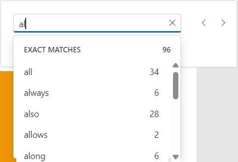
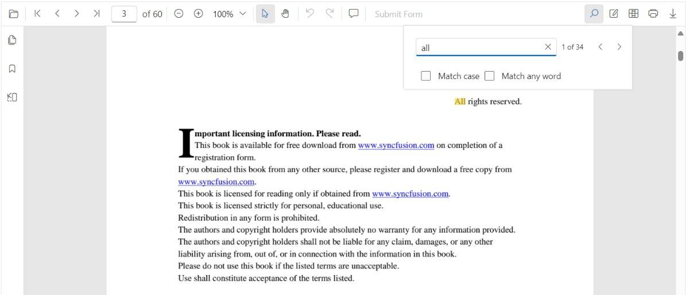
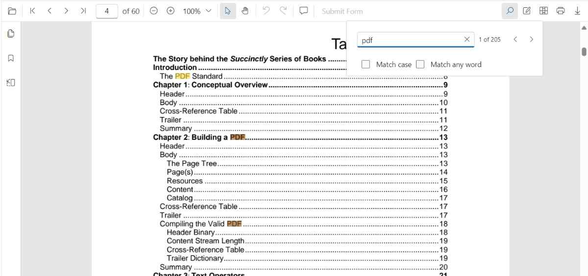

# Text search in Vue PDF Viewer

The text search feature in the Vue PDF Viewer locates and highlights matching content within a document. Enable or disable this capability with the following configuration.


N> The text search functionality requires importing TextSearch and adding it to the provide options. Otherwise, the search UI and APIs will not be accessible.

## Text search features in UI

### Real-time search suggestions while typing

Typing in the search box immediately surfaces suggestions that match the entered text. The list refreshes on every keystroke so users can quickly jump to likely results without completing the entire term.



### Select search suggestions from the popup

After typing in the search box, the popup lists relevant matches. Selecting an item jumps directly to the corresponding occurrence in the PDF.



### Dynamic Text Search for Large PDF Documents

Dynamic text search is enabled during the initial loading of the document when the document text collection has not yet been fully loaded in the background.


### Search text with the Match Case option

Enable the Match Case checkbox to limit results to case-sensitive matches. Navigation commands then step through each exact match in sequence.


### Search text without Match Case

Leave the Match Case option cleared to highlight every occurrence of the query, regardless of capitalization, and navigate through each result.



### Search a list of words with Match Any Word

Enable Match Any Word to split the query into separate words. The popup proposes matches for each word and highlights them throughout the document.


## Programmatic text Search

The Vue PDF Viewer provides options to toggle text search feature and APIs to customize the text search behavior programmatically.

### Enable or Disable Text Search 

Use the following snippet to enable or disable text search features



<template>
  <div style="height: 100vh">
    <ejs-pdfviewer
      id="pdfViewer"
      ref="pdfViewer"
      :enableTextSearch="true"
      :documentPath="documentPath"
      :resourceUrl="resourceUrl"
      style="height: 100%"
    >
    </ejs-pdfviewer>
  </div>
</template>

<script>
import {
  PdfViewerComponent, Toolbar, Magnification, Navigation, Annotation, FormDesigner,
  FormFields, PageOrganizer, TextSelection, TextSearch, Print
} from '@syncfusion/ej2-vue-pdfviewer';

export default {
  name: 'App',
  components: {
    'ejs-pdfviewer': PdfViewerComponent
  },
  data() {
    return {
      documentPath: 'https://cdn.syncfusion.com/content/pdf/pdf-succinctly.pdf',
      resourceUrl: 'https://cdn.syncfusion.com/ej2/31.2.2/dist/ej2-pdfviewer-lib'
    };
  },
  provide: {
    PdfViewer: [
      TextSelection, TextSearch, Print, Navigation, Toolbar, Magnification,
      Annotation, FormDesigner, FormFields, PageOrganizer
    ]
  }
};
</script>



### Programmatic text search

While the PDF Viewer toolbar offers an interactive search experience, you can also trigger and customize searches programmatically by calling the following APIs in textSearch module.

#### `searchText`

Use the [`searchText`](https://ej2.syncfusion.com/vue/documentation/api/pdfviewer/textsearch#searchtext) method to start a search with optional filters that control case sensitivity and whole-word behavior.

```ts
// searchText(text: string, isMatchCase?: boolean, isMatchWholeWord?: boolean)
this.$refs.pdfViewer.ej2Instances.textSearch.searchText('search text', false);
```

Set the `isMatchCase` parameter to `true` to perform a case-sensitive search that mirrors the Match Case option in the search panel.

```ts
// This will only find instances of "PDF" in uppercase.
this.$refs.pdfViewer.ej2Instances.textSearch.searchText('PDF', true);
```

#### `searchNext`

[`searchNext`](https://ej2.syncfusion.com/vue/documentation/api/pdfviewer/textsearch#searchnext) method searches the next occurrence of the current query from the active match.

```ts
// searchNext()
this.$refs.pdfViewer.ej2Instances.textSearch.searchNext();
```

#### `searchPrevious`

[`searchPrevious`](https://ej2.syncfusion.com/vue/documentation/api/pdfviewer/textsearch#searchprevious) API searches the previous occurrence of the current query from the active match.

```ts
// searchPrevious()
this.$refs.pdfViewer.ej2Instances.textSearch.searchPrevious();
```

#### `cancelTextSearch`

[`cancelTextSearch`](https://ej2.syncfusion.com/vue/documentation/api/pdfviewer/textsearch#canceltextsearch) method cancels the current text search and removes the highlighted occurrences from the PDF Viewer.

```ts
// cancelTextSearch()
this.$refs.pdfViewer.ej2Instances.textSearch.cancelTextSearch();
```

#### Complete Example

Use the following code snippet to implement text search using SearchText API



<template>
  <div style="height: 100vh">
    <div class="controls">
      <button @click="searchText">Search Text</button>
      <button @click="previousSearch">Previous Search</button>
      <button @click="nextSearch">Next Search</button>
      <button @click="cancelSearch">Cancel Search</button>
    </div>
    <ejs-pdfviewer
      id="pdfViewer"
      ref="pdfViewer"
      :documentPath="documentPath"
      :resourceUrl="resourceUrl"
      style="height: calc(100% - 50px)"
    >
    </ejs-pdfviewer>
  </div>
</template>

<script>
import {
  PdfViewerComponent, Toolbar, Magnification, Navigation, Annotation, FormDesigner,
  FormFields, PageOrganizer, TextSelection, TextSearch, Print
} from '@syncfusion/ej2-vue-pdfviewer';

export default {
  name: 'App',
  components: {
    'ejs-pdfviewer': PdfViewerComponent
  },
  data() {
    return {
      documentPath: 'https://cdn.syncfusion.com/content/pdf/pdf-succinctly.pdf',
      resourceUrl: 'https://cdn.syncfusion.com/ej2/31.2.2/dist/ej2-pdfviewer-lib'
    };
  },
  provide: {
    PdfViewer: [
      TextSelection, TextSearch, Print, Navigation, Toolbar, Magnification,
      Annotation, FormDesigner, FormFields, PageOrganizer
    ]
  },
  methods: {
    searchText() {
      this.$refs.pdfViewer.ej2Instances.textSearch.searchText('pdf', false);
    },
    previousSearch() {
      this.$refs.pdfViewer.ej2Instances.textSearch.searchPrevious();
    },
    nextSearch() {
      this.$refs.pdfViewer.ej2Instances.textSearch.searchNext();
    },
    cancelSearch() {
      this.$refs.pdfViewer.ej2Instances.textSearch.cancelTextSearch();
    }
  }
};
</script>



**Expected result:** the viewer highlights occurrences of `pdf` and navigation commands jump between matches.

[View Sample in GitHub](https://github.com/SyncfusionExamples/vue-pdf-viewer-examples)

## See also

- [Find Text](./find-text)
- [Text Search Events](./text-search-events)
- [Extract Text](../how-to/extract-text)
- [Extract Text Options](../how-to/extract-text-option)
- [Extract Text Completed](../how-to/extract-text-completed)
