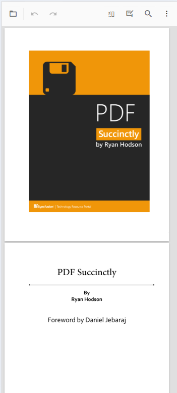
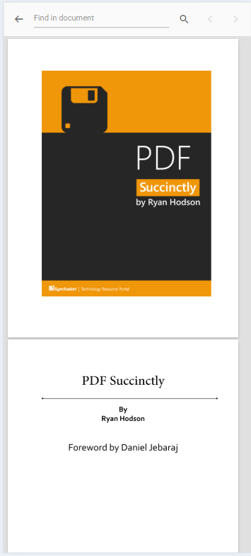
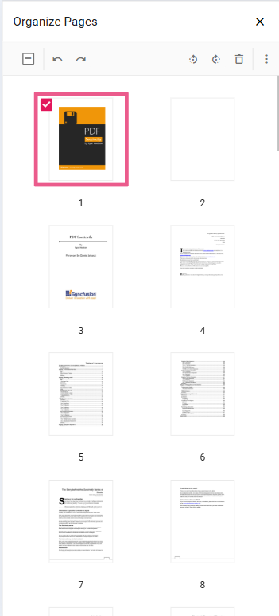
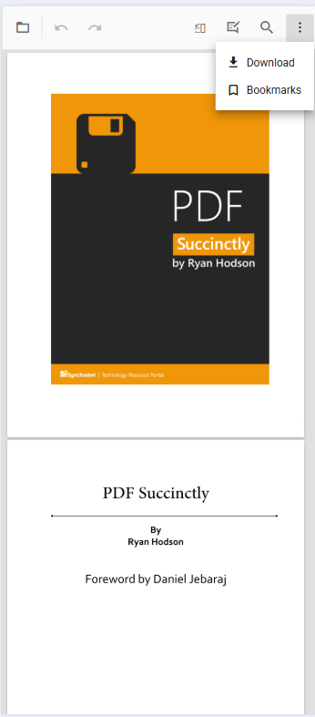

# Customize the Mobile Toolbar in Vue PDF Viewer

The Mobile PDF Viewer provides features for viewing, searching, annotating, and managing PDF documents on mobile devices. It exposes core tools such as search, download, bookmarking, annotation, and page organization. The desktop toolbar can also be enabled in mobile mode to expose additional actions when required.

## Mobile Mode Toolbar Configuration

In mobile mode, the toolbar is optimized for small screens and presents the most common actions for interacting with a PDF document. The following key features are available in mobile mode:

### Main Toolbar Options

- OpenOption: Tap to load a PDF document.
- SearchOption: Access the search bar to find text within the document.

- UndoRedoTool: Quickly undo or redo any annotations made.
- OrganizePagesTool: Enable or disable page organization features to modify document pages.

- AnnotationEditTool: Activate or deactivate annotation editing to add or modify annotations.

N> In mobile mode, the annotation toolbar is displayed at the bottom of the viewer.

### More Options Menu
When you open the more options menu, you will see additional actions such as:

- DownloadOption: Download the currently opened PDF document.
- BookmarkOption: View bookmarks within the document.

## Enable Desktop Mode in Mobile

The desktop toolbar can be enabled on mobile devices by setting the `enableDesktopMode` option. Enabling this option exposes desktop-style toolbar actions in the mobile PDF Viewer.

### Steps to Enable Desktop Mode

**Step 1:** Set `enableDesktopMode` to true in the component configuration.
**Step 2:** The viewer will use the desktop toolbar layout, granting access to additional actions and controls.




<template>
  

    <ejs-pdfviewer id="pdfViewer" :documentPath="documentPath" :resourceUrl="resourceUrl" :enableDesktopMode="true">
    </ejs-pdfviewer>
  

</template>




<template>
  

    <ejs-pdfviewer id="pdfViewer" :documentPath="documentPath" :resourceUrl="resourceUrl" :enableDesktopMode="true">
    </ejs-pdfviewer>
  

</template>




<template>
  

    <ejs-pdfviewer id="pdfViewer" :documentPath="documentPath" :serviceUrl="serviceUrl" :enableDesktopMode="true">
    </ejs-pdfviewer>
  

</template>




<template>
  

    <ejs-pdfviewer id="pdfViewer" :documentPath="documentPath" :serviceUrl="serviceUrl" :enableDesktopMode="true">
    </ejs-pdfviewer>
  

</template>




## Enable Scrolling in Desktop Mode with Touch Gestures

To ensure smooth touch scrolling of documents on mobile devices when the desktop toolbar is enabled, set the `enableTextSelection` option to **false**. This disables text-selection interactions that can interfere with touch-based scrolling.




<template>
  

    <ejs-pdfviewer id="pdfViewer" :documentPath="documentPath" :resourceUrl="resourceUrl" :enableDesktopMode="true" :enableTextSelection="false">
    </ejs-pdfviewer>
  

</template>




<template>
  

    <ejs-pdfviewer id="pdfViewer" :documentPath="documentPath" :resourceUrl="resourceUrl" :enableDesktopMode="true" :enableTextSelection="false">
    </ejs-pdfviewer>
  

</template>




<template>
  

    <ejs-pdfviewer id="pdfViewer" :documentPath="documentPath" :serviceUrl="serviceUrl" :enableDesktopMode="true" :enableTextSelection="false">
    </ejs-pdfviewer>
  

</template>




<template>
  

    <ejs-pdfviewer id="pdfViewer" :documentPath="documentPath" :serviceUrl="serviceUrl" :enableDesktopMode="true" :enableTextSelection="false">
    </ejs-pdfviewer>
  

</template>




## Print Option Not Available in Mobile Mode

The Print option is not available in mobile mode by default. Enabling the desktop toolbar on mobile via `enableDesktopMode` makes the Print option available.

### How to Use Print on Mobile:

- Set `enableDesktopMode` to true to load the desktop toolbar on mobile.
- After enabling desktop mode, the Print option appears in the toolbar and can be used to print the document from the mobile device.

N> Print functionality remains unavailable in the default mobile toolbar unless desktop mode is enabled.

## See also

* [Primary toolbar customization](./primary-toolbar)
* [Custom toolbar](./custom-toolbar)
* [Annotation toolbar customization](./annotation-toolbar)
* [Form designer toolbar customization](./form-designer-toolbar)
* [Toolbar customization](../toolbar)
* [Feature Modules](../feature-module)