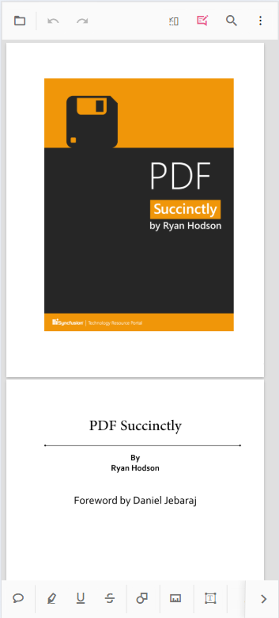

# Mobile Toolbar Interface in Vue PDF Viewer component

The mobile PDF Viewer offers a variety of features for viewing, searching, annotating, and managing PDF documents on mobile devices. It includes essential tools like search, download, bookmarking, annotation, and page organization. Users can also enable desktop toolbar features in mobile mode to access a more extensive set of actions.

## Mobile Mode Toolbar Configuration
In mobile mode, the toolbar is optimized for small screens, presenting the most common actions for interacting with a PDF document. Below are the key features available in mobile mode:

### Main Toolbar Options

- OpenOption: Tap to load a PDF document.
- SearchOption: Access the search bar to find text within the document.

- UndoRedoTool: Quickly undo or redo any annotations made.
- OrganizePagesTool: Enable or disable page organization features to modify document pages.

- AnnotationEditTool: Activate or deactivate annotation editing to add or modify annotations.

N> In mobile mode, the annotation toolbar is displayed at the bottom of the viewer.

### More Options Menu
When you open the more options menu, you will see additional actions such as:

- DownloadOption: Download the currently opened PDF document.
- BookmarkOption: View bookmarks within the document.

## Enable desktop mode in mobile

The desktop version of the toolbar can be enabled on mobile devices by using the `enableDesktopMode` API. This allows you to bring desktop-like features to the mobile PDF Viewer, providing access to additional toolbar actions typically available on desktop platforms.

### Steps to enable desktop mode

- Set `enableDesktopMode` to true in the configuration.
- This will replace the mobile toolbar with the desktop toolbar layout, allowing access to more actions and controls.




<template>
  

    <ejs-pdfviewer id="pdfViewer" :documentPath="documentPath" :resourceUrl="resourceUrl" :enableDesktopMode="true">
    </ejs-pdfviewer>
  

</template>




<template>
  

    <ejs-pdfviewer id="pdfViewer" :documentPath="documentPath" :resourceUrl="resourceUrl" :enableDesktopMode="true">
    </ejs-pdfviewer>
  

</template>




<template>
  

    <ejs-pdfviewer id="pdfViewer" :documentPath="documentPath" :serviceUrl="serviceUrl" :enableDesktopMode="true">
    </ejs-pdfviewer>
  

</template>




<template>
  

    <ejs-pdfviewer id="pdfViewer" :documentPath="documentPath" :serviceUrl="serviceUrl" :enableDesktopMode="true">
    </ejs-pdfviewer>
  

</template>




## Enable scrolling in desktop mode with touch gestures

To ensure smooth scrolling of PDF documents on a mobile device in desktop mode, enable touch gesture scrolling by setting `enableTextSelection` to false.




<template>
  

    <ejs-pdfviewer id="pdfViewer" :documentPath="documentPath" :resourceUrl="resourceUrl" :enableDesktopMode="true" :enableTextSelection="false">
    </ejs-pdfviewer>
  

</template>




<template>
  

    <ejs-pdfviewer id="pdfViewer" :documentPath="documentPath" :resourceUrl="resourceUrl" :enableDesktopMode="true" :enableTextSelection="false">
    </ejs-pdfviewer>
  

</template>




<template>
  

    <ejs-pdfviewer id="pdfViewer" :documentPath="documentPath" :serviceUrl="serviceUrl" :enableDesktopMode="true" :enableTextSelection="false">
    </ejs-pdfviewer>
  

</template>




<template>
  

    <ejs-pdfviewer id="pdfViewer" :documentPath="documentPath" :serviceUrl="serviceUrl" :enableDesktopMode="true" :enableTextSelection="false">
    </ejs-pdfviewer>
  

</template>




## Print option not available in mobile mode

The Print option is not available in mobile mode by default. If you need to use the print functionality on mobile devices, enable the desktop toolbar using the `enableDesktopMode` API.

- Enable Desktop Mode: Set `enableDesktopMode` to true to load the desktop version of the toolbar on your mobile device.
- Print Option: Once desktop mode is enabled, the print option will be available, allowing you to print the document directly from your mobile device.

N> In mobile mode, the print functionality will not be available unless desktop mode is enabled.

## See also

* [Primary toolbar customization](./toolbar-customization/primary-toolbar-customization)
* [Custom toolbar](./toolbar-customization/custom-toolbar)
* [Annotation toolbar customization](./toolbar-customization/annotation-toolbar-customization)
* [Form designer toolbar customization](./toolbar-customization/form-designer-toolbar-customization)
* [Mobile toolbar](./toolbar-customization/mobile-toolbar)
* [Toolbar customization](./how-to/toolbar-customization)
* [Feature Modules](./feature-module)