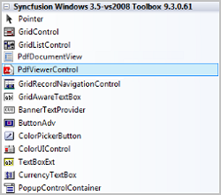
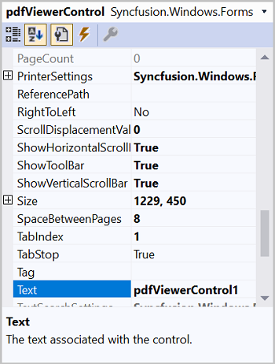

# Getting Started with Windows Forms PDF Viewer (PdfViewerControl)
This section briefly explains how to include the [Syncfusion® WinForms PdfViewer](https://www.syncfusion.com/pdf-viewer-sdk/winforms-pdf-viewer) component in Windows Forms App using Visual Studio.

## Prerequisites
* [System requirements for WinForms components](https://help.syncfusion.com/windowsforms/system-requirements)

## Create a new Windows Forms App in Visual Studio

You can create a **Windows Forms Application** using Visual Studio via [Microsoft Templates](https://learn.microsoft.com/en-us/dotnet/desktop/winforms/get-started/create-app-visual-studio) or the [Syncfusion&reg; Windows Forms](https://help.syncfusion.com/windowsforms/visual-studio-integration/template-studio).

## Assemblies Deployment

To add a WinForms PdfViewer component to your application by installing it via NuGet packages (Recommended) or by manually adding the required assemblies to the project.




The [WinForms PDF Viewer](https://www.syncfusion.com/pdf-viewer-sdk/winforms-pdf-viewer) (PdfViewerControl) and dependent assemblies can be found at the following location on your machine. 

### Install Syncfusion&reg; Windows Forms PdfViewer NuGet packages

To add **Windows Forms PdfViewer** component in the application, open the NuGet package manager in Visual Studio (*Tools → NuGet Package Manager → Manage NuGet Packages for Solution*), search and install:

•	[Syncfusion.PdfViewer.Windows](https://www.nuget.org/packages/Syncfusion.PdfViewer.Windows)


 


### Add Syncfusion® WinForms PdfViewer Assemblies

The table below lists the required assemblies to be added in project when the [WinForms PdfViewer](https://www.syncfusion.com/pdf-viewer-sdk/winforms-pdf-viewer) control is used in your application.

<table>
<tr>
<th>
Assembly</th><th>
Description</th></tr>
<tr>
<td>
Syncfusion.Compression.Base.dll</td><td>
This library handles various compression and decompression operations that are used in the PDF file internally.</td></tr>
<tr>
<td>
Syncfusion.Pdf.Base.dll</td><td>
This library contains the PDF reader and creator that supports the PDF Viewer.</td></tr>
<tr>
<td>
Syncfusion.PdfToImageConverter.Base.dll</td><td>
This library is responsible for Pdfium integration and image generation, enhancing the capabilities of the PDF Viewer.</td></tr>
<tr>
<td>
Syncfusion.PdfViewer.Windows.dll</td><td>
This assembly contains the rendering area and other related UI elements.</td></tr>
<tr>
<td>
Syncfusion.Shared.Base.dll</td><td>
This assembly contains various UI controls (ColorPickerPalette and Numeric UpDown) that are used in the PDF Viewer.</td></tr>
</table>


 


N>* Starting with version 23.1.x, Syncfusion PdfToImageConverter is necessary for PdfViewer applications.
N>* Starting with version 16.2.0.x, if you reference Syncfusion&reg;; assemblies from trial setup or from the NuGet feed, you also have to include a license key in your projects. Please refer to [this licensing guide](https://help.syncfusion.com/common/essential-studio/licensing/overview) to know about registering Syncfusion&reg; license key in your Windows Forms application to use our components.

## Add Windows Forms PdfViewer component

WinForms PdfViewer control can be added to an application either through the Windows Forms Designer or programmatically using code.




1.Open your form in the designer. Add the Syncfusion&reg;; controls to your .NET toolbox in Visual Studio if you haven't done so already (the install would have automatically done this unless you selected not to complete toolbox integration during installation).
   
   

2.Drag the PdfViewerControl from the toolbox onto the form. Appearance and behavior related aspects of the PdfViewerControl can be controlled by setting the appropriate properties through the properties grid. 

   
 
3.This will add the instance 'pdfViewerControl1' to the Designer.cs file. The PDF can be loaded in the Form1.cs file using the [Load](https://help.syncfusion.com/cr/windowsforms/Syncfusion.Windows.Forms.PdfViewer.PdfViewerControl.html#Syncfusion_Windows_Forms_PdfViewer_PdfViewerControl_Load_System_String_) method. 

	
	

	//Loading the document in the PdfViewerControl
	pdfViewerControl1.Load("Sample.pdf");

	
	

	'Loading the document in the PdfViewerControl
	pdfViewerControl1.Load("Sample.pdf")

	
	

	

	

1.Add Syncfusion.Windows.Forms.PdfViewer namespace in Form1.cs.

	
	

	using Syncfusion.Windows.Forms.PdfViewer;

	
	

	Imports Syncfusion.Windows.Forms.PdfViewer

	
	

2.Create a PdfViewerControl instance and load the PDF inside Constructor in Form1.cs. Also place the sample PDF document in the project folder.

	
	

	//Initializing the PdfViewerControl
	PdfViewerControl pdfViewerControl1 = new PdfViewerControl();

	//Add PdfViewerControl to the Form
	Controls.Add(pdfViewerControl1);
	//Docking the control to all edges of its containing control and sizing appropriately.
	pdfViewerControl1.Dock = DockStyle.Fill;

	//Loading the document in the PdfViewerControl
	pdfViewerControl1.Load(@"../../Sample.pdf");

	
	

	'Initializing the PdfViewerControl
	Dim pdfViewerControl1 As PdfViewerControl = New PdfViewerControl()

	'Add PdfViewerControl to the Form
	Controls.Add(pdfViewerControl1)
	'Docking the control to all edges of its containing control and sizing appropriately.
	pdfViewerControl1.Dock = DockStyle.Fill

	'Loading the document in the PdfViewerControl
	pdfViewerControl1.Load(@"../../Sample.pdf")

	
	

	
	 
	

N>[View Sample in GitHub.](https://github.com/syncfusion/pdf-viewer-sdk-winforms-demos/tree/master/pdfviewer/Getting%20Started/Pdf%20Viewer%20Demo)

N> You can also explore our [WinForms PDF Viewer example](https://github.com/syncfusion/pdf-viewer-sdk-winforms-demos/tree/master/pdfviewer) that shows you how to render and configure the PDF Viewer. Looking for the full WinForms PDF Viewer component overview, features, pricing, and documentation? Visit the [WinForms PDF Viewer](https://www.syncfusion.com/pdf-viewer-sdk/winforms-pdf-viewer) page.

## See Also
- [Working with PdfViewerControl](./working-with-pdf-viewer)
- [Working with PdfDocumentView](./working-with-pdfdocumentview)
