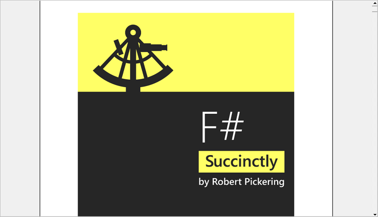

# How to load PDF without ToolStrip in WinForms PDF Viewer

In order to view the PDF without the toolbar, make use of the [PdfDocumentView](https://help.syncfusion.com/cr/windowsforms/Syncfusion.Windows.Forms.PdfViewer.PdfDocumentView.html) control instead of the PdfViewerControl as described in the [section](https://help.syncfusion.com/windowsforms/pdf-viewer/getting-started#adding-pdfdocumentview-to-an-application). Other features are similar to the PdfViewerControl.



PdfDocumentView pdfDocumentView1 = new PdfDocumentView();
pdfDocumentView1.Load("Sample.pdf");




Dim pdfDocumentView1 As New PdfDocumentView()
pdfDocumentView1.Load("Sample.pdf")




The following is the image of a PDF document viewed in PdfDocumentView.

