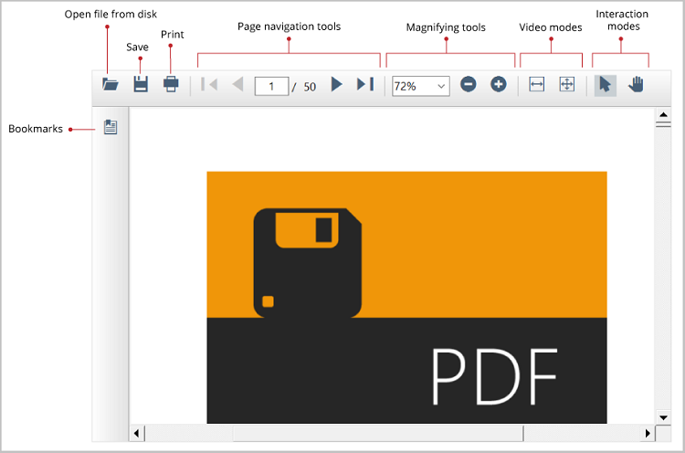

# Windows Forms PDF Viewer (PdfViewerControl) Overview

The [WinForms PDF Viewer](https://www.syncfusion.com/winforms-ui-controls/pdf-viewer) control supports viewing and printing PDF files in WinForms applications. The hyperlink and table of contents support provides easy navigation within and outside the PDF files.

## Key features

* Accurate, reliable rendering of PDF pages.
* [Open PDF files](https://help.syncfusion.com/document-processing/pdf/pdf-viewer/winforms/working-with-pdf-viewer#viewing-pdf-files)
* [Saving PDF](https://help.syncfusion.com/document-processing/pdf/pdf-viewer/winforms/saving-pdf-files)
* [Export PDF](https://help.syncfusion.com/document-processing/pdf/pdf-viewer/winforms/working-with-pdf-viewer#exporting-pdf)
* [Rendering Engine](https://help.syncfusion.com/document-processing/pdf/pdf-viewer/winforms/pdf-rendering-engines)
* Easy page navigation with:
    * [Bookmark panel](https://help.syncfusion.com/document-processing/pdf/pdf-viewer/winforms/bookmark-navigation)
    * [Hyperlink navigation](https://help.syncfusion.com/document-processing/pdf/pdf-viewer/winforms/working-with-hyperlinks)
    * Table of contents navigation
* Core interactions:
    * [Zooming](https://help.syncfusion.com/document-processing/pdf/pdf-viewer/winforms/magnifying-pdf-documents) and [panning](https://help.syncfusion.com/document-processing/pdf/pdf-viewer/winforms/interaction-modes#panning-mode)
    * [Text searching](https://help.syncfusion.com/document-processing/pdf/pdf-viewer/winforms/searching-text)
	* [Text Extraction](https://help.syncfusion.com/document-processing/pdf/pdf-viewer/winforms/extract-text-from-pdf)
	* Text selection and copy
* [Print](https://help.syncfusion.com/document-processing/pdf/pdf-viewer/winforms/printing-pdf-files) PDF files.
* [Localization](https://help.syncfusion.com/document-processing/pdf/pdf-viewer/winforms/localization)
* Customization 
	* [built-in themes](https://help.syncfusion.com/document-processing/pdf/pdf-viewer/winforms/working-with-themes)
	* [custom toolbar](https://help.syncfusion.com/document-processing/pdf/pdf-viewer/winforms/how-to/hide-or-disabling-toolbar-buttons) 
* Right to left (RTL)

N> You can also explore our [WinForms PDF Viewer example](https://github.com/syncfusion/winforms-demos/tree/master/pdfviewer) that shows you how to render and configure the PDF Viewer.