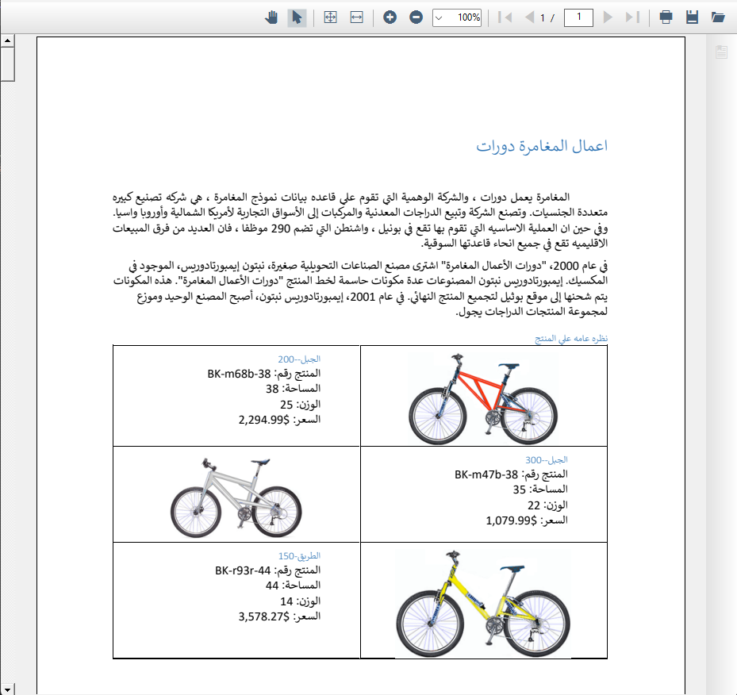

# Right to Left (RTL) in WinForms PDF Viewer

The [WinForms PDF Viewer](https://www.syncfusion.com/pdf-viewer-sdk/winforms-pdf-viewer) control supports right-to-left (RTL) rendering. All user interface elements are displayed based on left-to-right (LTR) or right-to-left (RTL) direction, ensuring proper layout and alignment for RTL languages.

## Code Changes for Enabling RTL

To enable RTL support in the WinForms PDF Viewer, set the `RightToLeft` property of the PDF viewer control to `Yes`. Refer to the following code snippet.




using System.Windows.Forms;

namespace WindowsFormsApp_RTL
{
    public partial class Form1 : Form
    {
        public Form1()
        {
            InitializeComponent();

            // Enable RTL layout for PDF Viewer control
            pdfViewerControl1.RightToLeft = RightToLeft.Yes;
        }
    }
}




The following screenshot shows the RTL-enabled PDF Viewer output

N> The sample project to perform the operation is available in the [GitHub](https://github.com/SyncfusionExamples/WinForms-PDFViewer-Examples/tree/master/RTL).