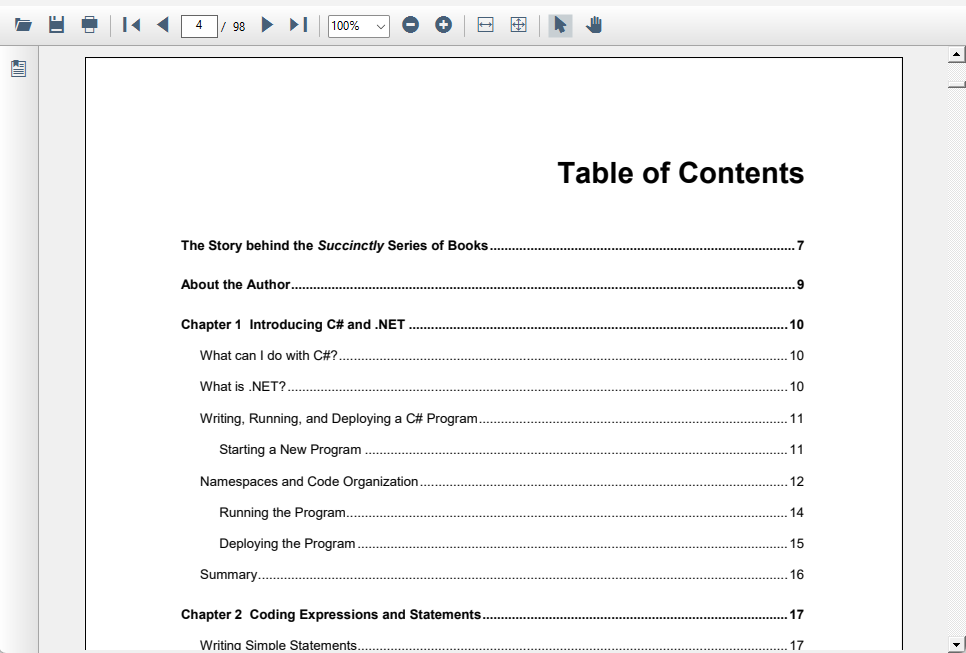

# Table of contents navigation in WinForms Pdf Viewer

Table of contents navigation support in PDF Viewer control allows users to navigate to a particular destination of the contents present in the table of contents(TOC) of the loaded PDF document at UI level.

For additinal information about how the Table of contents navigation navigates to the destination location, please refer to the [bookmark feature](https://help.syncfusion.com/document-processing/pdf/pdf-viewer/winforms/bookmark-navigation) of the PDF Viewer.

N> You can refer to our [WinForms PDF Viewer](https://www.syncfusion.com/pdf-viewer-sdk/winforms-pdf-viewer) feature tour page for its groundbreaking feature representations.