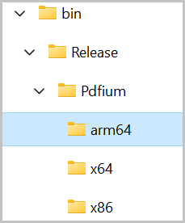

# PDF Rendering Engines in Windows Forms PDF Viewer (PdfViewerControl)

[WinForms PDF Viewer](https://www.syncfusion.com/pdf-viewer-sdk/winforms-pdf-viewer) renders the PDF pages through two different rendering engines.

* PDFium (Google Chrome’s PDF rendering engine)
* SfPdf (Syncfusion’s own PDF rendering engine)

## PDFium

PDFium is used in Google Chrome for rendering PDF files. It provides accurate and robust PDF rendering. It is the recommended PDF rendering engine. 

N>* From v16.3.0.x onwards, this PDFium rendering engine is the default rendering engine of Syncfusion&reg;; WinForms PDF Viewer.
N>* From v20.4.0.x onwards, ARM64-based Pdfium assembly is generated for Syncfusion&reg;; WinForms PDF Viewer control in applications that target ARM64 architecture.
N>* From v34.1.x onwards, Pdfium is upgraded to the new version which was built with the branch [chromium/7814](https://pdfium.googlesource.com/pdfium/+/refs/heads/chromium/7814).

### How PDFium works with Syncfusion’s PDF Viewer

* On running your WinForms application, Syncfusion&reg;; PDF Viewer control generates a folder named `PDFium` in the application output path folder (for example: bin/release or bin/debug) at runtime. 
* Syncfusion&reg;; PDF Viewer control detects the architecture of the running machine automatically.
* Next, it creates another subfolder named “x64”, “x86” or “arm64” based on the machine architecture.
* Extracts the PDFium binary (PDFium.dll) into the subfolder (x64, x86 or arm64) and consumes it to render PDF files.

N> PDFium rendering is not supported in Windows XP.

### How to run PDFium in a restricted access environment

If there is any access restriction applied to the application output folder, then the Syncfusion&reg;; PDF Viewer control is not able to extract and consume the PDFium engine as mentioned above.

In that situation, you need to add the following steps to consume the PDFium rendering engine.

* Create a folder that your application can access to create and read files. For example, <b>"d:\ThirdPartyBinaries\"</b>.
* Update the path of this folder to the [ReferencePath](https://help.syncfusion.com/cr/windowsforms/Syncfusion.Windows.Forms.PdfViewer.PdfViewerControl.html#Syncfusion_Windows_Forms_PdfViewer_PdfViewerControl_ReferencePath) property of PDF Viewer control, like shown in the following code sample.
* If [ReferencePath](https://help.syncfusion.com/cr/windowsforms/Syncfusion.Windows.Forms.PdfViewer.PdfViewerControl.html#Syncfusion_Windows_Forms_PdfViewer_PdfViewerControl_ReferencePath) is set, then PDF Viewer control extracts the PDFium binary inside that specified folder and consumes the PDFium rendering engine.



using Syncfusion.Windows.Forms.PdfViewer;
using System.Windows.Forms;

namespace PdfViewerDemo
{
    public partial class Form1 : Form
    {
        public Form1()
        {
            //Set the reference path.
            pdfViewer.ReferencePath = @"D:\ThirdPartyBinaries\";
            //Load the PDF.
            pdfViewer.Load("Sample.pdf");
        }
    }
}



N>At run time, the PDF viewer will check the custom folder path provided in the [ReferencePath](https://help.syncfusion.com/cr/windowsforms/Syncfusion.Windows.Forms.PdfViewer.PdfViewerControl.html#Syncfusion_Windows_Forms_PdfViewer_PdfViewerControl_ReferencePath) property. If you already placed the Pdfium assemblies in the custom folder path, it will refer to the already available assemblies from the location. It won’t generate the assemblies in the folder again. 
N>You need to place the PDFium assembly in the correct folder structure as mentioned below.
N>* ThirdPartyBinaries
N>	* Pdfium
N>		* x86
N>			* Pdfium.dll
N>		* x64
N>			* Pdfium.dll
N>		* arm64
N>			* Pdfium.dll

## SfPdf

`SfPdf` is Syncfusion's own PDF rendering engine. Before v16.3.0.x, the PDF Viewer control used this rendering engine as the default for rendering the PDF pages. If you wish to use `SfPdf` rendering engine or face any compatibility issues with `Pdfium` rendering engine in your environment, you may set the [RenderingEngine](https://help.syncfusion.com/cr/windowsforms/Syncfusion.Windows.Forms.PdfViewer.PdfViewerControl.html#Syncfusion_Windows_Forms_PdfViewer_PdfViewerControl_RenderingEngine) property to `SfPdf` as shown in the following code sample.

N> The recommended PDF rendering engine is PDFium.



using Syncfusion.Windows.Forms.PdfViewer;
using System.Windows.Forms;

namespace PdfViewerDemo
{
    public partial class Form1 : Form
    {
        public Form1()
        {
            //Set the rendering engine as `SfPdf`.
            pdfViewer.RenderingEngine = PdfRenderingEngine.SfPdf;
            //Load the PDF.
            pdfViewer.Load("Sample.pdf");
        }
    }
}

