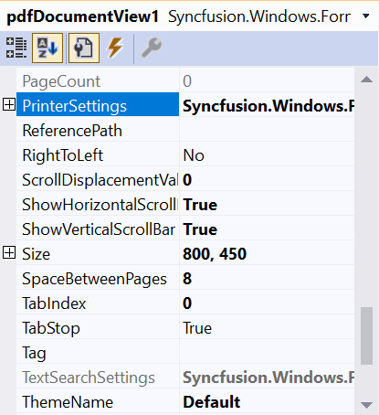

## Adding PdfDocumentView to an Application 

The [PdfDocumentView](https://help.syncfusion.com/cr/windowsforms/Syncfusion.Windows.Forms.PdfViewer.PdfDocumentView.html) control allows you to view PDF files without a toolbar. Other features are similar to the PdfViewerControl.

### Adding in designer

1. Open your form in the designer. Add the Syncfusion&reg;; controls to your .NET toolbox in Visual Studio if you haven't done so already (the install would have automatically done this unless you selected not to complete toolbox integration during installation).
   
   

2. Drag the PdfDocumentView from the toolbox onto the form. Appearance and behavior related aspects of the PdfDocumentView can be controlled by setting the appropriate properties through the properties grid. 

   
 
3. This will add the instance 'pdfDocumentView1' to the Designer cs file. The PDF can be loaded in the Form cs file using the [Load](https://help.syncfusion.com/cr/windowsforms/Syncfusion.Windows.Forms.PdfViewer.PdfDocumentView.html#Syncfusion_Windows_Forms_PdfViewer_PdfDocumentView_Load_System_String_) method. 





//Loading the document in the PdfDocumentView
pdfDocumentView1.Load("Sample.pdf");




'Loading the document in the PdfDocumentView
pdfDocumentView1.Load("Sample.pdf")




{{ codesnippet1 | OrderList_Indent_Level_1 }}
	
### Adding manually in code

1. Add Syncfusion.Windows.Forms.PdfViewer namespace.





using Syncfusion.Windows.Forms.PdfViewer;




Imports Syncfusion.Windows.Forms.PdfViewer




{{ codesnippet2 | OrderList_Indent_Level_1 }}

2. Create a PdfDocumentView instance and load the PDF.





//Initializing the PdfDocumentView
PdfDocumentView pdfDocumentView1 = new PdfDocumentView();

//Loading the document in the PdfDocumentView
pdfDocumentView1.Load("Sample.pdf");
//Add the PdfDocumentView to the Form
Controls.Add(pdfDocumentView1);




'Initializing the PdfDocumentView
Dim pdfDocumentView1 As PdfDocumentView = New PdfDocumentView()

'Loading the document in the PdfDocumentView
pdfDocumentView1.Load("Sample.pdf")
'Add the PdfDocumentView to the Form
Controls.Add(pdfDocumentView1)




{{ codesnippet3 | OrderList_Indent_Level_1 }}

N> You can also explore our [WinForms PDF Viewer example](https://github.com/syncfusion/winforms-demos/tree/master/pdfviewer) that shows you how to render and configure the PDF Viewer.

## See Also
- [Viewing PDF files](/windowsforms/pdf-viewer/working-with-pdf-viewer#viewing-pdf-files)
- [Getting started] (./Getting-Started)