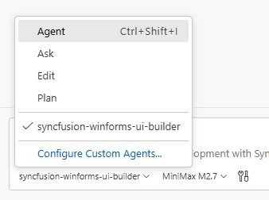

# Syncfusion® WinForms UI Builder Skill with PDFViewer for AI Assistant

**Syncfusion® WinForms UI Builder Skill** is an AI-powered agent skill that accelerates WinForms PDF Viewer development by transforming natural-language UI requirements into production-ready code using Syncfusion® WinForms components. 

Integrated with your AI-powered IDE, it leverages deep knowledge of **Syncfusion® PDF Viewer** and other WinForms components to deliver accurate and ready-to-use code.By combining intelligent code generation with best practices, accessibility standards, and design-system consistency, WinForms UI Builder helps you rapidly build scalable PDF viewing applications and user interfaces without leaving your development workflow.

## Prerequisites

Before installing WinForms UI Builder Skill with PDF Viewer, ensure the following:

- Install [APM (Agent Package Manager)](https://microsoft.github.io/apm/getting-started/installation/#quick-install-recommended)
- Required [.NET SDK](https://dotnet.microsoft.com/en-us/download) version ≥ 6
- Windows Forms application (existing or new); see [Overview](https://help.syncfusion.com/windowsforms/overview)
- A supported AI agent or IDE that integrates with the Skills (VS Code, Cursor, Syncfusion® Code Studio, etc.)
- Active Syncfusion<sup style="font-size:70%">&reg;</sup> license(any of the following):  
  - [Commercial](https://www.syncfusion.com/sales/unlimitedlicense)  
  - [Community License](https://www.syncfusion.com/products/communitylicense)  
  - [Free Trial](https://www.syncfusion.com/account/manage-trials/start-trials)

## Key Benefits

### **AI-Driven UI Generation**
- Transforms prompts into fully developed WinForms components rather than just partial code snippets.
- Automatically selects appropriate Syncfusion® components and features
- Produces structured, maintainable code

### **Control Usage & API Accuracy**
- Uses correct Syncfusion® control APIs and properties
- Injects required feature modules (paging, sorting, filtering, etc.)
- Avoids unsupported or deprecated patterns

### **Patterns & Best Practices**
- Recommended control composition and data-binding patterns
- Event handling aligned with Windows Forms standards and designer integration
- Secure and scalable coding patterns with proper resource management
- Designer-friendly code that works in both code-behind and UI designer

### **Accessibility & Design System**
- Follows Windows accessibility guidelines
- Supports keyboard navigation and accessibility standards
- Theme consistency across desktop applications

### **Design-System Integration**
- Supports Syncfusion® Windows Forms themes via SkinManager (Office2007, Office2010, Office2013, Office2016, Office2019, Metro, HighContrast)
- SkinManager integration for consistent theming
- Theme Studio support for customizing Office2019Colorful and HighContrastBlack themes
- Ensures consistent Syncfusion® styling across controls

## Installation

Before installing WinForms UI Builder, ensure that APM (Agent Package Manager) is installed and available in your environment.

### Verify APM Installation

Run the following command to confirm APM is installed:

```bash
apm --version
```

### Install the Syncfusion® WinForms UI Builder package using APM

Use the APM CLI to install the WinForms UI Builder skill for your preferred environment:




apm install syncfusion/winforms-ui-builder -t copilot




apm install syncfusion/winforms-ui-builder -t cursor




apm install syncfusion/winforms-ui-builder -t codex




apm install syncfusion/winforms-ui-builder -t claude




After installation, the following artifacts are added to your project for the GitHub Copilot target:

- `.agent/skills/` – contains the skill files
- `.github/agents/` – contains the agent configuration

Refer to the [documentation](https://microsoft.github.io/apm/reference/cli/targets/#detection-signals) for details about supported deployment targets.

> For [Syncfusion® Code Studio](https://help.syncfusion.com/code-studio/reference/configure-properties/custom-agents#predefined-agents), use the Copilot command above to install the WinForms UI Builder.

## How the Syncfusion® WinForms UI Builder Skill Works with PDF Viewer

1. **Intent Analysis** — Parse the user's prompt to identify control types and high-level form layout intent.
2. **Project Detection** — Automatically detects .NET framework (Framework, Core, or .NET 5+) and existing Syncfusion® configurations.
3. **Control Mapping** — Map intent to Syncfusion® Windows Forms controls and required feature controls.
4. **Theming & Design System**  
   Load required theming guidelines and confirm key design choices:
   - Syncfusion® Windows Forms theme (Office2007, Office2010, Office2013, Office2016, Office2019, Metro, HighContrast)
   - Core design basics (colors, fonts, control appearance, DPI awareness)
   - Light and dark theme variants per theme family
5. **Code Generation** — Produce C# Windows Forms controls, data bindings, event handlers, and styling.
6. **Dependency Management** — Recommend or install required Syncfusion® NuGet packages and .NET dependencies.
7. **Validation** — Run code compatibility and basic security checks, request confirmation for changes.
8. **Code Insertion** — Create Form classes, user controls, or patch existing files following Windows Forms conventions.

Key enforcement points:

- Adds correct SkinManager configuration and theme settings for chosen Syncfusion® themes (loads required theme assemblies)
- Injects only the feature controls and behaviors required by generated controls
- Follows Windows Forms conventions for control naming, initialization, and event handling
- Generates designer-compatible code with proper control hierarchy and parent-child relationships
- Ensures all required Syncfusion® assemblies and theme NuGet packages are referenced and configured
- Avoids unsupported or deprecated API usages for Syncfusion® Windows Forms controls

> The assistant handles most stages automatically and may request confirmation where required.

## Using the AI Assistant

After installing Windows Forms UI Builder with APM, the relevant agent and skill files are added to your project under:

- `.agent/skills/` (skill files)
- `.github/agents/` (Windows Forms UI builder agent configuration, based on the selected target)

To start using the skill:

1. Open your supported IDE.
2. In the chat panel, select the `syncfusion-winforms-ui-builder` agent from the **Agent dropdown**.



3. Start prompting the agent with a clear description of your UI requirements.

> For Syncfusion® Code Studio, if the UI Builder agent is not shown, ensure that the agent location is configured to use it in the chat, and refer to the [documentation](https://help.syncfusion.com/code-studio/reference/configure-properties/usersettings#agent-file-locations) to configure the agent location properly.

Examples Prompts:



Design an invoice viewing screen where the PDF viewer is displayed on the left and a structured details panel on the right. The panel should include invoice summary, payment status, client info, and action buttons (mark as paid, download, send reminder). Use card-based sections and soft colors for financial clarity.


Create a learning interface with the PDF viewer displaying course material. Add a collapsible sidebar with lesson navigation and progress tracking. Include a top progress bar, next/previous lesson buttons, and a notes section below or beside the viewer. Focus on student-friendly, distraction-free design.



Generated code follows Windows Forms best practices with proper control layout, event handling, data bindings, strong C# typing, and built-in security measures such as input validation and avoidance of hardcore secrets. The code is fully compatible with Visual Studio designer and Windows Forms conventions.

## Best Practices

Follow these guidelines to get the most out of UI Builder and ensure high-quality production-ready results:

- **Stay consistent** — Maintain consistent file organization, naming conventions (PascalCase for classes, camelCase for variables), and Windows Forms coding standards throughout your project.
- **Use advanced AI models** — For best results, use **Claude Sonnet 4.6 or higher** capability models to produce better code quality and more accurate implementations.
- **Review all content before production** — Validate the logic, security, and compatibility with your existing code and target .NET framework before deployment. Test control functionality within Visual Studio designer and at runtime.
- **Verify Syncfusion® licenses** — Ensure all required Syncfusion® controls have valid licenses before deploying to production.
- **Test across platforms** — Verify DPI awareness, high-resolution display support, and Windows accessibility features.

## Troubleshooting

- **APM installation failure**: Refer to this [documentation](https://microsoft.github.io/apm/getting-started/installation/#troubleshooting)

- **Skills not loading**: Ensure the **.agent/** and **.github/agents/** folders exist in your project and that the skill was installed successfully using APM. Verify that the correct agent is selected from the Agent dropdown in your IDE.

- **Control not rendering**: Retry generation using the specific control skill to resolve the issue, and ensure required Syncfusion® packages and themes are properly configured.

- **Syncfusion license banner appears**: Use the licensing skill to correctly register and validate your Syncfusion® license key in the application.


## FAQ

**Which agents/IDEs are supported?**
Any Skills-compatible agent that reads local skill files (Code Studio, VS Code, Cursor, etc.).

**Are skills loaded automatically?**  
Yes. Supported agents automatically load relevant skills based on your query.

**Can I customize the generated styles?**
Yes — the generated Windows Forms controls include clear integration points for style adjustments.

**Does it modify files automatically?**
The skill proposes changes and requires confirmation for insertion; automatic dependency installation may be offered depending on agent permissions.

## See also

- [Agent Skills Standards](https://agentskills.io/home)
- [Agent Package Manager](https://microsoft.github.io/apm/getting-started/quick-start/)
