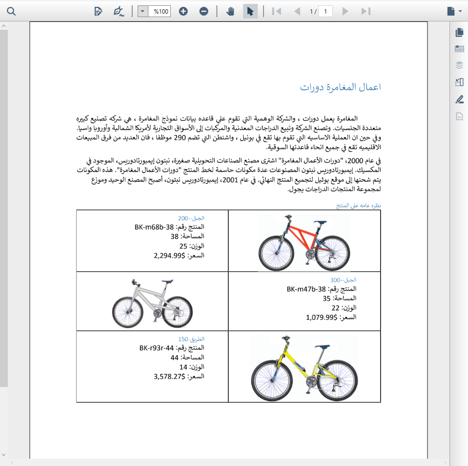

# Right to Left (RTL) in WPF PDF Viewer

The [WPF PDF Viewer](https://www.syncfusion.com/pdf-viewer-sdk/wpf-pdf-viewer) control supports right-to-left (RTL) rendering. All user interface elements are displayed based on left-to-right (LTR) or right-to-left (RTL) direction, ensuring proper layout and alignment for RTL languages.

## Enabling RTL in WPF PDF Viewer

RTL can be configured in the WPF PDF Viewer using the `FlowDirection` property. By default, the layout direction is `LeftToRight`; setting it to `RightToLeft` enables RTL. This can be set either in **XAML** or in the **code-behind (C#)**.

## Configuring RTL in XAML

RTL can be enabled in XAML by setting the `FlowDirection` property to `RightToLeft`.




 <Grid>
    <PdfViewer:PdfViewerControl x:Name="pdfViewer" FlowDirection="RightToLeft"/>
 </Grid>




## Configuring RTL in Code-Behind (C#)

RTL can also be configured programmatically by setting the `FlowDirection` property in the code-behind. Refer to the following code snippet.




using System.Windows;
using Syncfusion.Windows.PdfViewer;

namespace RTLSample
{
    public partial class MainWindow : Window
    {
        public MainWindow()
        {
            InitializeComponent();
            pdfViewer.FlowDirection = FlowDirection.RightToLeft;
            pdfViewer.Load("../../../Data/RTLText.pdf");

        }
    }
}




N> The sample project to perform the operation is available in the [GitHub](https://github.com/SyncfusionExamples/WPF-PDFViewer-Examples/tree/master/RTL).